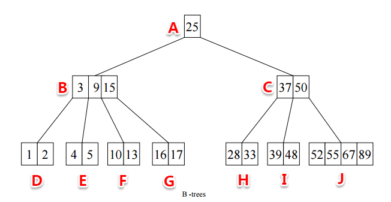

# 索引
这里我们以 MySQL 数据库为研究对象，讨论与数据库索引有关的话题。首先需要说明的是，MySQL 支持多种存储引擎，而各种存储引擎对索引的支持也各不相同，因此 MySQL 数据库支持多种索引类型，如 BTree 索引，哈希索引，全文索引等。为了避免混乱，首先我们只讨论 BTree 索引，因为这是平时使用 MySQL 时主要打交道的索引。

## 2.1 索引的本质
MySQL 官方对索引的定义为：索引（Index）是帮助 MySQL 高效获取数据的数据结构。提取句子主干，可以得到索引的本质：索引是数据结构。

## 2.2 常见的查询算法
我们知道，数据库查询是数据库最主要的功能之一。我们都希望查询数据的速度能尽可能的快，因此数据库系统的设计者会从查询算法的角度进行优化。**索引的出现其实就是为了提高数据查询的效率，就像书的目录一样。**

索引的出现是为了提高查询效率，但是实现索引的方式却有很多种。
那么有哪些查询算法可以使查询速度变得更快呢？

### 2.2.1 顺序查找
最基本的查询算法就是顺序查找（linear search），也就是对比每个元素的方法，不过这种算法在数据量很大时效率是极低的，查找的时间复杂度是 O(n)

### 2.2.2 二分查找
比顺序查找更快的查询方法应该就是二分查找了，二分查找的原理是从数组的中间元素开始，如果中间元素正好是要查找的元素，则搜素过程结束；如果某一特定元素大于或者小于中间元素，则在数组大于或小于中间元素的那一半中查找，而且跟开始一样从中间元素开始比较。如果在某一步骤数组为空，则代表找不到。查找的时间复杂度是 O(logn)，不过要求为有序数组。

有序数组在等值查询和范围查询场景中的性能都非常优秀。如果仅仅看查询效率，有序数组就是最好的数据结构了。但是，在需要更新数据的时候就麻烦了，你往中间插入一个数据时，必须挪动后面所有的记录，成本太高。

所以，有序数组仅适用于静态存储引擎，比如你要存储 2018 年某个城市的所有人口信息，这类不会再修改的数据。

### 2.2.3 二叉查找树
二叉查找树的特点是：
1. 若它的左子树不空，则左子树上所有的结点的值均小于它的根结点的值。
2. 若它的右子树不空，则右子树上所有的结点的值均大于它的根节点的值。
3. 它的左右子树也都是二叉查找树。

查找的时间复杂度一般为 O(logn)，当所有子树都在同一边的时候，退化为顺序查找，时间复杂度为 O(n).

所以为了维持 O(logn) 的时间复杂度，我们需要维护这棵二叉查找树是平衡二叉树。为了做这个保证，更新的时间复杂度也是O(logn)。

### 2.2.4 哈希散列法（哈希表）
其原理是根据 key 值和哈希函数创建一个哈希表（散列表），然后根据 key，通过散列函数，定位数据元素位置。

时间复杂度几乎是 O(1)，取决于产生冲突的多少。

需要注意的是，哈希散列法，产生的结果并不是有序的，这样的好处使增加新的值时很快，只需要往后追加。但是缺点是，因为不是有序的，所以哈希索引做区间查询的速度是很慢的。

所以，哈希表这种结构适用于只有等值查询的场景，例如 Memcached 及其他一些 NoSQL 引擎。

### 2.2.5 分块查找
分块查找又称为 索引顺序查找，他是顺序查找的一种改进方法。其算法思想是将 n 个数据元素按“按块有序”划分为 m 块（m <= n）。每一块中的结点不一定有序，但块与块之间必须“按块有序”；即第一块中任意元素的关键字必须小于第二块中任意元素的关键字；而第二块中任意元素又必须小于第三块中的任意元素，以此类推。

算法流程：
1. 先选取各块中的最大关键字，构成一个索引表。
2. 查找分为两部分：先对索引表进行二分查找或顺序查找，以确定记录在哪一块中；然后，在已确定的块中用顺序法进行查找。

这里我们稍微分析一下就知道，每种查找算法都只能应用于特定的数据结构之上，例如二分查找法要求被检索数据是有序的，而二叉树查找只能应用于二叉查找树上。但是，数据本身的组织结构不可能完全满足于各种数据结构（例如，理论上不可能同时将两列都按顺序进行组织），所以，在数据之外，数据库系统还维护着满足特定查找算法的数据结构，这些数据结构以某种方式引用（指向）数据，这样就可以在这些数据结构上实现高级查找算法。这种数据结构，就是索引。

## 2.3 平衡多路搜索树 多叉树
树可以有二叉，也可以有多叉。多叉树就是每个结点有多个儿子，儿子之间的大小保证从左到右递增。二叉树是搜索效率最高的，但是实际上大多数的存储引擎却并不使用二叉树。其原因是，索引不止存储在内存中，还要写到磁盘上。

重要的是，平衡多路搜索树的出现，还可以弥合不同的存储级别之间的访问速度的巨大差异，实现高效的I/O。

一般来说，当数据库中的表数据非常庞大时，索引本身也很大，因此不可能全部存储在内存中，因此索引往往以索引文件的形式存储在磁盘上。这样的话，索引查找过程中就要产生磁盘IO消耗，相对于内存存取，IO存取的消耗要高好几个数量级，所以评价一个数据结构作为索引最重要的指标就是在查找过程中磁盘IO操作次数的渐进复杂度。换句话说，索引的组织结构要尽量减少查找过程中磁盘IO的存取次数。

平衡二叉树的查找效率是非常高的，但是当数据量非常大时，树的存储的元素数量是有限的，这样会导致二叉查找树的深度过大而造成磁盘I/O读写过于频繁，进而导致查询效率低下。另外数据量过大也会导致内存空间不够容纳平衡二叉树所有结点的情况。想象一下一棵 100 万节点的平衡二叉树，树高20. 一次查询可能需要访问 20 个数据块。在机械硬盘时代，从磁盘随机读一个数据块需要 10ms 左右的寻址时间。也就是说，对于一个 100 万行的表，如果使用二叉树存储，单独访问一个行可能需要 20 个 10 ms的时间，这个查询是非常慢的。

为了让一个查询尽量少读磁盘，就必须让查询访问尽量少的数据块。那么，我们就不应该使用二叉树，而要使用 N叉树。这里“N叉“树中的 N 取决于数据块的大小。

以 InnoDB 的一个整数字段索引为例，这个 N 差不多是 1200. 这棵树高是 4 的时候，就可以存储 1200 的 3 次方个值，这已经 17 亿了。考虑到树根的数据块总是在内存中的，一个 10 亿行的表上一个整数字段的索引，查找一个值最多只需要访问 3 次硬盘。其实，树的第二层很可能也在内存中，那么访问磁盘的平均次数就更少了。

N 叉树由于在读写上的性能优点，以及适配磁盘的访问模式，已经被广泛应用在数据库引擎中。

> 不管是哈希还是有序数组，或者 N 叉树，他们都是不断迭代，不断优化的产物或者解决方案，数据库技术发展到今天，跳表、LSM 树等数据结构也被用于引擎设计中，这里不再一一展开。

> 我们心里要有个概念，数据库底层存储的核心就是基于这些数据模型的。每碰到一个新数据库，我们需要先关注它的数据模型，这样才能从理论上分析出这个数据库的适用场景。

B-Tree 是一种经典的 平衡多路搜索树。下面我们看看 B树 这个数据结构。

### 2.3.1 B-Tree
B树 又叫做 B-树，它就是一种平衡多路查找树，是由 Rudolf Bayer 和 Edward M.McCreight 于 1972 年在波音研究实验室工作室发明的。他们没有解释过 B-树 中的 B 代表的是什么含义，或许你可以理解为“balanced”，“broad”，“bushy”，或者直接理解为“Bayer”。
> McCreight 曾说过：你越考虑 B-树 中的 B 代表的是什么含义，你将越发深刻的理解 B树。

下图是一个典型的 B树。

一棵m阶B树是一棵平衡的m路搜索树，它或者是空树，或者满足下列性质：
1. 每个结点最多有 m 个子结点。
2. 每个非叶子结点（除了根结点）有至少 ⌈m/2⌉ 个子结点。
3. 根结点如果不是叶子结点，那么至少有2个子结点。
4. 一个有 k 个子结点的 非叶子结点，刚好有 k-1 个键。
5. 每个结点中的 键 都按照从小到大的顺序排列，每个关键字的左子树中的所有键都小于它，而右子树中的所有键都大于它。
5. 所有叶子结点的高度相同。

所以，根结点的 键 数量范围在 [1, m-1]之间，而非根结点的 键 数量范围是 [m/2, m-1]。

另外，注意这里的 m路 中的 m 代表的是 B树的阶数。描述一棵B树时必须指定它的阶数，阶数表示了一个结点最多有多少个孩子结点，一般用字母m表示阶数。

关于 B-Tree 有一些有趣的性质，例如对于度为 m 的B树，设其索引 N 个 key，那么其树高的上限为 `log_d^((N+1)/2)`；检索一个 key，其查找结点个数的渐进复杂度为 `O(log_d^(N))`。从这点可以看出，B树是一个非常有效率的索引数据结构。

另外，由于插入和删除新的数据时，会破坏B树的性质，因此在插入删除时，需要对树做一个 分裂、合并、转移等操作，以保持B树的性质。这里不打算完整讨论B-Tree这些内容，因为已经有许多资料详细说明了B-Tree的数学性质及插入删除算法，有兴趣的朋友可以查阅其它文献进行详细研究，通俗的文章可以看 [这篇博客](https://www.cnblogs.com/lianzhilei/p/11250589.html)

### 2.3.2 B+树
B树 有很多变种，其中最常见的就是 B+树，比如 MySQL 就普遍使用 B+树 实现其索引结构。

B+树的特征：
* 有 m 个子树的中间结点包含有 m 个元素（B树中是 m-1个元素），每个元素不保存数据，只用来索引。
* 所有的叶子结点包含了全部关键字的信息，及指向含有这些关键字记录的数据指针，且叶子结点本身按照关键字的大小自小而大的顺序链接。（而 B树 中的叶子节点并没有包括全部需要查找的信息）
* 所有的非叶子结点可以看成是索引信息，结点中只包含了其子树根结点中最大（或最小）关键字。（而 B树 的非叶子结点也包含需要查找的信息）
* B+树 通常在叶子结点之间添加额外的顺序访问指针，以便于提高区间访问的性能。

那么为什么说 B+树 与 B树 更适合数据库索引呢？

1）B+树 的磁盘读写代价更低

B+树 的内部结点并没有指向关键字具体信息的指针。因此其内部结点相对于 B树 更小。如果把所有同一内部结点的关键字存放在同一块盘中，那么盘块所能容纳的关键字数量也越多，一次性读入内存中的需要查找的关键字也就越多，相对来说 IO 读写次数也就降低了。

2）B+树 查询效率更加稳定

由于非叶子结点并不指向文件内容的结点，而只是叶子结点中关键字的索引。所以任何关键字的查找必须走一条从根结点到叶子结点的路径。所有关键字查询的路径长度相同，导致每一个数据的查询效率相当。

3）B+树便于范围查询（而且范围查询是数据库的常态）

B树在提高了 IO 性能的同时，并没有解决元素遍历时效率低下的问题。而 B+树 中只需要去遍历叶子结点就可以实现所有数据的遍历。而且在数据库中基于范围的查询是非常频繁的，B树不支持这样的操作或者说效率太低。

## 3. MySQL 中的索引实现
在 MySQL 中，索引属于存储引擎级别的概念，不同存储引擎对索引的实现方式是不一样的，这里主要讨论 InnoDB 和 MyISAM 两个存储引擎。

### 3.1 MyISAM 引擎索引实现
MyISAM 引擎使用 B+树 作为索引结构，叶子结点的 data 域存放的是数据记录的地址，下图是 MyISAM 索引的原理图

这里表里共有 3 列，假设我们以`Col1`为主键，则上图是一个 MyISAM 表的主索引示意图。可以看出 MyISAM 的索引文件仅保存数据记录的地址。在 MyISAM 中，主索引和辅助索引在结构上没有任何区别，只是主索引要求 key 是唯一的，而辅助索引的 key 可以重复。

假设我们在 Col2 上建立辅助索引，则此索引的示意图如下所示：

可以看出，同样也是一棵 B+树，叶子结点的 data 域保存数据记录的地址。因此，MyISAM 中索引检索的算法首先按照 B+树 的搜索算法搜索索引，如果指定的 key 存在，则取出其 data 域的地址，然后去相应地址读取数据记录。

MyISAM 的索引方式也叫做“非聚簇”索引，之所以这么做是为了与下面 InnoDB 的 “聚簇索引” 做区分。

### 3.2 InnoDB 引擎索引实现
虽然 InnoDB 中也是用 B+树 作为索引结构，但是实现方式却与 MyISAM 完全不同。

首先，InnoDB 中的数据文件本身就是索引文件。从上文直到，MyISAM 中的索引文件和数据文件是分离的，索引文件只保存数据记录的地址。而在 InnoDB 中，表数据文件本身就是按照 B+树 组织的一个索引结构，这棵树的 叶子结点 中的 data 域保存了完整的数据记录。这个索引的 key 是数据表的主键，因此 InnoDB 表数据文件本身就是主索引。

上图是 InnoDB 主键索引（同时也是数据文件）的示意图，可以看到叶子结点中包含了完整的数据记录，这种索引叫做 聚簇索引。因为 InnoDB 的数据文件本身要按主键聚集，所以 InnoDB 要求表必须有主键（MyISAM 可以没有），如果没有显式指定，则 MySQL 系统会自动选择一个可以唯一标识数据记录的列作为主键；如果不存在这种列，则 MySQL 自动为 InnoDB 表生成一个隐含字段作为主键，这个字段长度为 6 个字节，类型为 长整型。

而在 InnoDB中，非主键索引（或者说 辅助索引，二级索引）叶子结点的 data 域存放的是 **主键的值** 而不是地址。换句话说，InnoDB 中所有辅助索引都引用主键作为 data 域。例如，下图是 定义在 Col3 上的一个辅助索引。

因此，在 InnoDB 中，按主键进行查询比较高效，但是使用 辅助索引 搜索则需要检索两次：首先检索辅助索引，获得主键，然后用主键在主键索引中检索获得数据记录，这个过程称为 回表。

也就是说，使用非主键索引的查询需要多扫描一棵索引树。因此，我们在应用中应该尽量使用主键查询。

> Q：为什么这里的辅助索引不使用 记录地址，而是用主键 作为 叶子结点的 data 域？

> A：因为主键索引树可能会由于分裂等原因而产生变化，导致记录地址发生变化。使用主键的值作为 data 域，可以避免在主键索引树发生变化时更新辅助索引树。

了解不同存储引擎的索引实现方式对于正确使用索引和优化索引都有帮助。例如直到了 InnoDB 的索引实现后，我们明白了：
* 一般不建议使用过长的字段作为主键，因为所有辅助索引都使用 主键 作为 叶子节点的 data 域，如果主键过长的话，会使得辅助索引变得很大，而且叶子结点能容纳的数据数量就越少。
* 一般建议使用自增主键，因为 InnoDB 数据文件本身就是一棵 B+树，非单调的主键会造成在插入新记录时数据文件为了维持 B+树 的特性而频繁分裂调整，十分低效，而使用自增主键，每次添加新记录时，都是追加操作，既不涉及挪动其他数据记录，也不会触发叶子结点的分裂。

#### 覆盖索引
上面讲到过，在 InnoDB 中通过辅助索引查询数据的时候，可能会遇到 回表 的情况。那么，有没有可能通过索引优化，避免回表呢？

如果我们执行的语句是 `select ID from T where k between 3 and 5`，这时只需要查询 ID 的值，而 ID 的值已经在 k 索引树上了，因此可以直接提供查询结果，不需要回表。也就是说，在这个查询里面，索引 k 已经“覆盖”了我们的查询需求，我们称之为覆盖索引。

由于覆盖索引可以减少查询索引树的次数，显著提高查询性能，所以使用覆盖索引是一个常用的性能优化手段。

#### 最左前缀原则
B+树 这种索引结构，可以利用索引的“最左前缀”，来定位记录。

为了说明这个概念，我们以（name，age）这个联合索引来分析。

可以看到，索引项是按照索引定义里出现的字段顺序排序的。

当我们的逻辑需求是查到所有名字为“张三“的人时，可以快速定位到 ID4，然后向后遍历得到所有的结果。同样，如果我们想要查询所有名字第一个字是”张“的人，也可以用上这个索引，查找到第一个符合要求的记录是 ID3，然后向后遍历直到不符合要求为止。

可以看到，不止是索引的全部定义，只要满足最左前缀，就可以利用索引来加速检索。这个最左前缀可以是联合索引的最左 N 个字段，也可以是字符串索引的最左 M 个字符。

基于上面对最左前缀原则的说明，我们来讨论一个问题：在建立联合索引的时候，如何安排索引内的字段顺序。

这里我们评估的标准是：索引的复用能力。因为最左前缀原则，所以当已经有了（a，b）这个联合索引后，一般就不需要单独在 a 上建立索引了。因此，第一原则是，如果通过调整顺序，可以减少一个索引的维护，那么这个顺序往往是需要优先考虑的。

那么，如果既有联合查询，又有基于 a，b 各自的查询呢？查询条件里只有 b 的语句，就无法使用（a，b）这个联合索引了，这时候我们不得不维护另外一个索引，也就是说同时要维护（a，b）和 （b）两个索引。

这时候，我们需要考虑的就是空间了。比如上面这个市民表的场景，name 字段是比 age 字段大的，所以我们就建议使用 （name，age）的联合索引 加上 （age）的单字段索引。

### 3.3 对比InnoDB 和 MyISAM

# 参考资料
[数据库索引原理及优化](https://blog.csdn.net/suifeng3051/article/details/52669644)

[B树、B+树详解](https://www.cnblogs.com/lianzhilei/p/11250589.html)

