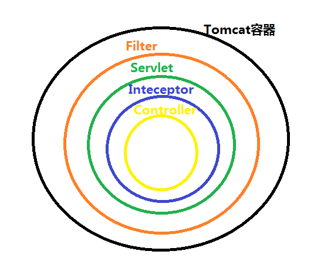

# 过滤器，监听器，拦截器
讲讲 过滤器（Filter），监听器（listener），拦截器（interceptor）。

首先通过两张图看看 过滤器 和 拦截器 之间的关系。



## 过滤器
过滤器（Filter）是 Servlet 中的概念，是指实现了 `javax.servlet.Filter` 接口的服务器端程序，主要用途是过滤字符编码，做一些业务逻辑判断等。其工作原理是：在 web.xml 中配置好要拦截的客户端请求，此时就可以对请求或响应（Request，Response）设置统一编码，简化操作。
Filter 随着 web应用的启动而启动，只初始化一次。

过滤器是在请求进入 Tomcat 容器之后，但请求进入 Servlet 之前进行预处理的。使用 Filter 的完整流程是：Filter 对用户请求进行预处理，接着将请求交给 Servlet 进行处理并生成响应，最后 Filter 再对服务器响应进行后处理。

在上一章 Tomcat 中有讲到过 Filter 的具体接口，因此这里略过。

过滤器是基于 **函数回调** 进行工作的。

## 监听器
监听器（Listener）也是 Servlet 中的概念，它也是随着 Web 应用的启动而启动，只初始化一次，随 Web应用的停止而摧毁，可以用来监听 servletContext，HttpSession，ServletRequest 等域对象的创建和销毁，以及属性发生更改等事件，用于在事件发生前后做一些必要的处理。例如，可以用来：1. 统计在线人数和在线用户。2. 统计网站访问量 等。

在 Servlet 中定义了一些常用的监听器接口：
* `javax.servlet.ServletContextListener`
* `javax.servlet.ServletRequestListener`
* `javax.servlet.http.HttpSessionListener`

Servlet 规范中
* 实现 `ServletContextListener` 的类可以在 Web 容器中上下文状态改变（创建或者销毁）时，收到消息，进行相应的处理。
* 实现 `ServletRequestListener`的类可以在请求进出 Web容器时收到消息，进行相应的处理。    
* 实现 `HttpSessionListener`的类可以在 Web 容器中Session会话改变（创建或销毁）时，收到消息，进行相应的处理。（例如上面说的获取网站在线人数就可以用这个接口实现）

## 拦截器
拦截器（Interceptor）是 Spring 里面的概念，是 Spring 框架支持的一种机制，主要是通过 `HandlerInterceptor` 接口来实现的。实现该接口的类注册到 Spring 容器内后，可以对相应的URL进行拦截操作，可以实现 日志，安全 等操作。

`HandlerInterceptor` 中有以下几个接口：
```java
public interface HandlerInterceptor {
    boolean preHandle(HttpServletRequest request, HttpServletResponse response, Object handler);
    void postHandle(HttpServeltRequest request, HttpServletResponse response, Object handler, @Nullalbe ModelAndView modelAndView);
    void afterCompletion(HttpServletRequest request, HttpServletResponse response, Object handler, @Nullable Exception ex);
}
```

如果我们要使用拦截器对请求进行拦截，做以下两个事情即可：
1. 编写拦截器类，继承 `HandlerInterceptor`接口。
2. 在 `WebMvcConfigurerAdapter` 类中重写 `addInterceptors` 方法，添加我们的拦截器类。

例如：
```java
@Configuration
public class MyWebAppConfigurer
        extends WebMvcConfigurerAdapter {
  
    @Override
    publicvoid addInterceptors(InterceptorRegistry registry) {
        // 多个拦截器组成一个拦截器链
        // addPathPatterns 用于添加拦截规则
        // excludePathPatterns 用户排除拦截
        registry.addInterceptor(new MyInterceptor1()).addPathPatterns("/**");
        registry.addInterceptor(new MyInterceptor2()).addPathPatterns("/**");
        super.addInterceptors(registry);
    }
  
}
```

### 拦截器的实现原理
Spring 中的 `dispatchServlet` 在对请求进行处理匹配的时候，会逐一尝试所有的 `handlerMapping`，直至找到能够处理该请求的handler，就返回相对应的 `handlerExecutionChain`。

我们看一下 `HandlerExecutionChain` 这个类的结构，可以发现其中有个字段是 `private HandlerInterceptor[] interceptors`，其中就包含了该handler的所有拦截器。

然后我们接着看一下 `dispatchServlet` 中的 `doDispatch` 方法，可以看到其中对 handler 的一系列处理逻辑，例如首先调用拦截器的 `preHandle` 方法，然后真正调用 handler 对请求进行处理，然后调用拦截器的 `postHandle`方法，最后调用 `afterCompletion`方法（即使处理过程中出现了异常，还是会调用`afterCompletion`方法）。