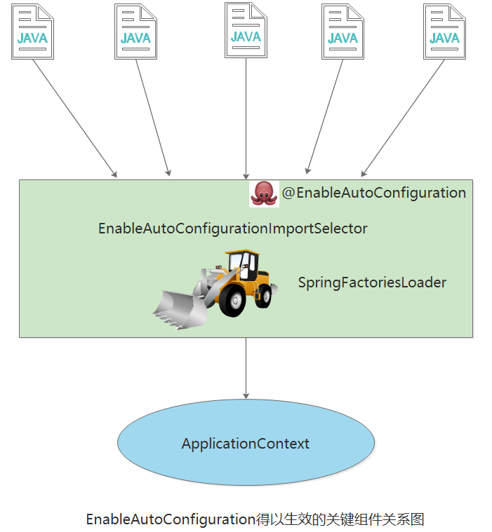
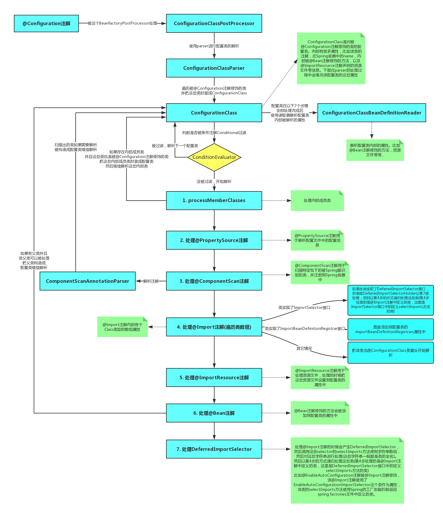

# Spring Boot启动流程

开发一个 Spring Boot 项目，都会用到如下启动类
```java
@SpringBootApplication
public class Application {
    public static void main(String[] args) {
        SpringApplication.run(Application.class, args);
    }
}
```

从中可以看出，关键部分有两个，一个是第 1 行的注解 `@SpringBootApplication`，一个是第 5 行的 `SpringApplication.run(...)`。
所以要了解 Spring Boot 的启动流程，从这两位入手就可以了。

下面氛围两部分：
1. 第一部分，从 `@SpringBootApplication` 入手，从注解的角度看看 SpringBoot 的关键注解。
> 注意，在 Java 中，注解只是起到标注的作用，可以理解为一种特殊的 comment，为 类/方法 进行特定标注，本身并不执行代码。真正使注解起作用的，是第二部分的启动过程，利用反射，读取类的注解并进行相应操作。
2. 第二部分，从 `SpringApplication.run()` 入手，了解真实的启动过程。
## @SpringBootApplication
`@SpringBootApplication` 是 SpringBoot 应用的核心注解，它其实是一个组合注解：
```java
@Target(ElementType.TYPE)
@Retention(RetentionPolicy.RUNTIME)
@Documented
@Inherited
@SpringBootConfiguration
@EnableAutoConfiguration
@ComponentScan(excludeFilters = { @Filter(type = FilterType.CUSTOM, classes = TypeExcludeFilter.class),
		@Filter(type = FilterType.CUSTOM, classes = AutoConfigurationExcludeFilter.class) })
public @interface SpringBootApplication {
    ...
}
```
虽然使用了多个 Annotation 进行原信息标注，但是其中重要的只有三个：
* `@Configuration`（点开`@SpringBootConfiguration`会发现里面还是用了`@Configuration`）
* `@EnableAutoConfiguration`
* `@ComponentScan`

下面分别介绍这三个注解。

### @Configuration
这里的 `@Configuration` 对我们来说应该不陌生，他就是 JavaConfig 形式的 Spring IoC 容器的配置类使用的那个 `@Configuration`。

所以，这里的启动类标注了 `@Configuration` 后，本身其实也是一个 IoC 容器的配置类。

### @ComponentScan
这个注解在 Spring 中非常重要，它对应 XML 配置中的元素。`@ComponentScan` 的功能其实就是自动扫描并加载符合条件的组件（比如 `@Component` 和 `@Repository` 等）或者 Bean 定义，最终将这些 Bean 定义加载到 IoC 容器中。

我们可以通过 basPackages 等属性来细粒度定制 @ComponentScan 自动扫描的范围。如果不指定，则 Spring 会默认从声明 @ComponentScan 所在类的 package 进行扫描。

> 所以 Spring Boot 的启动类最好是放在 root package 下，防止自动扫描范围不对。

### @EnableAutoConfiguration
这个注解同样非常重要，它主要是借助 @Import 的支持，将所有符合自动配置条件的 bean 定义加载到 IoC 容器中。

`@EnableAutoConfiguration` 作为一个复合注解，其自身定义关键信息如下：
```java
@Target(ElementType.TYPE)
@Retention(RetentionPolicy.RUNTIME)
@Documented
@Inherited
@AutoConfigurationPackage
@Import(AutoConfigurationImportSelector.class)
public @interface EnableAutoConfiguration {
    ...
}
```
其中最关键的就是 `@Import(AutoConfigurationImportSelector.class)`，借助 `@AutoConfigurationImportSelector`，可以帮助 Spring Boot 应用将所有符合条件的 `@Configuration` 配置都加载到当前 IoC 容器中。
就像一只“八爪鱼”一样，借助 Spring 框架原有的一个工具类：SpringFactoriesLoader 的支持，`@EnableAutoConfiguration` 可以智能的自动配置功效才大功告成。



上面提到的 SpringFactoriesLoader 在 Spring 中用到的地方非常多，其主要功能就是从指定的配置文件 `META-INF/spring.factories` 中加载配置。
```java
public abstract class SpringFactoriesLoader {
    //...
    public static <T> List<T> loadFactories(Class<T> factoryClass, ClassLoader classLoader) {
        ...
    }


    public static List<String> loadFactoryNames(Class<?> factoryClass, ClassLoader classLoader) {
        ....
    }
}
```
配合 `@EnableAutoConfiguration` 使用时，它提供了一种配置查找的功能支持，即根据 `@EnableAutoConfiguration` 的完整类名 `org.springframework.boot.autoconfigure.EnableAutoConfiguration` 作为查找的 key，获取对应的一组 `@Configuration` 类。


上图是从 Spring Boot 的 autoconfigure 依赖包中的 `META-INF/spring.factories` 中摘录的一段内容，可以很好的说明问题。

所以，`@EnableAutoConfiguration` 自动配置的魔法其实是：
* 从 classpath 中搜寻所有的 `META-INF/spring.factories` 配置文件，并将其中 `org.springframework.boot.autoconfigure.EnableutoConfiguration` 对应的配置项通过反射（Java Refletion）实例化为对应的标注了 `@Configuration` 的 JavaConfig 形式的 IoC 容器配置类，然后汇总并加载到 IoC 容器.

相关代码可以从 `AutoConfigurationImportSelector.getCandidateConfigurations()` 中看出端倪：
```java
	protected List<String> getCandidateConfigurations(AnnotationMetadata metadata, AnnotationAttributes attributes) {
        // 这里就是利用 SpringFactoiresLoader 从 spring.factories 中读取 @EnableAutoConfiguration 的类
		List<String> configurations = SpringFactoriesLoader.loadFactoryNames(getSpringFactoriesLoaderFactoryClass(),
				getBeanClassLoader());
		Assert.notEmpty(configurations, "No auto configuration classes found in META-INF/spring.factories. If you "
				+ "are using a custom packaging, make sure that file is correct.");
		return configurations;
	}
```
具体细节在第二部分介绍。

## 启动流程
SpringBoot 应用的 main 函数一般是
```java
public static void main(String[] args) {
    SpringApplication.run(SpringBootExampleApplication.class, args);
}
```
点进 run 函数，可以发现关键代码为：
```java
public static ConfigurableApplicationContext run(Class<?>[] primarySources, String[] args) {
    return new SpringApplication(primarySources).run(args);
}
```
从中可以看出，SpringBoot 的启动过程从大体上可以分为两步：
* 创建 SpringApplication，即 `new SpringApplication(primarySources)` 的过程。
* 运行 SpringApplication，即 `.run(args)` 的过程。
下面分别讲讲两部分
### 创建 SpringApplication
创建 SpringApplication 的过程主要代码为：
```java
public SpringApplication(ResourceLoader resourceLoader, Class<?>... primarySources) {
    this.resourceLoader = resourceLoader;
    Assert.notNull(primarySources, "PrimarySources must not be null");
    // primarySources 一般为应用的主类，在这里就是上面的 SpringBootExampleApplication 类
    this.primarySources = new LinkedHashSet<>(Arrays.asList(primarySources));
    // deduceFromClasspath() 主要使用 Class.isPresent() 来判断当前应用的类型（Reactive 还是 Servlet）
    this.webApplicationType = WebApplicationType.deduceFromClasspath();
    // getSpringFactoriesInstances(Class<T> type) 函数主要是利用 SpringFactoriesLoader 去 META-INF/spring.factories 中寻找 key 为 type 的类，并对其实例化
    // 实例化 key 为 org.springframework.boot.BootstrapRegistryInitializer 的类
    this.bootstrapRegistryInitializers = new ArrayList<>(
            getSpringFactoriesInstances(BootstrapRegistryInitializer.class));
    // 实例化 key 为 org.springframework.context.ApplicationContextInitializer 的类
    setInitializers((Collection) getSpringFactoriesInstances(ApplicationContextInitializer.class));
    // 实例化 key 为 org.springframework.context.ApplicationListener 的类
    setListeners((Collection) getSpringFactoriesInstances(ApplicationListener.class));
    // 利用方法调用栈，寻找方法名为 main 的方法，并将其对应的类作为主类
    this.mainApplicationClass = deduceMainApplicationClass();
}
```
简单来说，这一步做的是将一些关键信息保存在 SpringApplication 的属性中，为后面做准备。

### run（运行过程）
运行过程的主要代码在 SpringApplication 类中的 run 函数中
```java
public ConfigurableApplicationContext run(String ...args) {
    // 记录应用的启动时间
    long startTime = System.nanoTime();
    // 创建应用的引导上下文
    // 主要做的事情是获取到之前加载的所有 bootstrappers，然后挨个执行其 initialize 方法来完成对引导启动器上下文的环境设置
    DefaultBootstrapContext bootstrapContext = createBootstrapContext();
    ConfigurableApplicationContext context = null;
    configureHeadlessProperty();
    // 从 spring.factories 中获取所有的 SpringApplicationRunListeners
    // 默认情况下，SpringBoot 里这里会有唯一一个 SpringApplicationRunListener，即 EventPublishingRunListener
    // EventPublishingRunListener 在初始化的时候，会将 SpringApplication 中的 属性 listeners（即 ApplicationListener）赋值
    // 然后在调用相关方法时，使用 Multicaster 广播给所有的 ApplicationListener。
    SpringApplicationRunListeners listeners = getRunListeners(args);
    // 遍历所有 listeners，调用其 starting 方法。
    // 广播 ApplicationStartingEvent。相当于通知所有的 ApplicationListener，应用正在 starting。
    listeners.starting(bootstrapContext, this.mainApplicationClass);
    try {
        // 构建应用程序参数持有类
        ApplicationArguments applicationArguments = new DefaultApplicationArguments(args);
        // 创建并配置好当前 SpringBoot 应用将要使用的环境；
        // 广播 ApplicationEnvironmentPreparedEvent 事件，相当于通知所有的 ApplicationListener，应用环境准备好了
        ConfigurableEnvironment environment = prepareEnvironment(listeners, bootstrapContext, applicationArguments);
        configureIgnoreBeanInfo(environment);
        // 控制台上打印 banner
        Banner printedBanner = printBanner(environment);
        // 创建 SpringBoot 应用上下文。
        // 默认情况下，这里创建的是 AnnotationConfigServletWebServerApplicationContext。
        context = createApplicationContext();
        context.setApplicationStartup(this.applicationStartup);
        // 准备应用上下文，里面会依次调用之前创建的 ApplicationContextInitializer，对 context 进行初始化操作；
        // 之后还会广播 ApplicationContextInitializedEvent 给所有的 listeners。
        // 然后将 sources（默认为 primarySources，即应用的主类） 加载进上下文
        // 最后广播 ApplicationPreparedEvent 事件，告诉 listeners，应用上下文已经准备好了。
        prepareContext(bootstrapContext, context, environment, listeners, applicationArguments, printedBanner);
        // refresh 是非常关键的一步，里面会做很多事情，例如 BeanFactory 的设置，BeanFactoryPostProcessor 的执行，BeanPostProcessor 接口的执行，
        // 自动化配置类的解析、条件注解的解析、国际化的初始化等等。具体在下面再单独讲解
        refreshContext(context);
        // refresh 之后应该做的事情，目前是个空实现
        afterRefresh(context, applicationArguments);
        // 计算启动花的时间，并在日志中打印
        Duration timeTakenToStartup = Duration.ofNanos(System.nanoTime() - startTime);
        if (this.logStartupInfo) {
            new StartupInfoLogger(this.mainApplicationClass).logStarted(getApplicationLog(), timeTakenToStartup);
        }
        // 广播 ApplicationStartedEvent 事件，通知所有 ApplicationListener，应用已经启动了
        listeners.started(context, timeTakenToStartup);
        // 调用上下文中的 ApplicationRunner 和 CommandRunner 接口的实现类
        callRunners(context, applicationArguments);
    }
    catch (Throwable ex) {
        handleRunFailure(context, ex, listeners);
        throw new IllegalStateException(ex);
    }
    try {
        // 计算ready花的时间，并广播 ApplicationReadyEvent 事件至所有监听者 listeners
        Duration timeTakenToReady = Duration.ofNanos(System.nanoTime() - startTime);
        listeners.ready(context, timeTakenToReady);
    }
    catch (Throwable ex) {
        handleRunFailure(context, ex, null);
        throw new IllegalStateException(ex);
    }
    return context;
}
```
这样 run 方法执行完毕后，Spring 容器初始化工作完毕，各种监听器、初始化器也做了相应工作。

下面具体看一下 `refreshContext(context)` 这一步。

还是以 web 程序为例，这里对应的上下文为 `AnnotationConfigServletWebServerApplicationContext`。它的 refresh 方法调用了父类 `AbstractApplicationContext` 的 refresh 方法。

下面首先给出 refresh 的主要代码，然后解释其中的主要方法。
```java
@Override
public void refresh() throws BeansException, IllegalStateException {
    // refresh 过程只能一个线程处理，不允许并发执行
    synchronized (this.startupShutdownMonitor) {
        StartupStep contextRefresh = this.applicationStartup.start("spring.context.refresh");

        // Prepare this context for refreshing.
        // 刷新前的准备，包括 设置flag、时间、初始化 properties 等。
        prepareRefresh();

        // Tell the subclass to refresh the internal bean factory.
        ConfigurableListableBeanFactory beanFactory = obtainFreshBeanFactory();

        // Prepare the bean factory for use in this context.
        prepareBeanFactory(beanFactory);

        try {
            // Allows post-processing of the bean factory in context subclasses.
            postProcessBeanFactory(beanFactory);

            StartupStep beanPostProcess = this.applicationStartup.start("spring.context.beans.post-process");
            // Invoke factory processors registered as beans in the context.
            invokeBeanFactoryPostProcessors(beanFactory);

            // Register bean processors that intercept bean creation.
            registerBeanPostProcessors(beanFactory);
            beanPostProcess.end();

            // Initialize message source for this context.
            initMessageSource();

            // Initialize event multicaster for this context.
            initApplicationEventMulticaster();

            // Initialize other special beans in specific context subclasses.
            onRefresh();

            // Check for listener beans and register them.
            registerListeners();

            // Instantiate all remaining (non-lazy-init) singletons.
            finishBeanFactoryInitialization(beanFactory);

            // Last step: publish corresponding event.
            finishRefresh();
        }

        catch (BeansException ex) {
            if (logger.isWarnEnabled()) {
                logger.warn("Exception encountered during context initialization - " +
                        "cancelling refresh attempt: " + ex);
            }

            // Destroy already created singletons to avoid dangling resources.
            destroyBeans();

            // Reset 'active' flag.
            cancelRefresh(ex);

            // Propagate exception to caller.
            throw ex;
        }

        finally {
            // Reset common introspection caches in Spring's core, since we
            // might not ever need metadata for singleton beans anymore...
            resetCommonCaches();
            contextRefresh.end();
        }
    }
}
```
### 1. prepareRefresh
1. 设置容器的启动时间，撤销关闭状态，开启活跃状态。
2. 初始化属性源信息（Property）。
3. 验证环境信息里一些必须存在的属性。

### 2. prepareBeanFactory
1. 设置 beanFactory 的类加载器为当前上下文的类加载器，添加属性编辑注册器（`PropertyEditorRegistrar`）
2. 添加 ApplicationContextAwareProcessor 这个 BeanPostProcessor，并取消相关 7 个接口的自动注入，因为 ApplicationContextAwareProcessor 把这些接口的实现工作做了。ApplicationContextAwareProcessor 的作用是让 bean 在实现了 `EnvironmentAware` 等 7 个接口后，可以感知到应用上下文的相关属性。
3. 设置特殊类型对应的bean。BeanFactory 对应刚刚获取到的 beanFactory；ResourceLoader、ApplicationEventPublisher、ApplicationContext 这三个接口对应的 bean 都设置为当前上下文。
4. 注册 ApplicationListenerDetector 这个 BeanPostProcessor。
5. 注入一些其他信息的 bean，例如 environment、systemProperties 等。

### 3. postProcessBeanFactory
准备好 beanFactory 后的一些后续操作，不同的上下文会执行不同的操作。
* `GenericWebApplicationContext` 会在 beanFactory 中添加 `ServletContextAwareProcessor`，该处理器用于处理实现了 `ServletContextAware` 接口的 bean。这种类型的 bean 在初始化时，可以感知到 servletContext 和 servletConfig。
* 另外，`AnnotationConfigEmbeddedWebApplicationContext` 对应的 postProcessBeanFactory方法为：
```java
protected void postProcessBeanFactory(ConfigurableListableBeanFactory beanFactory) {
    // 调用父类，即 GenericWebApplicationContext 对应的 postProcessBeanFactory 函数
    super.postProcessBeanFactory(beanFactory);
    // 查看 basePackages 属性。如果设置了该属性，会使用 ClassPathBeanDefinitionScanner 去扫描 basePackages 包下的 bean 并注册
    if (!ObjectUtils.isEmpty(this.basePackages)) {
        this.scanner.scan(this.basePackages);
    }
    // 查看 annotatedClasses 属性，如果设置了会使用 AnnotatedBeanDefinitionReader 去注册这些 bean
    if (!this.annotatedClasses.isEmpty()) {
        this.reader.register(ClassUtils.toClassArray(this.annotatedClasses));
    }
}
```

### 4. invokeBeanFactoryPostProcessor
在 Spring 上下文中找出实现了 BeanFactoryPostProcessor 接口的 processors 并执行。
Spring 上下文会委托给 PostProcessorRegistrationDelegate 的 invokeBeanFactoryPostProcessors 方法执行。
> BeanFactoryPostProcessor 的作用是用来修改 Spring 上下文中已经存在的 bean 的定义，使用 ConfigurableListableBeanFactory 对 bean 进行处理。

这里的处理逻辑如下。

首先从 Spring 上下文中找出类型为 `BeanDefinitionRegistryPostProcessor` 的 bean（这些 processor 是在容器刚创建时通过构造 AnnotatedBeanDefinitionReader 的时候注册到容器中的），然后按照优先级分别执行。优先级的逻辑如下：
1. 先把实现了 PriorityOrdered 接口的 BeanDefinitionRegistryPostProcessor 全部找出来，排序后依次执行其 `postProcessBeanDefinitionRegistry` 方法。
2. 把实现了 Ordered 接口的 BeanDefinitionRegistryPostProcessor 全部找出来，排序后依次执行。
3. 剩下的 BeanDefinitionRegistryPostProcessor 全部找出来并依次执行。
4. 然后执行以上所有 processor 的 `postProcessBeanFactory` 接口（因为 `BeanDefinitionRegistryPostProcessor` 接口是 `BeanFactoryPostProcessor` 的子类，所以一定可以找到 `postProcessBeanFactory` 接口）。

接下来从 Spring 上下文中找出类型为 `BeanFactoryPostProcessor` 的 bean（会忽略掉上面的 bean），然后执行。
这里的查找规则与上面的 BeanDefinitionRegistryPostProcessor 相同，先找 PriorityOrdered，再找 Ordered，最后是两者都没有的。

这里需要重点说明的是 `ConfigurationClassPostProcessor` 这个 processor，因为这个 processor 是处理 `@Configuration` 注解的，在 SpringBoot 中非常重要。

`ConfigurationClassPostProcessor` 是优先级最高的 processor（因为其实现了 PriorityOrdered 接口）。

这个 processor 会去 BeanFactory 中找出所有带有 @Configuration 注解的 bean，然后使用 ConfigurationClassParser 去解析这个类。

ConfigurationClassParser 内部有个 `Map<ConfigurationClass, ConfigurationClass>` 类型的 configurationClasses，用于保存已经解析的 Configuration 类。
ConfigurationClass 是一个对要解析的配置类的封装，内部存储了配置类的注解信息、被 @Bean 注解修饰的方法、@ImportResource 注解修饰的信息、ImportBeanDefinitionRegistrar 等。

> 这里 ConfigurationClassPostProcessor 最先被处理还有另外一个原因是如果程序中有自定义的 BeanFactoryPostProcessor，那么这个 PostProcessor 首先得通过 ConfigurationClassPostProcessor 被解析出来，然后才能被 Spring 容器找到并执行。(ConfigurationClassPostProcessor 不先执行的话，这个 Processor 是不会被解析的，不会被解析的话也就不会执行了)。

在简单的程序中，只有主类 SpringBootExampleApplication 有 @Configuration 注解（@SpringBootApplication 中包含此注解），所以这个配置类会被 ConfigurationClassParser 解析。
解析过程如下：

1. 处理 @PropertySource 注解，进行配置信息的解析。
2. 处理 @ComponentScan 注解，使用 ComponentScanAnnotationParser 扫描 basePackage 下需要解析的类 (@SpringBootApplication 注解也包括了 @ComponentScan 注解，只不过 basePackages 是空的，空的话会去获取当前 @Configuration 修饰的类所在的包)，并注册到 BeanFactory 中(这个时候bean并没有进行实例化，而只是进行了注册。具体的实例化在 finishBeanFactoryInitialization 方法中执行)。对于扫描出来的类，递归解析。
3. 处理 @Import 注解，先递归找出所有注解，然后过滤出只有 @Import 注解的类，得到 @Import 注解的值。找出所有的 @Import 注解后，开始处理逻辑
    1. 遍历这些 `@Import` 注解内部的属性类集合。
    2. 如果这个类是 `ImportSelector` 接口的实现类，实例化这个 ImportSelector。如果这个类还是 `DeferredImportSelector` 接口的实现类，那么加入 ConfigurationClassParser 的 `deferredImportSelectors` 属性中，让第 6 步处理；否则调用 ImportSelector 的 `selectImports` 方法得到需要 import 的类，然后对这些类递归做 @Import 注解的处理。
    3. 如果这个类是 `ImportBeanDefinitionRegistrar` 接口的实现类，设置到配置类的 importBeanDefinitionRegistrars 属性中。
    4. 其他情况，把这个类加入到 configurationClassParser 的 importStack（队列）属性中，然后把这个类当作 @Configuration 修饰的类，递归重头开始解析这个类。
4. 处理 @ImportResource 注解：获取 @ImportResource 注解的 locations 属性，得到资源文件的地址信息，然后遍历这些资源文件，并把它们添加到配置类的 importedResources 属性中
5. 处理 @Bean 注解：获取被 @Bean 修饰的方法，然后添加到配置类的 beanMethods 属性中
6. 处理 DeferredImportSelector：处理第 3 步 @Import 产生的 deferredImportSelector，调用其 Group 类的 process 方法，找到需要 import 的类，然后调用第 3 步相同的逻辑进行处理（注意是所有的配置类处理完之后才会执行这一步）。
> 比如查找 @SpringBootApplication 注解的 @Import 注解数据的话，首先发现 @SpringBootApplication 不是一个 @Import 注解，然后递归调用修饰了 @SpringBootApplication 的注解，发现有个 @EnableAutoConfiguration 注解，再次递归发现被 @Import(AutoConfigurationImportSelector.class) 修饰，还有 @AutoConfigurationPackage 注解，再次递归该注解，发现被 @Import(AutoConfigurationPackages.Registrar.class) 修饰。所以 @SpringBootApplication 对应的 @Import 注解有两个，分别是 @Import(AutoConfigurationPackages.Registrar.class) 和 @Import(EnableAutoConfigurationImportSelector.class)。找出所有的 `@Import` 注解后，开始处理逻辑。

这里 @SpringBootApplication 注解被 @EnableAutoConfiguration 修饰，@EnableAutoConfiguration 注解被 @Import(AutoConfigurationImportSelector.class) 修饰。
所以在第 3 步中，会找出这个被 @Import 修饰的类 `AutoConfigurationImportSelector`。


这个类刚好实现了 `DeferredImportSelector` 接口，因此会在第 6 步被执行。
第 6 步 selectImport 得到的类就是自动化配置类。

需要注意的是，`AutoConfigurationImportSelector` 由于实现了 `DeferredImportSelector` 接口，并不是直接调用其 `selectImport` 方法，而是调用其子类 `AutoConfigurationGroup` 的 `process` 方法，然后在其中调用 `getAutoConfigurationEntry` 来读取自动配置类的。
> 因此直接在 `AutoConfigurationImportSelector$selectImport` 方法里打断点时，会发现执行不到。比较神奇。

在当前 processor 中，ConfigurationClassParser 解析完配置类后，会将解析完的类存放在其 configurationClasses 属性中。
然后，processor 会创建一个 ConfigurationClassBeanDefinitionReader 去解析这些配置类。

下面这段代码是 ConfigurationClassBeanDefinitionReader 解析配置类的代码：
```java
public void loadBeanDefinitions(Set<ConfigurationClass> configurationModel) {
    TrackedConditionEvaluator trackedConditionEvaluator = new TrackedConditionEvaluator();
    for (ConfigurationClass configClass : configurationModel) {
        // 对每个配置类，调用 loadBeanDefinitionsForConfigurationClass 方法
        loadBeanDefinitionsForConfigurationClass(configClass, trackedConditionEvaluator);
    }
}

private void loadBeanDefinitionsForConfigurationClass(ConfigurationClass configClass,
    TrackedConditionEvaluator trackedConditionEvaluator) {
  // 使用条件注解判断是否需要跳过这个配置类
  if (trackedConditionEvaluator.shouldSkip(configClass)) {
    // 跳过配置类的话，在Spring容器中移除bean的注册
    String beanName = configClass.getBeanName();
    if (StringUtils.hasLength(beanName) && this.registry.containsBeanDefinition(beanName)) {
      this.registry.removeBeanDefinition(beanName);
    }
    this.importRegistry.removeImportingClassFor(configClass.getMetadata().getClassName());
    return;
  }

  if (configClass.isImported()) {
    // 如果自身是被 @Import 注释所 import 的，注册自己
    registerBeanDefinitionForImportedConfigurationClass(configClass);
  }
  // 注册方法中被 @Bean 注解修饰的bean
  for (BeanMethod beanMethod : configClass.getBeanMethods()) {
    loadBeanDefinitionsForBeanMethod(beanMethod);
  }
  // 注册 @ImportResource 注解注释的资源文件中的 bean
  loadBeanDefinitionsFromImportedResources(configClass.getImportedResources());
  // 注册 @Import 注解中的 ImportBeanDefinitionRegistrar 接口的 registerBeanDefinitions
  loadBeanDefinitionsFromRegistrars(configClass.getImportBeanDefinitionRegistrars());
}
```

稍微总结一下，invokeBeanFactoryProcessors 方法总的来说就是从 Spring 上下文中找出 BeanDefinitionRegistryPostProcessor 和 BeanFactoryPostProcessor 接口的实现类，并按照一定顺序执行。

其中 ConfigurationClassPostProcessor 这个 BeanDefinitionRegistryPostProcessor 优先级最高，它会对项目中的 @Configuration 注解修饰的类（还有 @Component，@ComponentScan，@Import，@ImportResource 修饰的类也会被处理）进行解析，解析完成后把这些 bean 注册到 BeanFactory 中。
> 需要注意的是，这个时候注册进来的 bean 还没有被实例化。

下图是对 ConfigurationClassPostProcessor 的总结：


### 5. registerBeanPostProcessors
这一步的主要目的是从 Spring 上下文中找出实现了 BeanPostProcessor 接口的 bean，并设置到 beanFactory 的 `beanPostProcessors` 属性中。
之后 bean 被实例化的时候，相关 BeanPostProcessor 会被调用。

该方法委托给了 PostProcessorRegistrationDelegate 类的 `registerBeanPostProcessors` 方法执行。这里的过程与 `invokeBeanFactoryPostProcessors` 类似：
1. 先找出实现了 PriorityOrdered 接口的 BeanPostProcessor，然后排序，然后加载到 BeanFactory 的 BeanPostProcessor 集合中。
2. 再找出实现了 Ordered 接口的 BeanPostProcessor，然后排序，然后加载到 BeanFactory 的 BeanPostProcessor 集合中。
3. 再找出剩下的 BeanPostProcessors，排序后加入到 BeanFactory 的 BeanPostProcessor 集合中。

在注册之前，beanFactory 里有 4 个 beanPostProcessors，它们是：


注册之后，beanFactory 里有 11 个 beanPostProcessors，它们是：


这里的 beanPostProcessors 包括 AutowiredAnnotationBeanPostProcessor（用来处理被 @Autowired 注释修饰的 bean） 等。

### 6. initMessageSource
配置 beanFactory 的 `messageSource` 属性，可以用来做类似国际化的事情。

### 7. initApplicationEventMulticaster
在 Spring 上下文中初始化事件广播器，事件广播器用于事件的发布。

具体来说，在 Spring 上下文中寻找名称为 applicationEventMulticaster 的 bean：
* 找到的话，将其设置为 beanFactory 的 `applicationEventMulticaster` 属性。
* 如果找不到该 bean 的话，则 new 一个 SimpleApplicationEventMulticaster 并设置为 `applicationEventMulticaster`。

### 8. onRefresh
根据 context 的类型，创建一些特殊的 bean。

例如，web 程序的上下文 AnnotationConfigEmbeddedWebApplicationContext 会调用 createEmbeddedServletContainer 方法去创建内置的 Servlet 容器。

目前 SpringBoot 支持的内置容器有：
*  Tomcat、Jetty、Netty、Undertow

### 9. registerListeners
把 Spring 上下文中的应用监听器（applicationListeners）都注册到事件广播器（applicationEventMulticater）中。

然后在 Spring 上下文的 beanFactory 中寻找所有实现了 ApplicationListener 接口的 bean，将它们也加入到 applicationEventMulticater 中。（注意这里并不对它们做实例化，仅仅把 beanName 加入进去）

### 10. finishBeanFactoryInitialization
实例化 beanFactory 中已经被注册但是还没有实例化的所有 bean。（除了懒加载的 bean）。

例如上面 `invokeBeanFactoryPostProcessors` 方法根据各种注解解析出来的 bean，这个时候都会被实例化。

实例化的过程中，beanPostProcessor 开始起作用。

### 11. finishRefresh
refresh 结束阶段需要做的事情。

1. 初始化生命周期处理器，并设置到 Spring 上下文的 `lifecycleProcessor` 属性中。
2. 调用 `lifecycleProcessor` 的 `onRefresh` 方法，这个方法会找出 Spring 上下文中实现了 SmartLifecycle 接口的类，并进行 start 方法的调用。
3. 发布 ContextRefreshedEvent 事件告知 applicationListeners，进行相应操作。
4. 调用 LiveBeansView 的 `registerApplicationContext` 方法：如果设置了 JMX 相关的属性，则就调用该方法。