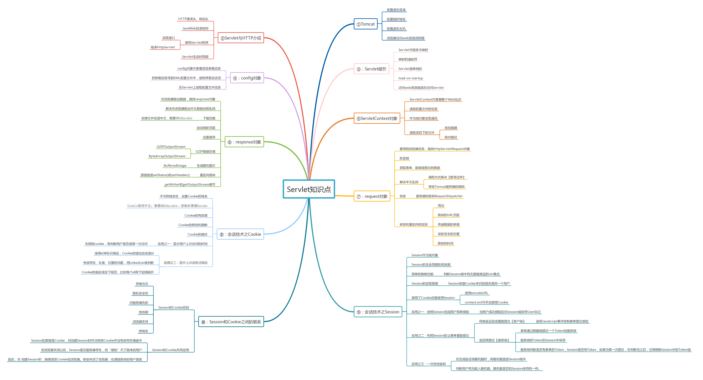

# Servlet
## 思维导图
Servlet的知识点可以用以下思维导图概括.
.

## Servlet介绍

## ServletConfig

## ServletContext

## Request

## Response

## Cookie

## Session

## Filter
Java类实现了Filter接口，就被称为过滤器。Filter接口内有三个方法：
1. `void init(FilterConfig var1) throws ServletException`;
2. `void  doFilter(ServletRequest request, ServletResponse response, FilterChain chain) throws IOException,ServletException`;
3. `void destroy()`; 

其中主要的方法为doFilter(). FilterChain为一个接口，里面又定了doFilter方法，其原因是：过滤器不仅有一个，在Java中使用了链式结构管理过滤器，把所有过滤器放在一个链式结构内。上一个过滤器在doFilter方法中调用chian的doFilter方法，以执行下一个过滤器（如果没有过滤器了，则执行目标资源）。

过滤器的执行顺序：
* 过滤器的执行顺序是看web.xml文件中mapping的先后顺序的。如果放在注解中配置，则比较urlPattern的字符串优先级。
* 过滤器是“嵌套”执行的。假设现在有Filter1，Filter2，那么执行顺序为：

过滤器1开始执行 -> 过滤器2开始执行 -> 执行目标资源 -> 过滤器2执行完毕 -> 过滤器1执行完毕

