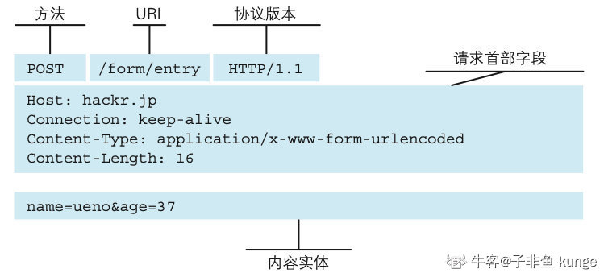
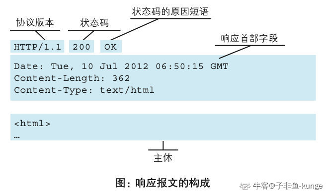

# HTTP
HTTP 全称 HyperText Transfer Proxy（超文本传输协议）。先看看几个与 HTTP 有关的概念。

## URI 与 URL
* URI（Uniform Resource Idendifier），统一资源标识符，用来定位互联网上的唯一资源。
* URL（Uniform Resource Location），统一资源定位符。URL 其实是 URI 的一个子集，不仅定义这个资源，而且定义了如何找到这个资源。

URL主要由四个部分组成：协议，主机，端口，路径，如下图所示。

## HTTP 报文格式
HTTP 报文格式如下图所示

请求和响应的报文格式都是基本相同的，只是起始行稍有不同。下面分别看一个请求和响应的例子

### 请求

请求方法通常有以下几类
* GET：请求 URL 指定的资源。GET 方法通常应该具有幂等性，即无论请求多少次，都只会返回资源，而不会额外创建或者改变资源。GET请求只有头部，没有请求体。
* HEAD：HEAD 请求应该与 GET 请求相同的资源，只不过 HEAD请求 只要求返回响应头部，不需要返回响应体。
* POST：POST 请求会提交一个请求体给服务器，一般用来创建、上传资源，不具有幂等性，一般将请求的资源附在请求体上传输。
* PUT：PUT 一般用来修改资源，与 POST 类似，将请求的资源附在请求体上传输。
* DELETE：DELETE 一般用来删除资源。
* OPTIONS：OPTIONS 请求 用来查询对资源可以实行的方法。这种请求在跨域中用的比较多（CORS）

### 响应

响应报文主要有5种类型的响应码：
* 1xx：提示信息，表示目前是协议处理的中间阶段，还需要后续的操作。例如 100 Continue
* 2xx：成功。报文已经收到并正确处理。
    * 200：OK。请求获取/创建资源 成功。
    * 201：Created。该请求已经成功，并因此创建了一个新的资源，通常使用在 POST 请求的响应中。
    * 206：Partial Content。服务器已成功处理了部分 GET 请求。
* 3xx：重定向。资源位置发生变化，需要客户端重新发送请求。
    * 301：Move Permanently。永久重定向，说明请求的资源已经永久被移动到了由 Location 指定的 URL 上，是固定的不会再变的。
    * 302：Found。临时重定向，表明请求的资源暂时移动到了由 Location 指定的 URL 上。
* 4xx：客户端错误。
    * 400：Bad Request。表明请求的语义有误或者参数有误。
    * 401：Unauthorized。当前请求用户需要验证。该响应必须包含一个适用于被请求资源的 WWW-Authenticate 信息头以询问用户信息。
    * 403：Forbidden。服务器已经理解请求但是拒绝执行，可以认为用户没有权限。
    * 404：Not Found。服务器未能发现所请求的资源。
    * 405：Method Not Allowed。该请求的资源不能执行指定的请求方法。该响应必须包含一个 Allow 头信息用以表示当前资源能够接受的请求方法列表。
* 5xx：服务器错误。
    * 500：Internal Server Error。服务器遇到意外情况并阻止请求执行。
    * 502：Bad Gateway。服务器作为网关需要得到一个处理这个请求的响应，但是得到了一个错误的响应。

### 常用头字段
请求和响应的 header 格式都是一样的，key-value 形式，用 `:` 分离。此外 HTTP 头部字段非常灵活，除了标准的 Host，Connection 等，也可以任意添加自定义头。

常用的头字段（待补充）