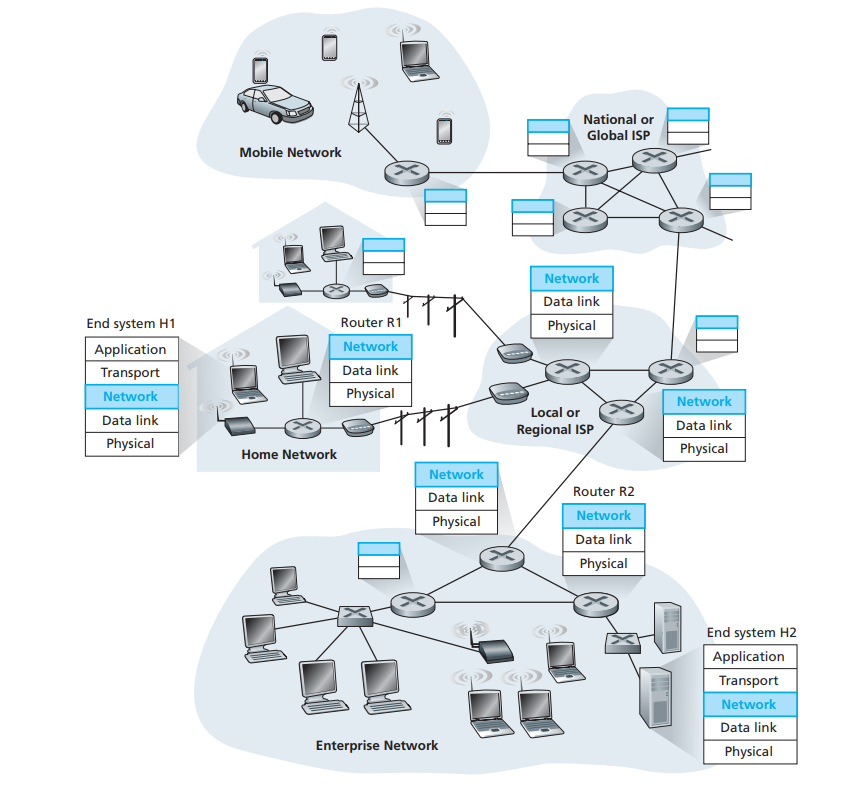
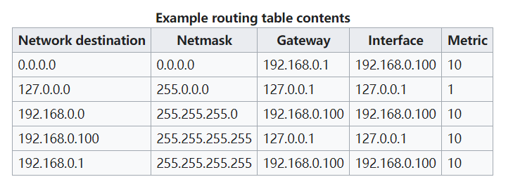
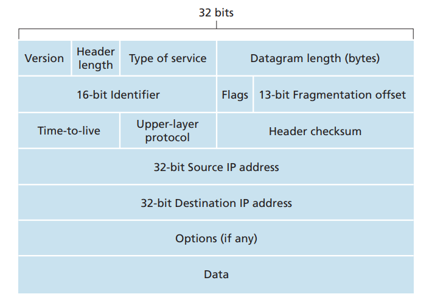

# 网络层（IP）
要理解网络层的作用，首先要回顾一下传输层的作用。传输层最大的特征就是 复用 和 分用。、

所谓的 复用 指的是主机所有进程共享一个传输层服务，所有应用层的数据包，最终都是交给传输层处理。所谓 分用 则是，数据包到达对端的传输层后，根据端口号识别它应该发往哪个进程，每一个进程都可以绑定一个或多个端口号。

如果把数据包通信比喻成物流传输，那么传输层的作用则是：控制物流的发货量，是否重发，什么时候重发，接收到数据包后返回确认，并决定将包分给谁。传输层的行为发生在端与端之间，而网络层则充当快递员的角色，需要根据目的地址，层层转发，最后交给目的端。
上面一节介绍了传输层。传输层是依赖网络层的主机到主机的通信服务。所以这里，我们需要了解这种主机到主机的通信服务的真实情况是什么。

如果说传输层是实现了 host 中进程之间的通信，那么网络层则是实现了 host 间的通信，它通过数据包的目标IP地址，不断找出通往该IP地址的路由器（下一跳路由器地址），并最终将数据包送往目的机器。所以网络层的本质功效是导航数据包去目标机器。

## 网络层的基本功能
上面我们较为抽象地概括了数据包在网络层的转发流程。接下来我们讨论网络层的两个基本功能，研究网络层的运作机制。

网络层的两个基本功能是 转发（Forwarding）和 路由选择（Routing）。两者含义不同，在这里做区分：
* 转发（Forwarding）：当数据包到达路由器的一条输入链路时，路由器必须将该分组移动到适当的输出链路，这个路由器本地的动作，这叫转发。
* 路由选择（Routing）：当分组从发送方流向接收方时，网络层必须决定这些分组所采用的路由或路径，计算这些路径的算法被称为 路由选择算法（Routing Algorithm）。

## 转发（Forwarding）
我们先来看看转发。每台路由器具有一张转发表（Forwarding Table）。路由器通过检查到达分组首部字段的值，然后使用该值在该路由器的转发表中索引查询。

转发表（因为处于网络层，有些地方也称之为路由表）的格式一般如下

* Network Destination 和 Netmask 一起描述了 Network Identifier。例如 目的地址 192.168.0.0 和 子网掩码 255.255.255.0 共同组成了 192.168.0.0/24
* Gateway 与 下一条（next hop）含义相同。
* Interface 表示 哪个本地网卡接口负责到达 Gateway。例如，在上面的路由表中，Gateway 192.168.0.1（互联网路由器）可以通过本地网卡 192.168.0.100 到达。
* Metrics 表示使用指定路由的开销。在进行路由选择的时候，这个指标会起到作用。

当对数据包进行转发时，路由器会解析出包中的 目的IP 地址，然后与表项中的 子网掩码 做 **与运算**，如果运算结果与表项中的 Network Destination 相同，那么代表符合该表项，可以转发。

另外，这里的第一条表项里的 目的地 和 子网掩码 都是 `0.0.0.0`，那么所有IP地址都能够匹配上这一条，所以这一条也可以称为 默认路由：所有不清楚该如何转发的IP地址，就转发到这条表项对应的网卡。

### IPv4 协议结构
介绍完路由表后，我们来看一下 IP数据包协议。IPv4 数据报协议如下图所示

* Version: 4 bit 字段，代表着网络数据包的协议版本号，目前有两种版本，IPv4 和 IPv6. 两者的数据包协议格式并不相同，这里不做深入探讨。
* Header length: 4 bit 字段，代表数据包首部长度。因为 IPv4 中有个 Options 的可选部分，这使得数据包首部可变长，因此需要指定。该字段为 4 bit，也就是最大值为 15， 这里每个单位代表 4字节。因此当 Header Length 为 15 时，数据包首部达到最大字节数，也就是 60 字节。目前绝大多数情况下，IPv4 的数据包首部都是 20 字节，Options 字段几乎不用。
* Type of service：8 bit 字段，表示数据包服务类型，可以指定其低延时、高吞吐量和可靠传输等属性，以便将不同类型的 IP数据包 相互区分开来。例如，将实时数据报（如用于IP电话应用）与非实时流量（如FTP）分开也许会有用。
* Datagram length(bytes): 16 bit 字段，制定了数据包的长度（包括首部和数据部分），单位是字节，它是 16 位的，因此理论上最大字节数为 65535，但是现实中，鲜有数据包长度超过 1500 字节。
* 16-bit Identifier、Flags 和 Fragmentation offset：这三个字段与 IP数据报分片 有关（下面会更详细的说明）。由于我们的数据链路层，能够通过的单个数据帧的大小是有限制的，它有一个最大传输单元的限制 MTU，当 IP数据报 的大小超过 MTU 时，就会被分片。数据报到达目的主机后才会被重组，重组会在将数据报交给上层传输层之前完成。当发送端发送一个数据报时，会为每个数据报写上一个标志，当该数据报被分片时，每个分片会被重新装到新的 数据报 中，但是这些分片的 Identifier 字段是相同的，最后一个分片的 flag 为 0，其他的为 1，而且每个分片还会记录自己处的偏移地址。
* Time to live：简称 TTL，8 bit 字段，用来确保数据报不会永远（如由于长时间的路由选择环路）在网络中循环。每当数据报被一台路由器处理时，该字段的值减 1. 若 TTL 字段减为0，则该数据报必须被丢弃。
* Upper-layer protocol：8 bit 字段，该字段指示了 IP数据报的数据部分应该交给哪个特定的传输层协议。例如，值为 6 表示要交给 TCP，值为 17 表示要交给 UDP。
* Header checksum: 16 bit 字段，首部检验和，用来帮助路由器检测收到的IP数据报中的比特错误。
* Source IP：32 bit 字段，源IP地址，即发送端的IP地址。
* Destination IP：32 bit 字段，目的IP地址，即接收方的IP地址。
* Options：可选首部，一般不用。
* Data：数据部分，一般是运输层包含首部和数据部分的整个包，也可以是 ICMP 数据包。

### IP数据报分片
我们要知道，并不是所有的链路层协议都能承载相同长度的网络层分组。有的协议能承载大数据报，有的协议只能承载小分组。例如，以太网帧能承载不超过1500字节的数据，而某些广域网链路的帧可承载不超过576字节的数据。

一个链路层帧能承载的最大数据量叫做 **最大传输单元（Maximum Transmission Unit, MTU）**。因为每个 IP数据报封装在链路层帧中从一台路由器传输到下一台路由器，故链路层协议的 MTU 严格限制着 IP数据报 的长度。而且最大的问题在于，在发送方和目的地路径上的每段链路都可能使用不同的链路层协议，且每个协议都可能有不同的 MTU。

解决该问题的方法是将 IP数据报 中的数据部分分成多个较小的 IP数据报，用单独的链路层帧封装这些较小的 IP数据报。每个这些较小的数据报都称为 片（fragment）。

片在其到达目的地运输层之前需要重新组装。实际上，TCP 和 UDP 都希望从网络层收到完整的未分片的报文（也的确是这样的）。IPv4 的设计者感到在路由器中重新组装数据报会给协议带来相当大的复杂性并且影响路由器性能，因此他们决定将数据报的重新组装工作放到端系统中，而不是网络路由器中。

为了让目的主机能够成功执行重新组装的任务，IPv4 的设计者 将 16-bit Idendifier, Flags, Fragmentation offset（标识、标志 和 片偏移） 这三个字段放在 IP数据报 首部。当发送端发送一个数据报时，会为每个数据报写上一个标志，当该数据报被分片时，每个分片会被重新装到新的 数据报 中，但是这些分片的 Identifier 字段是相同的，最后一个分片的 flag 为 0，其他的为 1，而且每个分片还会记录自己处的偏移地址。

IP分片在将许多不同的链路层技术粘合起来起到了重要作用。但是分片也是有开销的。
* 首先，它使路由器和端系统更复杂。
* 其次，分片能够被用于生成 Dos 攻击，攻击者可以发送一系列古怪的，无法预期的片。Jolt2 攻击就是一个典型例子，其中某攻击者向目标主机发送了小片的流，这些片中没有一个片的偏移量是 0. 当目标试图从这些不良分组中重建数据报时，可能会崩溃。
* 另一类行为是发送交迭的 IP片，这些片的偏移量地址被设置地不能适当的排列起来。易受攻击的操作系统由于对交迭的片不知道该如何应对，可能会崩溃。

IP协议的新版本 IPv6 从根本上废止了分片，从而简化了 IP分组 的处理，并且使得 IP 不太容易受到攻击。

### 无类别域间路由选择（CIDR）
因特网的地址分配策略被称为 无类别域间路由选择（Classless Interdomain Routing）。CIDR 将子网寻址的概念一般化。对于子网寻址，32比特的IP地址被分为两部分，并且也具有点分十进制数形式 a.b.c.d/x，其中 x 指示了地址的第一部分中的比特数。

形式如 `a.b.c.d/x` 的地址的 x 最高比特构成了 IP地址 的网络部分，并且经常被称为该地址的 前缀（prefix）。一个组织通常被分配一块连续的地址，即具有相同前缀的一段地址。

### 网络地址转换（NAT）
由于IPv4是由32位整型数值表示，因此他能够表示的IP一共是2^32个，大约是42亿个。IP地址非常有限，而我们使用IP的需求却非常大，为了缓解这个问题，专家们将以下几个地址段作为私有网络地址段，凡是数据包IP地址在以下三个地址段之内的，均会被视为是私有网络的IP，他们是不能在公网上传输的，他们分别是：
* 10.0.0.0 - 10.255.255.255.255
* 172.16.0.0 - 172.31.255.255
* 192.168.0.0 - 192.168.255.255

这样，我们可以给某个区域内的所有用户，将其规划为一个私有网络，而这个私有网络内所有的用户则共享一个公网IP（比如我们的公司网络，家庭网络等）。这种做法可以使一个公网IP被众多用户共享，它的存在节约了大量的公网IP地址。包含这三个区间范围内的IP数据包不能在公网上被转发，他们只能使用同一个公网IP，因此私有网络内发出去的IP数据包，需要将自己的source ip和共用的公网IP做一层映射关系，这种关系被称之为Network Address Translation。

我们发出的数据包一般是应用进程发出的，而应用进程要使用网络，往往需要绑定一个端口号，而NAT映射，则是将私有网络内的一个host，发出的数据包中，将其source ip和port，映射到公网ip和另一个port上，如下图所示。

右边3个host处于同一个私有网络中，当他们的10.0.0.1这个host上的，端口为3345的进程，发送一个数据包（目标IP为128.119.40.186端口为80）时，当数据包经过他们的gateway时，该数据包的source ip会被替换为该网络共享的公网ip：138.76.29.7，将3345端口替换为5001。数据包达到目标后，如有数据包返回，则会将返回包发往绑定138.76.29.7的路由器，当数据包达到时，gateway路由器又会将这个目标地址为138.76.29.7，端口为5001的数据包的目标ip修改为10.0.0.1端口号修改为3345，从而使数据包能够在私有网络上传输，最后返回给绑定10.0.0.1这个ip的host上。

通过上面的流程，我们可以得出一个结论，运行私有网络的内网中运行的进程，要和外网进行通信，需要在gateway建立一个映射关系，需要 公网ip+port 映射内部网络的一个应用进程，所对应的ip和port。数据包出去时，要对source ip和source port进行修改，然后才能在公网上被转发；返回时，需要对destination ip和destination port进行修改，然后才能在内网中进行转发。

NAT 在近几年得到了十分广泛的使用。但是，许多 IETF 团体中的人大声疾呼反对 NAT。主要有三个原因：
1. 他们认为端口号是用于进程编址的，而不是用于主机编址的。
2. 他们认为路由器通常仅应当处理高达第三层的分组。
3. 他们认为 NAT 协议违反了端到端原则，即主机彼此应该相互直接对话，结点不应介入修改 IP地址 和 端口号。
4. 他们认为应该使用 IPv6 来解决 IP地址短缺的问题，而不是不计后果的使用如NAT之类的权宜之计。

但不管喜欢与否，NAT 已经成为了因特网中的一个重要组件。 

## 路由选择（Routing）
上面研究的都是网络层的转发功能。我们知道当分组到达一台路由器时，该路由器索引其转发表并决定该分组被指向的链路接口。我们也知道路由选择算法在网络路由器中运行、交换和计算信息，用这些信息配置这些转发表。

对路由选择算法的一种广义分类方式是 根据该算法是全局式的还是分散式的来加以区分。
* 全局式路由选择算法（global routing algorithm）用完整的、全局性的网络知识计算出从源到目的地之间的最低费用路径。该算法以所有结点之间的连通性及所有链路的费用为输入，要求算法在真正开始计算之前，以某种方式获得这些信息。实践中，具有全局状态信息的算法常被称为链路状态（Link State，LS）算法，因为该算法必须知道网络中每条链路的费用。
* 分散式路由选择算法（decentralized routing algorithm）以迭代，分布式的方式计算出最低费用路径。没有结点拥有关于所有网络链路费用的完整信息，而每个结点仅有与其直接相连链路的费用知识即可开始工作。比较经典的有被称为 距离向量（Distance-Vector，DV）算法的分布式路由选择算法。

因特网中的路由选择协议包含了之前看过的原理，主要有 路由选择信息协议（RIP） 和 开放最短路优先（OSPF）。

详情以后再说。