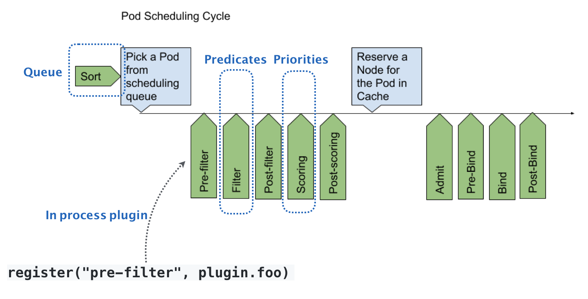

# Scheduler
这里介绍一下 Kubernetes 的默认调度器（default scheduler）。

在 Kubernetes 项目中，默认调度器的主要职责，就是为一个新建出来的 Pod，寻找一个合适的节点（Node）。

而这里的“最合适”，包含了两层含义：
1. 从集群所有的节点中，根据调度算法挑选出所有可以运行该 Pod 的节点；
2. 从第一步的结果中，再根据调度算法挑选出一个最符合条件的节点作为最终结果。

所以在具体的调度流程中，默认调度器会首先调用一组叫做 Predicate 的调度算法，来检查每个 Node。然后，再调用一组叫做 Priority 的调度算法，来给上一步得到的结果里的每个 Node 打分。最终的调度结果，就是得分最高的那个 Node。

而调度器对每一个 Pod 调度成功，实际上就是将它的 `spec.nodeName` 字段填上调度结果的节点名字。

在 Kubernetes 中，上述调度机制的工作原理，可以用如下所示的一副示意图来表示。


可以看到，Kubernetes 默认调度器的核心，实际上就是两个相互独立的控制循环。

## Informer Path
第一个控制循环，我们可以称之为 Informer Path。它的主要目的，是启动一系列的 Informer，用来监听（watch）Etcd 中 Pod，Node，Service 等与调度相关的 API 对象的变化。例如，当一个待调度 Pod（即，它的 nodeName 字段是空的）被创建出来后，调度器就会通过 Pod Informer 的 Handler，将这个待调度 Pod 添加进调度队列。

在默认情况下，Kubernetes 的调度队列是一个 PriorityQueue（优先级队列），并且当某些集群信息发生变化时，调度器还会对调度队列里的内容进行一些特殊操作。这里的设计，主要是出于调度优先级和抢占的考虑。

此外，Kubernetes 的默认调度器还要负责对调度器缓存（即：scheduler cache）进行更新。事实上，Kubernetes 调度部分进行性能优化的一个最根本原则，就是尽最大可能将集群信息 Cache 化，以便从根本上提高 Predicate 和 Priority 调度算法的执行效率。

## Scheduling Path
而第二个控制循环，是调度器负责 Pod 调度的主循环，我们可以称之为 Scheduling Path。

Scheduling Path 的主要逻辑，就是不断地从调度队列里出队一个 Pod。然后，调用 Predicates 算法进行“过滤”。这一步“过滤”得到的一组 Node，就是所有可以运行这个 Pod 的宿主机列表。当然，Predicates 算法需要的 Node 信息，都是从 Scheduler Cache 里直接拿到的，这是调度器保证算法执行效率的主要手段之一。

接下来，调度器就会再调用 Priorities 算法为上述列表里的 Node 打分，分数从 0 到 10。得分最高的 Node，就会作为这次调度的结果。

调度算法执行完成后，调度器就需要将 Pod 对象的 nodeName 字段的值，修改为上述 Node 的名字。这个步骤在 Kubernetes 里面被称作 Bind。

但是，为了不在关键调度路径里远程访问 APIServer，Kubernetes 的默认调度器在 Bind 阶段，只会更新 Scheduler Cache 里的 Pod 和 Node 的信息。这种基于“乐观”假设的 API 对象更新方式，在 Kubernetes 里被称作 Assume。

Assume 之后，调度器才会创建一个 Goroutine 来异步地向 APIServer 发起更新 Pod 的请求，来真正完成 Bind 操作。如果这次异步的 Bind 过程失败了，其实也没有太大关系，等 Scheduler Cache 同步之后一切就会恢复正常。

当然，正是由于上述 Kubernetes 调度器的“乐观”绑定的设计，当一个新的 Pod 完成调度需要在某个节点上运行起来之前，该节点上的 kubelet 还会通过一个叫作 Admit 的操作来再次验证该 Pod 是否确实能够运行在该节点上。这一步 Admit 操作，实际上就是把一组叫作 GeneralPredicates 的、最基本的调度算法，比如：“资源是否可用”“端口是否冲突”等再执行一遍，作为 kubelet 端的二次确认。

除了上述的“Cache 化”和“乐观绑定”，Kubernetes 默认调度器还有一个重要的设计，那就是“无锁化”。

在 Scheduling Path 上，调度器会启动多个 Goroutine 以节点为粒度并发执行 Predicates 算法，从而提高这一阶段的执行效率。而与之类似的，Priorities 算法也会以 MapReduce 的方式并行计算然后再进行汇总。而在这些所有需要并发的路径上，调度器会避免设置任何全局的竞争资源，从而免去了使用锁进行同步带来的巨大的性能损耗。

所以，在这种思想的指导下，如果你再去查看一下前面的调度器原理图，你就会发现，Kubernetes 调度器只有对调度队列和 Scheduler Cache 进行操作时，才需要加锁。而这两部分操作，都不在 Scheduling Path 的算法执行路径上。

当然，Kubernetes 调度器的上述设计思想，也是在集群规模不断增长的演进过程中逐步实现的。尤其是 “Cache 化”，这个变化其实是最近几年 Kubernetes 调度器性能得以提升的一个关键演化。

不过，随着 Kubernetes 项目发展到今天，它的默认调度器也已经来到了一个关键的十字路口。事实上，Kubernetes 现今发展的主旋律，是整个开源项目的“民主化”。也就是说，Kubernetes 下一步发展的方向，是组件的轻量化、接口化和插件化。所以，我们才有了 CRI、CNI、CSI、CRD、Aggregated APIServer、Initializer、Device Plugin 等各个层级的可扩展能力。可是，默认调度器，却成了 Kubernetes 项目里最后一个没有对外暴露出良好定义过的、可扩展接口的组件。

当然，这是有一定的历史原因的。在过去几年，Kubernetes 发展的重点，都是以功能性需求的实现和完善为核心。在这个过程中，它的很多决策，还是以优先服务公有云的需求为主，而性能和规模则居于相对次要的位置。

而现在，随着 Kubernetes 项目逐步趋于稳定，越来越多的用户开始把 Kubernetes 用在规模更大、业务更加复杂的私有集群当中。很多以前的 Mesos 用户，也开始尝试使用 Kubernetes 来替代其原有架构。在这些场景下，对默认调度器进行扩展和重新实现，就成了社区对 Kubernetes 项目最主要的一个诉求。

所以，Kubernetes 的默认调度器，是目前这个项目里为数不多的、正在经历大量重构的核心组件之一。这些正在进行的重构的目的，一方面是将默认调度器里大量的“技术债”清理干净；另一方面，就是为默认调度器的可扩展性设计进行铺垫。

而 Kubernetes 默认调度器的可扩展性设计，可以用如下所示的一幅示意图来描述：



可以看到，默认调度器的可扩展机制，在 Kubernetes 里面叫作 Scheduler Framework。顾名思义，这个设计的主要目的，就是在调度器生命周期的各个关键点上，为用户暴露出可以进行扩展和实现的接口，从而实现由用户自定义调度器的能力。

上图中，每一个绿色的箭头都是一个可以插入自定义逻辑的接口。比如，上面的 Queue 部分，就意味着你可以在这一部分提供一个自己的调度队列的实现，从而控制每个 Pod 开始被调度（出队）的时机。

而 Predicates 部分，则意味着你可以提供自己的过滤算法实现，根据自己的需求，来决定选择哪些机器。

需要注意的是，上述这些可插拔式逻辑，都是标准的 Go 语言插件机制（Go plugin 机制），也就是说，你需要在编译的时候选择把哪些插件编译进去。

有了上述设计之后，扩展和自定义 Kubernetes 的默认调度器就变成了一件非常容易实现的事情。这也意味着默认调度器在后面的发展过程中，必然不会在现在的实现上再添加太多的功能，反而还会对现在的实现进行精简，最终成为 Scheduler Framework 的一个最小实现。而调度领域更多的创新和工程工作，就可以交给整个社区来完成了。这个思路，是完全符合我在前面提到的 Kubernetes 的“民主化”设计的。

不过，这样的 Scheduler Framework 也有一个不小的问题，那就是一旦这些插入点的接口设计不合理，就会导致整个生态没办法很好地把这个插件机制使用起来。而与此同时，这些接口本身的变更又是一个费时费力的过程，一旦把控不好，就很可能会把社区推向另一个极端，即：Scheduler Framework 没法实际落地，大家只好都再次 fork kube-scheduler。

## 总结
在本篇文章中，我为你详细讲解了 Kubernetes 里默认调度器的设计与实现，分析了它现在正在经历的重构，以及未来的走向。

不难看到，在 Kubernetes 的整体架构中，kube-scheduler 的责任虽然重大，但其实它却是在社区里最少受到关注的组件之一。这里的原因也很简单，调度这个事情，在不同的公司和团队里的实际需求一定是大相径庭的，上游社区不可能提供一个大而全的方案出来。所以，将默认调度器进一步做轻做薄，并且插件化，才是 kube-scheduler 正确的演进方向。

下面，我们具体看看默认调度器里面的调度策略有哪些，是如何实现的。

## Predicates
首先看看 Predicates。Predicates 在调度中的作用，可以理解为 Filter。即：它按照调度策略，从当前集群的所有节点中，“过滤”出一些符合条件的节点。这些节点，都是可以运行待调度 Pod 的宿主机。

而在 Kubernetes 中，默认的调度策略有以下四种。

### GeneralPredicates
第一种叫 GeneralPredicates。顾名思义，这一组过滤规则，负责的是最基础的调度策略。比如，PodFitsResources 计算的就是宿主机的 CPU 和内存资源是否够用。

当然，我在前面已经提到过，PodFitsResources 检查的只是 Pod 的 requests 字段。需要注意的是，Kubernetes 的调度器并没有为 GPU 等硬件资源定义具体的资源类型，而是统一用一种名叫 Extended Resource 的、Key-Value 格式的扩展字段来描述的。

而 PodFitsHost 检查的是，宿主机的名字是否跟 Pod 的 spec.nodeName 一致。

PodFitsHostPorts 检查的是，Pod 申请的宿主机端口（spec.nodePort）是不是跟已经被使用的端口有冲突。

PodMatchNodeSelector 检查的是，Pod 的 nodeSelector 或者 nodeAffinity 指定的节点，是否与待考察节点匹配，等等。

可以看到，像上面这样一组 GeneralPredicates，正是 Kubernetes 考察一个 Pod 能不能运行在一个 Node 上最基本的过滤条件。所以，GeneralPredicates 也会被其他组件（比如 kubelet）直接调用。

之前已经提到过，kubelet 在启动 Pod 前，会执行一个 Admit 操作来进行二次确认。这里二次确认的规则，就是执行一遍 GeneralPredicates。

### 与 Volume 相关的过滤规则
第二种类型，是与 Volume 相关的过滤规则。

这一组过滤规则，负责的是跟容器持久化 Volume 相关的调度策略。

其中，NoDiskConflict 检查的条件，是多个 Pod 声明挂载的持久化 Volume 是否有冲突。比如，AWS EBS 类型的 Volume，是不允许被两个 Pod 同时使用的。所以，当一个名叫 A 的 EBS Volume 已经被挂载在了某个节点上时，另一个同样声明使用这个 A Volume 的 Pod，就不能被调度到这个节点上了。

而 MaxPDVolumeCountPredicate 检查的条件，则是一个节点上某种类型的持久化 Volume 是不是已经超过了一定数目，如果是的话，那么声明使用该类型持久化 Volume 的 Pod 就不能再调度到这个节点了。

而 VolumeZonePredicate，则是检查持久化 Volume 的 Zone（高可用域）标签，是否与待考察节点的 Zone 标签相匹配。

此外，这里还有一个叫作 VolumeBindingPredicate 的规则。它负责检查的，是该 Pod 对应的 PV 的 nodeAffinity 字段，是否跟某个节点的标签相匹配。

此外，如果该 Pod 的 PVC 还没有跟具体的 PV 绑定的话，调度器还要负责检查所有待绑定 PV，当有可用的 PV 存在并且该 PV 的 nodeAffinity 与待考察节点一致时，这条规则才会返回“成功”。比如下面这个例子：
```yaml
apiVersion: v1
kind: PersistentVolume
metadata:
  name: example-local-pv
spec:
  capacity:
    storage: 500Gi
  accessModes:
  - ReadWriteOnce
  persistentVolumeReclaimPolicy: Retain
  storageClassName: local-storage
  local:
    path: /mnt/disks/vol1
  nodeAffinity:
    required:
      nodeSelectorTerms:
      - matchExpressions:
        - key: kubernetes.io/hostname
          operator: In
          values:
          - my-node
```
可以看到，这个 PV 对应的持久化目录，只会出现在名叫 my-node 的宿主机上。所以，任何一个通过 PVC 使用这个 PV 的 Pod，都必须被调度到 my-node 上才可以正常工作。VolumeBindingPredicate，正是调度器里完成这个决策的位置。

### 宿主机相关的过滤规则
第三组规则，主要是考察待调度 Pod 是否满足 Node 本身的某些条件。

比如，PodToleratesNodeTaints，负责检查的就是我们前面经常用到的 Node 的“污点”机制。只有当 Pod 的 Toleration 字段与 Node 的 Taint 字段能够匹配的时候，这个 Pod 才能被调度到该节点上。

而 NodeMemoryPressurePredicate，检查的是当前节点的内存是不是已经不够充足，如果是的话，那么待调度 Pod 就不能被调度到该节点上。

### 与 Pod 相关的过滤规则
第四组规则，跟 GeneralPredicates 大多数是重合的。而比较特殊的，是 PodAffinityPredicate。这个规则的作用是，检查待调度 Pod 与 Node 上已有 Pod 之间的亲密度（Affinity）和反亲密度（anti-affinity）关系。

比如下面这个例子
```yaml
apiVersion: v1
kind: Pod
metadata:
  name: with-pod-antiaffinity
spec:
  affinity:
    podAntiAffinity: 
      requiredDuringSchedulingIgnoredDuringExecution: 
      - weight: 100  
        podAffinityTerm:
          labelSelector:
            matchExpressions:
            - key: security 
              operator: In 
              values:
              - S2
          topologyKey: kubernetes.io/hostname
  containers:
  - name: with-pod-affinity
    image: docker.io/ocpqe/hello-pod
```

这个例子里的 podAntiAffinity 规则，就指定了这个 Pod 不希望和任何携带了 security=S2 标签的 Pod 存在于同一个 Node 上。需要注意的是，PodAffinityPredicate 是有作用域的，比如上面这条规则，就仅对携带了 Key 是kubernetes.io/hostname标签的 Node 有效。这正是 topologyKey 这个关键词的作用。

而与 podAntiAffinity 相反的，就是 podAffinity，比如下面这个例子：
```yaml
apiVersion: v1
kind: Pod
metadata:
  name: with-pod-affinity
spec:
  affinity:
    podAffinity: 
      requiredDuringSchedulingIgnoredDuringExecution: 
      - labelSelector:
          matchExpressions:
          - key: security 
            operator: In 
            values:
            - S1 
        topologyKey: failure-domain.beta.kubernetes.io/zone
  containers:
  - name: with-pod-affinity
    image: docker.io/ocpqe/hello-pod
```

这个例子里的 Pod，就只会被调度到已经有携带了 security=S1 标签的 Pod 运行的 Node 上。而这条规则的作用域，则是所有携带 Key 是failure-domain.beta.kubernetes.io/zone标签的 Node。

此外，上面这两个例子里的 requiredDuringSchedulingIgnoredDuringExecution 字段的含义是：这条规则必须在 Pod 调度时进行检查（requiredDuringScheduling）；但是如果是已经在运行的 Pod 发生变化，比如 Label 被修改，造成了该 Pod 不再适合运行在这个 Node 上的时候，Kubernetes 不会进行主动修正（IgnoredDuringExecution）。

上面这四种类型的 Predicates，就构成了调度器确定一个 Node 可以运行待调度 Pod 的基本策略。

在具体执行的时候， 当开始调度一个 Pod 时，Kubernetes 调度器会同时启动 16 个 Goroutine，来并发地为集群里的所有 Node 计算 Predicates，最后返回可以运行这个 Pod 的宿主机列表。

需要注意的是，在为每个 Node 执行 Predicates 时，调度器会按照固定的顺序来进行检查。这个顺序，是按照 Predicates 本身的含义来确定的。比如，宿主机相关的 Predicates 会被放在相对靠前的位置进行检查。要不然的话，在一台资源已经严重不足的宿主机上，上来就开始计算 PodAffinityPredicate，是没有实际意义的。

## Priority
接下来，我们再来看一下 Priorities。

在 Predicates 阶段完成了节点的“过滤”之后，Priorities 阶段的工作就是为这些节点打分。这里打分的范围是 0-10 分，得分最高的节点就是最后被 Pod 绑定的最佳节点。

Priorities 里最常用到的一个打分规则，是 LeastRequestedPriority。它的计算方法，可以简单地总结为如下所示的公式：

```
score = (cpu((capacity-sum(requested))10/capacity) + memory((capacity-sum(requested))10/capacity))/2
```

可以看到，这个算法实际上就是在选择空闲资源（CPU 和 Memory）最多的宿主机。

而与 LeastRequestedPriority 一起发挥作用的，还有 BalancedResourceAllocation。它的计算公式如下所示：

```
score = 10 - variance(cpuFraction,memoryFraction,volumeFraction)*10
```

其中，每种资源的 Fraction 的定义是：Pod 请求的资源 / 节点上的可用资源。而 variance 算法的作用，则是计算每两种资源 Fraction 之间的距离。而最后选择的，则是资源 Fraction 差距最小的节点。

所以说，BalancedResourceAllocation 选择的，其实是调度完成后，所有节点里各种资源分配最均衡的那个节点，从而避免一个节点上 CPU 被大量分配，而 Memory 大量剩余的情况。

此外，还有 NodeAffinityPriority、TaintTolerationPriority 和 InterPodAffinityPriority 这三种 Priority。顾名思义，他们与前面的  PodMatchNodeSelector、PodToleratesNodeTaints 和 PodAffinityPredicate 这三个 Predicate 的含义和计算方法是类似的。但是作为 Priority，一个 Node 满足上述规则的字段数目越多，它的得分就会越高。

在默认 Priorities 里，还有一个叫作 ImageLocalityPriority 的策略。它是在 Kubernetes v1.12 里新开启的调度规则，即：如果待调度 Pod 需要使用的镜像很大，并且已经存在于某些 Node 上，那么这些 Node 的得分就会比较高。

当然，为了避免这个算法引发调度堆叠，调度器在计算得分的时候还会根据镜像的分布进行优化，即：如果大镜像分布的节点数目很少，那么这些节点的权重就会被调低，从而“对冲”掉引起调度堆叠的风险。

以上，就是 Kubernetes 调度器的 Predicates 和 Priorities 里默认调度规则的主要工作原理了。

在实际的执行过程中，调度器里关于集群和 Pod 的信息都已经缓存化，所以这些算法的执行过程还是比较快的。

此外，对于比较复杂的调度算法来说，比如 PodAffinityPredicate，它们在计算的时候不只关注待调度 Pod 和待考察 Node，还需要关注整个集群的信息，比如，遍历所有节点，读取它们的 Labels。这时候，Kubernetes 调度器会在为每个待调度 Pod 执行该调度算法之前，先将算法需要的集群信息初步计算一遍，然后缓存起来。这样，在真正执行该算法的时候，调度器只需要读取缓存信息进行计算即可，从而避免了为每个 Node 计算 Predicates 的时候反复获取和计算整个集群的信息。

## 总结
在本篇文章中，主要讲述了 Kubernetes 默认调度器里的主要调度算法。

需要注意的是，除了本篇讲述的这些规则，Kubernetes 调度器里其实还有一些默认不会开启的策略。你可以通过为 kube-scheduler 指定一个配置文件或者创建一个 ConfigMap ，来配置哪些规则需要开启、哪些规则需要关闭。并且，你可以通过为 Priorities 设置权重，来控制调度器的调度行为。

