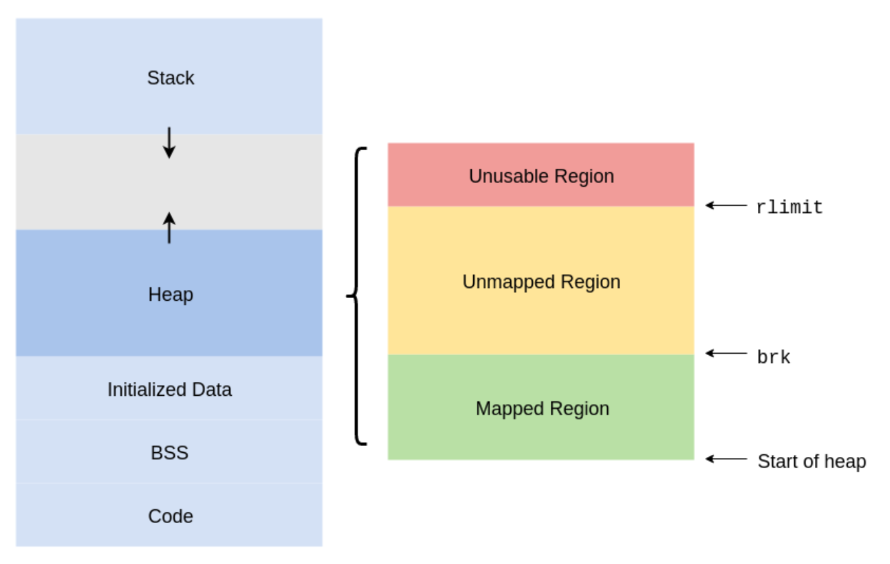
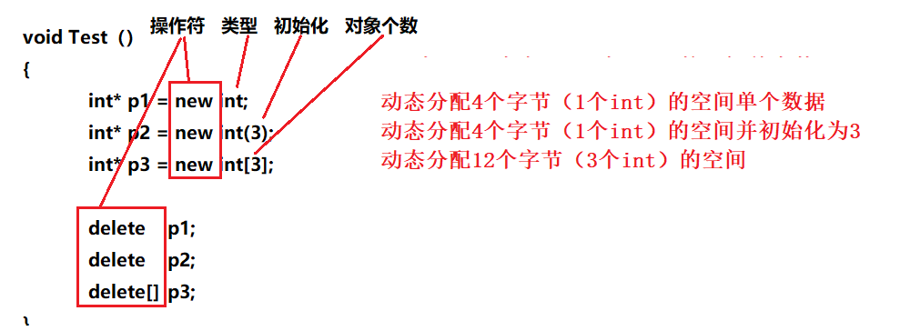

# 动态内存管理

## malloc与free
malloc与free是C语言标准库中的函数，用于动态内存分配与释放。

`malloc`
* C语言中的标准库函数，存在于头文件`<stdlib.h>`中。
* 函数声明为： `void* malloc(size_t size)`。
* 作用：为开辟一块`size`大小的内存空间，如果分配成功则返回指向这块空间的指针，分配失败则返回空指针NULL。

`free`
* 也是C语言中的标准库函数，存在与头文件`<stdlib.h>`中。
* 函数声明为： `void free(void *ptr)`。
* 作用：将分配给指针ptr指向区域的内存空间进行回收。
* 这里的ptr必须已经被`malloc`或者`realloc`,`calloc`类型的函数调用过，否则会产生未定义行为。
* 如果free(ptr)已经被调用过，重复调用也会产生未定义行为。
* 如果ptr为NULL，不执行任何操作。

### 实现原理
malloc以及free可以有多种实现方式，并且没有一种方法是完美的，因为我们需要在速度，开销和避免碎片/空间有效性之间做出折衷。

简单来说，我们把进程中一个从x到y的内存区域称为「堆」。所有`malloc`函数分配的内存会存在这个区域中。`malloc`会维护一个数据结构，我们干脆简化为一个链表，其中含有内存块的「元信息」，以及真正存放数据的「内存块区域」。当我们调用`malloc`的时候，它会遍历这个列表寻找有没有合适大小的未分配的内存块，如果有的话，将其指针返回，并且标记这块内存已经被分配了；如果没有的话，它会使用`sbrk()`这个系统调用来扩大堆区域，也就是说增加y的值（注意这里`sbrk`一定是一个系统调用，我们不可能从用户空间去改变堆的大小）。并且，这里的y是不能无限制增长的，在Linux中有一个变量`RLIMIT_DATA`用来限制进程中数据区（data segment，包括初始化数据，未初始化数据以及堆）的最大值。当堆区增长到最大限度后，再调用`sbrk`就会报`ENOMEM`错误。



我们还要注意，在Linux实现中，当malloc申请的内存超过`MMAP_THRESHOLD`时，它就不会使用`sbrk`去增加堆大小分配内存了，而是直接使用`mmap`系统调用做一个私有匿名映射，为其分配内存。这里的`MMAP_THRESHOLD`默认为128KB，并且可以通过`mallopt`系统调用去修改其大小。这里我们没有直接堆内存，因此内存分配大小不会受到`RLIMIT_DATA`的影响。

另一方面，`free(void *ptr)`在实现的时候，会找到ptr所对应的，之前所分配的内存块，将它标记为未分配，并且加入「未分配链表」中，同时还会进行一些空闲内存整合的操作，来减小内存碎片。

## new和delete
在C语言中，我们写程序时，总是会有动态开辟内存的需求，每到这个时候我们就会想到用malloc/free 去从堆里面动态申请出来一段内存给我们用。但对这一块申请出来的内存，往往还需要我们对它进行稍许的“加工”后即初始化 才能为我们所用，虽然C语言为我们提供了`calloc`来开辟一段初始化好（0）的一段内存，但面对象中各是各样的数据成员初始化，它同样束手无策。同时，为了保持良好的编程习惯，我们也都应该对申请出来的内存作手动进行初始化。
对此，这常常让我们感到一丝繁琐，于是到了C++中就有了`new/delete, new[]/delete[]` ，用它们便可实现动态的内存管理。

在C++中，把int 、char..等内置类型的变量也看作对象，它们也是存在构造函数和析构函数的，只是通常对它们，系统调用了默认的构造函数来初始化以及默认的析构（编译器优化）。所以new int、new int(3)看起来和普通的定义好像没什么区别。 但对于自定义类型的对象，此种方式在创建对象的同时，还会将对象初始化好；于是new/delete、new []/delete []方式管理内存相对于malloc/free的方式管理的优势就体现出来了，因为它们能保证对象一被创建出来便被初始化，出了作用域便被自动清理。

new/delete 是C++中的「关键字」，需要编译器支持。他们的使用格式入下：


new会先调用operator new函数，申请足够的内存（通常底层使用malloc实现）。然后调用类型的构造函数，初始化成员变量，最后返回自定义类型指针。delete先调用析构函数，然后调用operator delete函数释放内存（通常底层使用free实现）。

这里提到的`operator new`, `operator delete`是C++标准库函数。而 new/delete 关键字真正的实现就是依赖于那几个函数的。在C++中我们称之为‘placement版’内存管理接口。
```c++
void* operator new (size_t size);　　
void operator delete (size_t size);

void* operator new [](size_t size);　　
void operator delete[] (size_t size);
```

所以，我们可以得出 new/delete 关键字的执行步骤大致如下：
```c
new -> operator new -> malloc -> 构造函数  //初始化一个对象时
new -> operator new[] -> operator new -> malloc -> 构造函数 //初始化多个对象时
delete -> 析构函数 -> operator delete -> free //删除单个对象时
delete -> 析构函数 -> operator delete[] -> operator delete -> free //删除多个对象时
```
为了避免上述表示产生混乱，在此作出解释：operator new 底层是由 malloc 实现的，operator delete 底层是由 free 实现的（也不是必须，这其实取决于 C++标准库 具体是如何去实现这几个函数的），但是构造函数和析构函数并不是包含在operator函数中的，在new关键词中构造函数是在operator函数之后执行的，在delete关键字中析构函数是在operator函数之前执行的。

另外，我们发现，由于在delete的时候我们要执行析构函数，如果是 delete[] 的话，我们要对所有对象依次执行析构函数，所以我们必须要知道「对象的数量」。但是我们发现在 delete[] 语法中只需传入指针，无需传入数量，那么它是如何知道对象的数目呢？

这其实是因为，在使用 new[] 关键字创建对象时，编译器会首先用4个字节「保存对象数量」，然后在后移4个字节的地方才会调用 operator new[]函数，这样可以保证返回指针的「前面4个字节」存储的是对象数量，也就是说 delete[] 关键字 在删除对象的时候，只需要读取指针对象「之前的4个字节」即可得到对象数量，进行析构处理，然后再调用 operator delete[] 进行内存的释放。

同时我们还要注意，并不是对于每一个 new[] 都会开辟这么4个字节去存储对象数量。对于没有显示定义析构函数的对象类型，例如 int, char这种，编译器就会进行优化，不额外开启内存存储对象数量，因为这些对象并不需要依次调用析构函数，所以直接无脑释放就行了。

所以根据以上，我们必须注意：new一定要和delete配套使用，new[] 一定要和 delete[] 配套使用。


## malloc/free 与 new/delete 区别和联系

*  malloc/free只是动态分配内存空间/释放空间。而new/delete除了分配空间还会调用构造函数和析构函数进行初始化与清理（清理成员）。
*  它们都是动态管理内存的入口。
*  malloc/free是C/C++标准库的函数，new/delete是C++操作符。
*  malloc/free需要手动计算类型大小且返回值为void*，new/delete可自动计算类型的大小，返回对应类型的指针。
*  malloc/free管理内存失败会返回NULL，new/delete等的方式管理内存失败会抛出异常。
