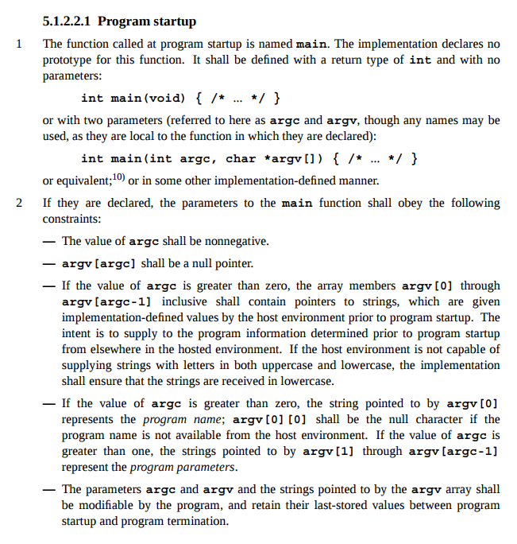
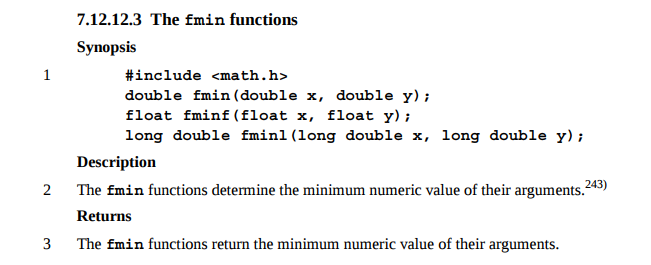

# C/C++ 标准库
在学习 C/C++ 的日子里，我们经常会有一个困惑：我们在代码里使用的标准库函数和类都是哪里来的？谁实现了它们？它们是打包好在操作系统里了吗？有没有官方的 C/C++ 手册呢？

在这篇文章里，我会通过讲述C和C++的一些核心概念以及库函数实现等，尽力去回答这些问题。

## C和C++是如何被创造出来的
当我们在谈论C和C++时，我们实际上是在谈论一系列的规则，这些规则定义了这个语言应该做什么，怎么做，以及需要提供什么样的功能。C/C++编译器必须遵循这些规则，从而处理C/C++源代码以生成可执行程序。这听起来与HTML很相似：HTML是浏览应该遵循的一系列指令从而使其能够以一种确定的方式渲染出网页。

与HTML类似，C/C++语言中的规则也是理论性的。国际标准化组织（ISO）的一大群人每年聚会几次，讨论并在纸上定义语言规则。是的，C/C++是标准化的产物。他们最后会产出一本叫做 「标准」（Standard）的白皮书，并且你可以从他们的网站上买到。随着语言的不断发展，每次发布一版白皮书，都会定义一个新标准，这也是为什么我们有不同的C和C++版本：C99，C11，C++03，C++11，C++14等等，这里的数字代表的是发布年份。

这些「标准」是非常细节化的技术文档：所以我们一般不会把它当作书籍去阅读。它通常被分为两部分：
1. C/C++特性和功能。
2. C/C++ API —— 一开发人员在其 C/C++ 程序中使用的一系列类，函数和宏的集合。

例如，下面是从C标准中第一部分中节选的一部分，这里定义了main函数的结构。

下面则是从同一份标准中节选的对一个 C API - `fmin`函数的描述。

正如我们所看到的，在这份标准里是几乎没有代码的。所以必须有人阅读这份标准，然后将其实现成计算机能够使用的形式。这也就是致力于「编译器」和「标准库实现」的人们所做的事情：前者制作一个可以读取和处理C和C++源文件的工具，后者则将标准库转换为代码。下面让我们深入看一看。

## C 标准库
C标准库（C Standard Library / ISO C Library），是用于诸如输入/输出处理，字符串处理，内存管理，数学计算和许多其他操作系统服务之类任务的宏，类型和函数的集合。它是在C标准中（例如C11标准）中被指定的。它的内容分布在不同的头文件中，例如上文提到过的`math.h`。

## C++ 标准库
与 C标准库 的概念相似，只不过是针对C++的。C++标准库是一系列的C++模板，其中提供了一些常用的数据结构和函数，例如列表，栈，数组，常用算法，迭代器，以及其他你能想到的C++组件。同时，C++标准库还包含了C标准库，并且C++标准中也指定了C标准。

## C/C++ 标准库的实现
现在我们来讨论真正的代码。致力于标准库实现的程序员们在阅读官方C/C++标准后，用代码将它们实现出来。它们必须依赖操作系统所提供的函数（读写文件，内存分配，线程创建等系统调用）来实现标准库，因此每一个操作系统都有自己的标准库实现，有时它是系统的一个核心部分，有时它作为附加部分——编译器，必须单独下载安装。

### GNU/Linux 实现
`GNU C Library`,也被称作`glibc`，是GNU工程对C标准库的实现。并且，不是所有的标准C函数都能在`glibc`中找到：大部分数学函数都在另一个叫做`libm`的库中实现。

虽然在今天，`glibc`是Linux中使用最为广泛的C标准库，然后，在90年代有一段时间，它有一个叫做`Linux libc(or just libc)`的竞争对手，这个对手是从`glibc 1.x`版本中fork出来的。在那段时间里，`libc`是许多Linux发行版中的C标准库实现。

在多年的发展后，`glibc`开始比`Linux libc`要优秀的多，因此所有的Linux发行版都用回了`glibc`。因此如果你现在在你的Linux系统中发现了名叫`libc.so.6`的文件，不要担心，它并不是`Linux libc`，而是现代的`glibc`，之所以将版本号加到6，就是因为要与之前的`Linux libc`进行区分。而之所以不叫`glibc.so.6`的原因则是所有的Linux库都必须以`lib`开头。

另一方面，C++标准库实现则是在`libstdc++`中，也叫`The GNU Standard C++ Library`，这是一个在 GNU/Linux 上实现标准C++库的正在进行的项目。通常，默认情况下，所有常用的Linux发行版都将使用`libstdc++`。

### Mac和iOS中的实现
在Mac和iOS中，C标准库的实现在`libSystem`中，这是一个位于`/usr/lib/libSystem.dylib`文件中的核心库。`libSystem`中还有一些其他的部分，例如math库，thread库以及其他底层函数。

而对于C++标准库而言，在 OS X Mavericks（version 10.9）之前，默认使用`libstdc++`. 这与现代Linux系统中的实现是相同的。而从 OS X Mavericks开始，苹果转向了`libc++`，一个`LLVM`工程中用来代替`GNU libstdc++`的C++标准库实现。

ios开发者可以使用 iOS SDK（ Software Development Kit）来调用标准库（iOS SDK 是用来开发iOS应用的一套工具）。

### Windows中的实现
在Windows中，标准库的实现一直严格绑定到Visual Studio中。他们称其为 C/C++ Run-time Library(CRT)，其中同时实现了C和C++标准库。

在很早的时候，CRT的实现在名为`CRTDLL.DLL`文件中（当时应该没有C++标准库）。从Windows95开始，微软开始把它封装为`MSVCRT[version-number].DLL`（例如 MSVCRT20.DLL, MSVCRT70.DLL 等等），这时大概包含了C++标准库。大约在1997年，他们决定将名称简化为`MSVCRT.DLL`，不幸的是，这导致了令人讨厌的DLL混乱。因此，从 Visual Studio version 7.0 开始，他们又换回了带上版本号的表示方式。

Visual Studio 2015 带来了一次深度的CRT重构。C/C++标准库实现移动到了一个新的库中，`the Universal C Runtime Library(Universal CRT or UCRT)`. UCRT现在是Windows的组件，从Windows10开始作为操作系统的一部分提供。

### Android中的实现
`Bionic`是Google为其安卓操作系统编写的C标准库实现。第三方开发者能够通过`Android Native Development Kit(NDK)`来访问`Bionic`（NDK是能够让你使用C/C++来编写安卓应用的一套工具）。

而对于C++而言，NDK 则提供了几种实现：
1. `libc++`，安卓现在所使用的官方C++标准库。从 NDK Release 17 开始，它将成为NDK中唯一支持的C++标准库。
2. `gnustl`，这是`libstdc++`的别名，也就是 GNU/Linux 中使用的C++标准库。在安卓中这个库的使用已经不建议了，并且它将从NDK Release 18 开始被移除。
3. `STLPort`，这是一个由 STLport 项目 实现的C++标准库，从2008年开始就不活跃了。与`gnustl`类似，这个库也会在 NDK Release 18 中被移除。

## 我可以替换默认的标准库实现吗？
通常来说，如果我们在资源极其有限的系统上工作，那么可能会需要一个不同的C标准库实现。仅举几例，包括`uClibc-ng`，`musl libc`和`Diet libc`，它们都致力于在嵌入式Linux系统中进行开发，以提供较小的二进制文件和较小的内存使用。

C++标准库也有不同的实现方式：例如 Apache C++标准库，uSTL 或 EASTL 等。因为考虑到开发速度，最后两个实际上只实现了模板部分，而没有实现整个库。而Apache版本则侧重于可移植性。

## 如果我不使用标准库呢？
不使用标准库十分简单：只要不引入任何它的头文件即可。然而，为了让你的程序能够做到某些功能，你需要通过系统调用直接与操作系统打交道。正如我之前所说的，这本来是标准库中用于实现这些功能的方法。并且很有可能你还需要使用汇编语言来与硬件借口打交道。

如果这听起来让你感到兴奋，那么我可以告诉你，Internet 上的某些人正在尝试编写不使用标准库的[工作程序](http://weeb.ddns.net/0/programming/c_without_standard_library_linux.txt)。用这种方式写程序，你会失去可移植性，因为你使用了操作系统本身提供的系统调用函数。然而使用这种方式编程可能会使你学到很多知识，并且让你在使用抽象库的时候真正知道自己在干什么。

除了学习之外，你在为嵌入式系统编程的时候也不会想包含标准库：在有限的内存下，每一个字节都很重要，因此你更倾向于编写更多的汇编代码，因为这时的代码不需要可移植性。[The demoscene](https://en.wikipedia.org/wiki/Demoscene)是一个项目，在其中人们努力将精美的视听演示内容放入有限大小的程序二进制文件中 —— 4K仍然不是最低限度：一些演示机构组织1K，256字节，64字节甚至32字节的比赛，其中是不许使用标准库的。

## 参考资料
[What are the C and C++ Standard Libraries?](https://www.internalpointers.com/post/c-c-standard-library)