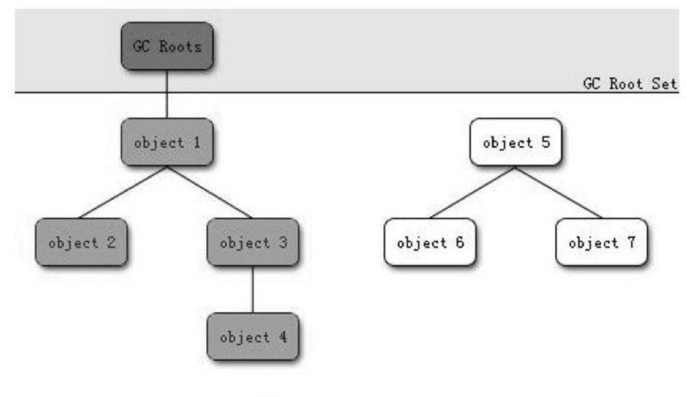
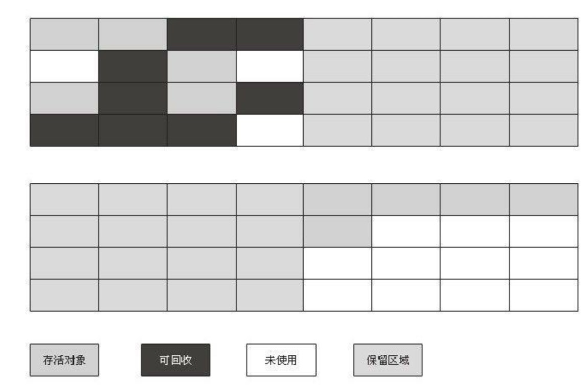
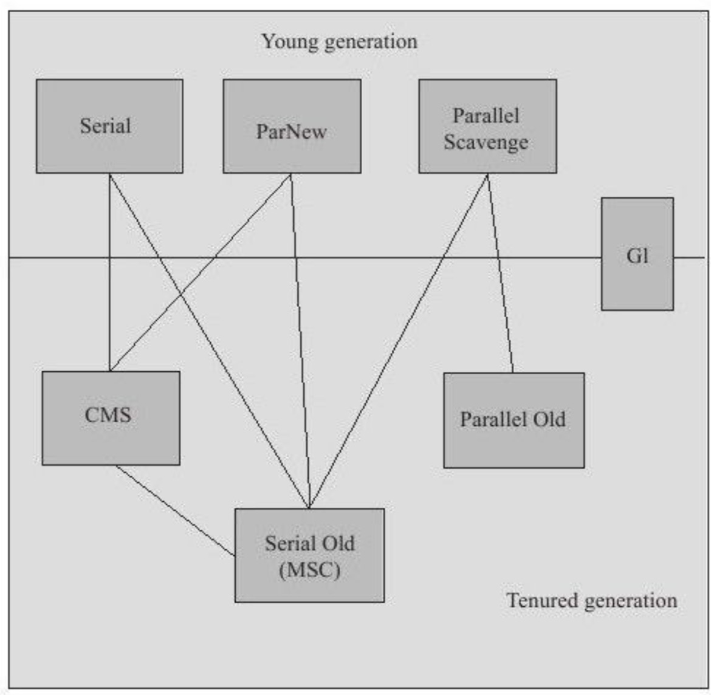

# 垃圾回收机制

垃圾收集（garbage collection），也简称GC，是Java里很重要的机制，主要作用对象为**堆和方法区**。

在堆里存放着几乎所有的对象实例，垃圾收集器在对堆进行回收之前，首先要判断这些对象中哪些还“活着”，哪些已经“死去”。

首先需要了解一个比较简单通用的判断方法，虽然在Java里并没有使用，叫做**引用计数法**。
### 引用计数法
引用计数法的思想很简单，给对象添加一个引用计数器，每当有一个地方引用它的时候，计数器加1；当引用失效时，计数器减1；任何时刻计数器为0时，代表这个对象不可能再被使用，可以被回收了。

引用计数算法（Reference Counting）实现简单，判定效率也高，但是，至少在主流的JVM虚拟机中都没有选用此方法来管理内存，其中最主要的原因就是因为它很难解决对象之间**相互循环引用**的问题。例如，对象`objA`和`objB`都有字段`instance`，并且`objA.instance=objB, objB.instance=objA`，除此之外两个对象再无任何引用，此时两个对象都不可能再被访问，但是由于它们互相引用对方，导致无法被回收。

### 可达性分析
在Java以及其他主流商业语言（C#等）的实现中，都是通过可达性分析（Reachability Analysis)的方法来判断对象是否存活的。这个算法的核心是通过一系列称为`GC Root`的对象作为起始点，从这些节点向下探索，搜索所走过的路径称为引用链，当一个对象到GC Root没有任何引用链相连，或者说从GC Root到这个对象不可达时，这个对象就被判定为可回收的对象。如图所示，对象`ojb5, obj6, obj7`虽然互相有关联，但是没有GC Root与之相连，故判定为可回收的对象。

所以下面的关键是，在Java语言中，哪些对象可作为`GC Root`呢？包含以下几种：
* 虚拟机栈（栈帧中的局部变量表）中引用的对象。
* 方法区中类静态属性引用的对象。
* 方法区中常量引用的对象。
* 本地方法栈中JNI（即一般说的Native方法）引用的对象。

在以上例子中，`objA`和`objB`的`instance`属性不能作为`GC Root`，所以这两个对象虽然互相引用，却可以被回收。

另外，即使再可达性分析中判定为不可达的对象，也不是”非死不可“的，这时候它们暂时还处于”缓刑“阶段，要真正宣告一个对象的死亡，至少要经历两次标记过程：如果对象在进行可达性分析后没有与 GC Roots 相连接的引用链，那么它会被第一次标记，随后进行一次筛选，筛选的条件是对象有没有必要执行 finalize（）方法。如果有必要的话，将它加到一个名为 `F-Queue` 的队列中，等待执行 finalize 方法（在 finalize 中是可以自救的）；如果没有必要，就会真的被回收了。

### 回收方法区
Java 虚拟机规范中说过，方法区是可以不用实现垃圾收集的，而且的确，在方法区进行垃圾收集的“性价比”是很低的。在堆中，尤其是新生代中，一次垃圾收集一般可以回收70%～95%的空间，而永久代的垃圾收集效率远低于此。

不过在 HotSpot 虚拟机中，方法区的确是有垃圾收集机制的，这里主要回收两部分内容：一个是废弃常量，一个是无用类。

* 废弃常量：回收废弃常量与回收 Java 堆中的对象类似。以常量池中的字面量为例，例如一个字符串“abc”已经进入常量池中，但是当前系统没有任何一个String对象是叫做“abc”的，也就是说没有任何地方引用这个字面量，如果这是发生了垃圾回收，并且有必要的话，这个常量会被系统清理出常量池。常量池中的其他类（接口）、方法、字段的符号引用也与此类似。

* 无用类：判断一个类是否是无用的类比判断废弃常量苛刻很多。类必须同时满足三个条件才行：
    1. 该类所有实例已被回收，也就是说Java堆中不存在任何该类实例。
    2. 加载该类的`ClassLoader`已经被回收。
    3. 该类对应的`Java.lang.Class`对象没有在任何地方被引用，无法在任何地方通过反射访问该类的方法。

## 垃圾收集算法
垃圾收集算法实现涉及大量程序细节，而且各个平台的虚拟机操作内存方法各不相同，因此这里不过多讨论算法的实现，只介绍算法的思想和发展过程。

### 标记-清除算法（Mark-Sweep)
标记-清除算法是最基础的收集算法，算法分为两个阶段，标记和清除：首先标记出需要回收的对象，在标记完成后统一回收所有标记的对象。其标记过程在前一章节已经讲过，一般通过可达性分析进行标记。

它的不足之处有两个：
1. 执行效率不稳定。如果堆中有大量对象需要被回收，这时必须进行大量的标记和清楚的动作，导致效率不高。
2. 内存利用率不高。标记清除后，内存中会产生大量不连续的内存碎片，空间碎片过多可能会导致以后在程序需要分配较大对象时，无法找到足够大的连续内存而不得不提前触发另一次垃圾收集。

标记-清除的执行过程如下图所示。

### 复制算法
为了解决效率问题，一种称为“复制”（Copying）的收集算法出现了，它将可用内存按照容量划分为大小相等的两块，每次只使用其中的一块。当这一块内存用完了，就将还存活的对象复制到另外一块上面，然后再把已使用过的这一块内存空间一次性清理掉。这样使得每次都是对整个半区进行内存回收，内存分配时也不用考虑内存碎片等复杂情况，只需要移动栈顶指针，按顺序分配内存即可，实现简单，运行高效。只是这种算法需要将可用的内存缩小为原来的一半，代价较大。

复制算法的执行过程如下图所示：

现在的商业虚拟机都采用这种收集算法来回收新生代，并且IBM公司研究表明，新生代中的98%的对象都是存活时间非常短的，所以并不需要用1:1的比例来划分空间，而是将空间划分为一块较大的Eden空间和两块较小的Survivor空间，每次使用Eden和其中一块Survivor。当回收时，将Eden和Survivor中还存活的对象一次性复制到另一块Survivor空间上，最后清理掉Eden和刚用过的Survivor空间。HotSpot默认Eden和Survivor的比例是8:1，也就是说每次新生代中可用内存空间为整个新生代容量的90%（80%+10%），只有10%的空间被浪费，并且10%的空间对于垃圾回收后存活的对象来说基本够用。当然我们无法保证每次回收都只有不多于10%的对象存活，当Survivor空间不够用时，需要依赖其他内存（这里是指老年代）进行分配担保（Handle Promotion）。

### 标记-整理算法（Mark-Compact)
复制收集算法在对象存活率较高时需要进行较多的复制操作，效率会变低。更关键的是，如果不想要浪费50%的空间，就需要有额外的空间进行分配担保，以应对垃圾回收率不高的情况，所以老年代中一般不采用这种算法。

根据老年代的特点，有人提出了**标记-整理**的算法，标记过程仍然不变，但后续步骤不是对可回收对象进行清理，而是让所有存活的对象向一端移动，然后直接清理掉端边界以外的内存，标记-整理的算法示意图如下。

标记-清除算法和标记-整理算法的本质差异就在于前者是一种非移动式的回收算法，而后者是移动式的。是否移动回收后的存活对象是一项优缺点并存的风险决策：
* 如果移动存活对象，需要更新所有引用这些对象的地方，这是一个极为负重的操作，而且这种对象移动操作，需要全程暂停用户应用程序，因此被形象的描述为“Stop The World”。
* 如果完全不考虑移动和整理对象，那么弥散于堆中的存活对象导致的空间碎片化问题就只能依赖更为复杂的内存分配器和内存访问器来解决。

### 分代收集算法
当前商业虚拟机的垃圾收集都采用**分代收集**的方法。在新生代里，每次垃圾回收都有大批对象死去，只有少量存活，因此使用复制算法，只需要付出少量对象的复制成本就可以完成收集；而老年代中由于存活率高，没有额外空间对其进行分配担保，就必须使用**标记-清理**算法或者**标记-整理**算法。

## 垃圾收集器
如果说垃圾收集算法是内存回收的方法论，垃圾收集器就是内存回收的具体实现。不同的厂商，不同版本的虚拟机所提供的垃圾收集器都可能会有很大区别，并且一般会提供参数供用户根据自己的应用特点和要求组合出各个年代所使用的收集器。这里列出JDK 1.7 Update 14后的HotSpot虚拟机所包含的所有垃圾收集器，如图所示。

