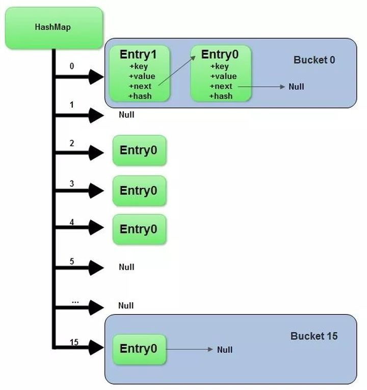
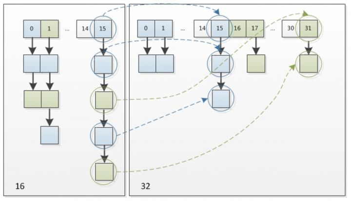

# HashMap
HashMap 是常用的用于存储 key-value 键值对数据的一个集合，底层是基于对 Map 的接口实现。每一个键值对又叫 Entry（Node），这些 Entry（Node） 分散的存储在一个由 <数组，链表，红黑树> 组成的集合中，其中 key 和 value 都支持`null`.
* HashMap 与 HashTable 作用基本相同，除了「HashMap 不是线程安全的，并且允许`null`值」

HashMap 的结构图如下



上图可以看出，HashMap 的底层就是一个数组，数组中的每一项又是一个链表或者红黑树。当新建一个 HashMap 时，就会初始化一个数组。

## 核心成员变量
``` java
// 默认的HashMap table 数组大小 16，必须是2的幂
static final int DEFAULT_INITIAL_CAPACITY = 1 << 4; // aka 16

// 数组最大值，2^30 
static final int MAXIMUM_CAPACITY = 1 << 30;

// 默认的负载因子
static final float DEFAULT_LOAD_FACTOR = 0.75f;

// 链表转换为红黑树的节点最小个数（当链表长度大于等于8时会从链表转变为红黑树）
static final int TREEIFY_THRESHOLD = 8;

// 红黑树经过remove后节点个数小于等于该值时 从红黑树蜕变为链表
static final int UNTREEIFY_THRESHOLD = 6;

// 当桶中的bin被树化时最小的hash表容量。
// 如果没有达到这个阈值，即hash表容量小于 MIN_TREEIFY_CAPACITY，当桶中bin的数量太多时会执行resize扩容操作。
static final int MIN_TREEIFY_CAPACITY = 64;

// HashMap的数组，是Node类型的，初始值为null
transient Node<K,V>[] table;

// 在迭代器中使用，可依次遍历Hashmap的节点
transient Set<Map.Entry<K,V>> entrySet;

// HashMap的节点个数
transient int size;

// HashMap的修改次数，主要用在fail-fast中
transient int modCount;

// HashMap阀值，当size超过阀值时进行扩容操作，一般情况下阀值 = 数组的长度 * 负载因子
int threshold;

// 负载因子，默认是0.75f
final float loadFactor;
```

## 主要构造函数
```java
public HashMap(int initialCapacity, float loadFactor) {
    // 传入默认初始化的容量大小参数
    if (initialCapacity < 0)
        throw new IllegalArgumentException("Illegal initial capacity: " +
                                           initialCapacity);
    if (initialCapacity > MAXIMUM_CAPACITY)
        initialCapacity = MAXIMUM_CAPACITY;
    if (loadFactor <= 0 || Float.isNaN(loadFactor))
        throw new IllegalArgumentException("Illegal load factor: " +
                                           loadFactor);
    this.loadFactor = loadFactor;
    // 这里有个比较重要的方法tableSizeFor，根据 initialCapacity，返回一个合适的2的指数
    this.threshold = tableSizeFor(initialCapacity);
    // 注意这里 tableSizeFor 的返回值其实是 capacity，而不是 threshold，这里只是暂借 threshold 这个成员变量存一下（可以从后面的resize函数中印证）
}
```
上面用`tableSizeFor()`函数，来根据传入的 initialCapacity，找到一个「比它大的，同时是2的n次方」的数字。那么`tableSizeFor()`是如何实现的呢？看下面的代码
```java
static final int tableSizeFor(int cap) {
    int n = cap - 1;
    n |= n >>> 1;
    n |= n >>> 2;
    n |= n >>> 4;
    n |= n >>> 8;
    n |= n >>> 16;
    return (n < 0) ? 1 : (n >= MAXIMUM_CAPACITY) ? MAXIMUM_CAPACITY : n + 1;
}
```
这里主要运用了位运算，其中`>>>`是无符号右移，`|=`是 或运算后赋值。
经过这几次或运算后，其实就是**把当前二进制位最大的1右边的0全部改成1**。最后再用它加1，就得到了一个2的n次方的数。

## 主要函数
### hash(Object key)
首先看一下用于计算key的哈希值的函数`hash(Object key)`:
```java
static final int hash(Object key) {
    int h;
    return (key == null) ? 0 : (h = key.hashCode()) ^ (h >>> 16);
}
```
可以看见，这里将key的哈希值的高16位与低16位进行了异或运算，这相当于一个”扰动函数”，是综合速度，功效，质量 来考虑的，这么做可以在 数组table 的长度较小的时候，也能保证考虑到高低bit都参与到哈希计算中，同时不会有太大的开销。那么到底为什么使用这样的“扰动函数”会带来更小的碰撞可能性呢？我们看下面。

我们知道上面代码里的 `key.hashCode()` 函数调用的是 key 键值 自带的哈希函数，返回 int 型散列值。理论上散列值是一个 int 型，如果直接拿散列值作为下标访问 HashMap 主数组的话，int型 数字范围是 -2147483648 到 2147483648. 前后加起来大概有 40亿 的映射空间。

只要哈希函数映射得比较均匀松散，一般是很难发生碰撞的。但问题是 40亿 长度的数组，内存里是放不下的，何况 HashMap 扩容之前的数组长度初始大小才 16. 所以这个散列值不能直接拿来用。用之前我们需要对数组的长度进行取模运算，得到的余数用来访问数组下标。

> 顺便说一下，这里也可以解释为什么 HashMap 的数组长度要取 2的整数幂。因为这样（数组长度-1）正好相当于一个 “低位掩码”。“与”操作的结果就是散列值的高位全部归0，只保留低位值，用来做数组下标访问。以初始长度 16 为例，16-1 = 15. 2进制表示是`1111`，和散列值做与操作后，结果就是截取了最低的四位值。

这时候问题就来了。就算我们的散列值分布再松散，要是只取最后几位的话，碰撞也会很严重。更严重的是如果散列本身做的不好，分布上成等差数列的漏洞，恰使最后几位呈现规律性重复，就更加难受了。这时候“扰动函数”的作用就体现出来了。我们将散列值的高半区和低半区做异或，就是为了混合原始哈希码的高位和低位，以此来加大低位的随机性。而且混合后的低位参杂了高位的部分特征，这样高位的信息也被变相保留了下来。


### get(Object key)
再看一下`get(Object key)`相关函数，即如何根据`key`找到相应的`value`。
```java
public V get(Object key) {
    Node<K,V> e;
    return (e = getNode(hash(key), key)) == null ? null : e.value;
}

final Node<K,V> getNode(int hash, Object key) {
    Node<K,V>[] tab; Node<K,V> first, e; int n; K k;
    if ((tab = table) != null && (n = tab.length) > 0 &&
        (first = tab[(n - 1) & hash]) != null) {  // 注意这里，根据 (n - 1) & hash 来计算下标值
        if (first.hash == hash && // always check first node
            ((k = first.key) == key || (key != null && key.equals(k))))
            return first;
        if ((e = first.next) != null) {   // 到这里，说明first不匹配，需要往后找（链表或者红黑树）
            if (first instanceof TreeNode)
                return ((TreeNode<K,V>)first).getTreeNode(hash, key);  // 说明已经是红黑树结构，要调用getTreeNode来匹配节点
            do {  // 进入这里，说明还是链表结构，直接遍历匹配hash值即可。
                if (e.hash == hash &&
                    ((k = e.key) == key || (key != null && key.equals(k))))
                    return e;
            } while ((e = e.next) != null);
        }
    }
    return null;
}
```
可以看到，当`node`为链表时，直接遍历即可，较为简单。而当`node`为树节点的时候，就要调用TreeNode版本的getNode:`node.getTreeNode()`来进行节点匹配了。

### put(K key, V value)
然后我们来看看 HashMap 的 `put` 方法。put 的执行过程可以用下图概括，可以对比源码获得更细致的研究。


源码及解释如下：
```java
final V putVal(int hash, K key, V value, boolean onlyIfAbsent,
                boolean evict) {
    Node<K,V>[] tab; Node<K,V> p; int n, i;
    // 如果table没有初始化，或者初始化的大小为0，进行resize操作
    if ((tab = table) == null || (n = tab.length) == 0)
        n = (tab = resize()).length;
    // 如果hash值对应的桶内没有数据，直接生成结点并且把结点放入桶中
    if ((p = tab[i = (n - 1) & hash]) == null)
        tab[i] = newNode(hash, key, value, null);
    // 如果hash值对应的桶内有数据解决冲突，再放入桶中
    else {
        Node<K,V> e; K k;
        //判断put的元素和已经存在的元素是相同(hash一致，并且equals返回true)
        if (p.hash == hash &&
            ((k = p.key) == key || (key != null && key.equals(k))))
            e = p;
        // put的元素和已经存在的元素是不相同(hash一致，并且equals返回true)
        // 如果桶内元素的类型是TreeNode，也就是解决hash解决冲突用的树型结构，把元素放入树种
        else if (p instanceof TreeNode)
            e = ((TreeNode<K,V>)p).putTreeVal(this, tab, hash, key, value);
        else {
            // 桶内元素的类型不是TreeNode，而是链表时，把数据放入链表的最后一个元素上
            for (int binCount = 0; ; ++binCount) {
                if ((e = p.next) == null) {
                    p.next = newNode(hash, key, value, null);
                    // 如果链表的长度大于转换为树的阈值(TREEIFY_THRESHOLD)，将存储元素的数据结构变更为树
                    if (binCount >= TREEIFY_THRESHOLD - 1) // -1 for 1st
                        treeifyBin(tab, hash);
                    break;
                }
                // 如果查已经存在key，停止遍历
                if (e.hash == hash &&
                    ((k = e.key) == key || (key != null && key.equals(k))))
                    break;
                p = e;
            }
        }
        // 已经存在元素时
        if (e != null) { // existing mapping for key
            V oldValue = e.value;
            if (!onlyIfAbsent || oldValue == null)
                e.value = value;
            afterNodeAccess(e);
            return oldValue;
        }
    }
    ++modCount;
    // 如果K-V数量大于阈值，进行resize操作
    if (++size > threshold)
        resize();
    afterNodeInsertion(evict);
    return null;
}
```

### resize()
HashMap 的扩容机制也用的很巧妙，以最小的性能来完成扩容。扩容后的容量变成了原来的两倍，所以经过 rehash 后，元素的位置要么是在原位置，要么是在原位置的基础上加上原容量的位置。举个例子，如果原容量为16，那么扩容后的容量为 32. 如果一个元素在下标为 7 的位置，那么扩容后，要么还在 7 的位置，要么在 7 + 16 = 23 的位置。

下面我们看看 Java8 里面是如何做到扩容的。

在扩容后，所有元素重新计算哈希，此时table容量变为原来两倍，因此 n-1 的掩码范围在高位多了 1 bit，因此此时我们不用像 JDK1.7 里面一样重新计算 hash，而是只要看看原来的 hash值新增的那个 bit 是 1 还是 0 就好了，是 0 的话索引没变，是 1 的话索引变成“原索引 + oldCap”。下面是 16 扩容为 32 时的 resize 示意图。


而 hash 指的高位是否为 1，只需要和扩容前的长度做与操作就可以了，因为扩容后的长度为2的整次幂，所以源码中有 `e.hash & oldCap` 来做到这个逻辑。

这个设计的确很巧妙，既省去了重新计算哈希值的时间，而且同时，由于新增的 1 bit 是 0 还是 1 可以认为是随机的，因此 resize 的过程，均匀的把之前冲突的节点分散到了新的 bucket 中。这一块就是 JDK1.8 中优化的地方。
> 有一点要注意，在 JDK1.7 中 rehash 的时候，旧链表迁移到新链表的时候，如果在新链表中的索引位置相同，则链表元素会倒置，但是从上图可以看出，JDK1.8 中不会倒置。

下面是 JDK1.8 中 resize 的源码

```java
final Node<K,V>[] resize() {
    Node<K,V>[] oldTab = table;
    int oldCap = (oldTab == null) ? 0 : oldTab.length;
    int oldThr = threshold;
    int newCap, newThr = 0;
    // 计算新的容量值和下一次要扩展的容量
    if (oldCap > 0) {
    // 超过最大值就不再扩充了，就只好随你碰撞去吧
        if (oldCap >= MAXIMUM_CAPACITY) {
            threshold = Integer.MAX_VALUE;
            return oldTab;
        }
        // 没超过最大值，就扩充为原来的2倍
        else if ((newCap = oldCap << 1) < MAXIMUM_CAPACITY &&
                    oldCap >= DEFAULT_INITIAL_CAPACITY)
            newThr = oldThr << 1; // double threshold
    }
    else if (oldThr > 0) // initial capacity was placed in threshold
        newCap = oldThr;
    else { // zero initial threshold signifies using defaults
        newCap = DEFAULT_INITIAL_CAPACITY;
        newThr = (int)(DEFAULT_LOAD_FACTOR * DEFAULT_INITIAL_CAPACITY);
    }
    // 计算新的resize上限
    if (newThr == 0) {
        float ft = (float)newCap * loadFactor;
        newThr = (newCap < MAXIMUM_CAPACITY && ft < (float)MAXIMUM_CAPACITY ?
                    (int)ft : Integer.MAX_VALUE);
    }
    threshold = newThr;
    @SuppressWarnings({"rawtypes","unchecked"})
        Node<K,V>[] newTab = (Node<K,V>[])new Node[newCap];
    table = newTab;
    if (oldTab != null) {
        // 把每个bucket都移动到新的buckets中
        for (int j = 0; j < oldCap; ++j) {
            Node<K,V> e;
            //如果位置上没有元素，直接为null
            if ((e = oldTab[j]) != null) {
                oldTab[j] = null;
                //如果只有一个元素，新的hash计算后放入新的数组中
                if (e.next == null)
                    newTab[e.hash & (newCap - 1)] = e;
                //如果是树状结构，使用红黑树保存
                else if (e instanceof TreeNode)
                    ((TreeNode<K,V>)e).split(this, newTab, j, oldCap);
                //如果是链表形式
                else { // preserve order
                    Node<K,V> loHead = null, loTail = null;
                    Node<K,V> hiHead = null, hiTail = null;
                    Node<K,V> next;
                    do {
                        next = e.next;
                        //hash碰撞后高位为0，放入低Hash值的链表中
                        if ((e.hash & oldCap) == 0) {
                            if (loTail == null)
                                loHead = e;
                            else
                                loTail.next = e;
                            loTail = e;
                        }
                        //hash碰撞后高位为1，放入高Hash值的链表中
                        else {
                            if (hiTail == null)
                                hiHead = e;
                            else
                                hiTail.next = e;
                            hiTail = e;
                        }
                    } while ((e = next) != null);
                    // 低hash值的链表放入数组的原始位置
                    if (loTail != null) {
                        loTail.next = null;
                        newTab[j] = loHead;
                    }
                    // 高hash值的链表放入数组的原始位置 + 原始容量
                    if (hiTail != null) {
                        hiTail.next = null;
                        newTab[j + oldCap] = hiHead;
                    }
                }
            }
        }
    }
    return newTab;
}
```


## 面试常问
Q：为什么要把 capacity 设为 2的n次方 呢？并且扩容的时候，也是以2倍容量的形式进行扩容？

A：因为我们在根据哈希值`hash`取下标时，是用位运算 `hash & (len - 1)` ，其中`len`为2的幂，故`len-1`的二进制尾部全部是1，在进行与操作时，能够进行充分散列（并且等同于`hash % len`的取余操作）。

注意：用位运算计算哈希下标，是因为计算机在进行位运算时效率非常高。

Q：为什么要使用红黑树？

A：首先我们要知道，在 JDK1.7及以前，HashMap 都是用 <数组 + 链表> 实现的，在 1.8 之后才是 <数组 + （链表或红黑树）>来实现的。

那么究竟为什么要用红黑树呢？在介绍红黑树之前，我们先来看看 **二叉查找树(Binary Search Tree)**。

二叉查找树是一种特殊的二叉树，有以下几个特征：
1. 左子树上的所有结点的值都小于或等于它的根结点的值。
2. 右子树上的所有节点的值都大于或等于它的根结点的值。
3. 左右子树分别也都是二叉查找树。

顾名思义，二叉查找树是用来“查找”的，那么他是如何查找的呢？其实就是从根节点开始，根据二叉查找树的（1）和（2）性质，决定进入左子树或者右子树，然后一直往下查找，直到找到待找的元素。

这种查找的模式与二分法有着相似之处，插入和查找的时间复杂度均为 O(logn).

但是普通的二叉查找树会有特殊情况，当顺序插入结点时，二叉查找树可能会退化成具有 n 个结点的线性链表，这时最坏情况，插入和查找的时间复杂度都是 O(n).

为了解决这种可能会退化的情况，出现了一种能够在任何顺序插入元素时，都能保持树的高度较小的二叉查找树，我们称之为 自平衡二叉查找树（Self-balancing Binary Search Tree）。

实现了 自平衡二叉查找树 的数据结构有很多种，例如：
* 2-3 树
* AVL 树
* 红黑树

