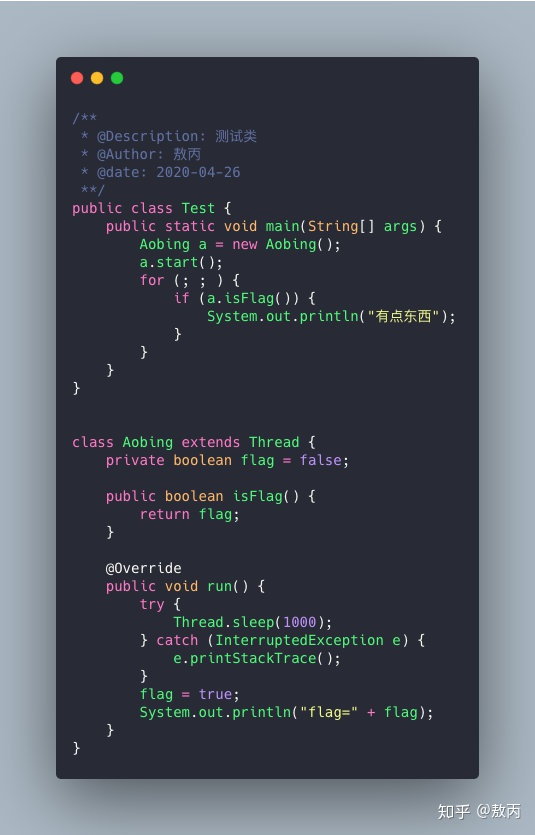
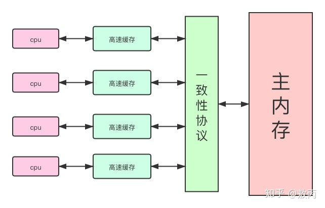
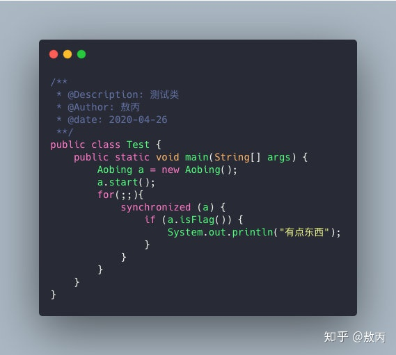

# JMM
JMM 全称 Java Memory Model，即 Java 内存模型，是 Java 虚拟机规范定义的一种内存模型，Java 内存模型是标准化的，屏蔽了底层不同计算机的区别。（注意这里和 JVM 完全不是一个东西）。

先来看一个 demo。

上图代码，运行后会发现，虽然在 Aobing 线程中已经修改了 flag，但是主线程中却一直不会打印 “有点东西”，这就是因为 Aobing 线程对 flag 的修改并没有被主线程 “看见”。
> 如果给 flag 加上 volatile 修饰，那么主线程就可以看见，也会正常打印 “有点东西”了。

那正式聊之前，先大概看一下现代计算机的内存模型吧。

## 现代计算机的内存模型
其实早期计算机中cpu和内存的速度是差不多的，但在现代计算机中，cpu的指令速度远超内存的存取速度，由于计算机的存储设备与处理器的运算速度有几个数量级的差距，所以现代计算机系统都不得不加入一层读写速度尽可能接近处理器运算速度的高速缓存（Cache）来作为内存与处理器之间的缓冲。

将运算需要使用到的数据复制到缓存中，让运算能快速进行，当运算结束后再从缓存同步回内存之中，这样处理器就无须等待缓慢的内存读写了。

基于高速缓存的存储交互很好地解决了处理器与内存的速度矛盾，但是也为计算机系统带来更高的复杂度，因为它引入了一个新的问题：**缓存一致性**（CacheCoherence）。

在多处理器系统中，每个处理器都有自己的高速缓存，而它们又共享同一主内存，如下图所示。

然后我们看看 JMM。

## JMM
Java 内存模型（JMM）描述了 Java 程序中各种变量（线程共享变量）的访问规则，以及在 JVM 中将变量，存储到内存和从内存中读取变量这样的底层细节。

JMM 有以下规定：
* 所有的共享变量都存储于主内存，这里所说的变量指的是实例变量和类变量，不包含局部变量，因为局部变量是线程私有的，因此不存在竞争问题。
* 每一个线程还存在自己的工作内存，线程的工作内存，保留了被线程使用的变量的工作副本。
* 线程对变量的所有的操作(读，取)都必须在工作内存中完成，而不能直接读写主内存中的变量。
* 不同线程之间也不能直接访问对方工作内存中的变量，线程间变量的值的传递需要通过主内存中转来完成。

正是因为这样的机制存在，才导致了可见性问题的存在，那我们就讨论下可见性的解决方案。

## 可见性的解决方案
### 1. 加锁

为什么加锁可以解决可见性问题呢？因为某一个线程进入 synchronized 前后，线程会获得锁，清空工作内存，从主内存拷贝共享变量最新的值到工作内存成为副本，执行代码，将修改后的副本的值刷新回主内存中，线程释放锁。

而获取不到锁的线程会阻塞等待，所以变量的值肯定一直都是最新的。

### 2. 使用 volatile 修饰共享变量
为什么给 flag 加了 volatile 关键字就可以解决可见性问题呢？

每个线程操作数据的时候会把数据从主内存读取到自己的工作内存，如果他操作了数据并且写会了，他其他已经读取的线程的变量副本就会失效了，需要都数据进行操作又要再次去主内存中读取了。

volatile 保证不同线程对共享变量操作的可见性，也就是说一个线程修改了 volatile 修饰的变量，当修改写回主内存时，另外一个线程立即看到最新的值。

是不是看着加一个关键字很简单，但实际上他在背后含辛茹苦默默付出了不少，我从计算机层面的缓存一致性协议解释一下这些名词的意义。

之前我们说过当多个处理器的运算任务都涉及同一块主内存区域时，将可能导致各自的缓存数据不一致，举例说明变量在多个CPU之间的共享。

如果真的发生这种情况，那同步回到主内存时以谁的缓存数据为准呢？

为了解决一致性的问题，需要各个处理器访问缓存时都遵循一些协议，在读写时要根据协议来进行操作，这类协议有MSI、MESI（IllinoisProtocol）、MOSI、Synapse、Firefly及DragonProtocol等。

这里举例 Intel 的 MESI 协议。

### MESI（缓存一致性协议）
当 CPU 写数据时，如果发现操作的变量是共享变量，即在其他 CPU 中也存在该变量的副本，会发出信号通知其他 CPU 将该变量的缓存行置为无效状态，因此当其他 CPU 需要读取这个变量时，发现自己缓存中缓存该变量的缓存行是无效的，那么它就会从内存重新读取。

至于是怎么发现数据是否失效呢？这里有一种**嗅探**机制。

每个处理器通过嗅探在总线上传播的数据来检查自己缓存的值是不是过期了，当处理器发现自己缓存行对应的内存地址被修改，就会将当前处理器的缓存行设置成无效状态，当处理器对这个数据进行修改操作的时候，会重新从系统内存中把数据读到处理器缓存里。

#### 总线风暴
那么嗅探会带来什么问题吗？有，总线风暴。

由于 volatile 的 MESI 缓存一致性协议，需要不断的从主内存嗅探和cas不断循环，无效交互会导致总线带宽达到峰值。

所以我们也不能大量使用 volatile。至于什么时候去使用 volatile，什么时候使用锁，根据场景区分。

## 禁止指令重排序
除了保证共享变量的可见性外，volatile 还可以起到禁止指令重排序的作用。

具体下次再讲，总之就是通过内存屏障的做法，来禁止特定类型的处理器重排序。

## 总结
聊了这么多，volatile 虽然可以保证可见性，但是并不能保证原子性。如果一定要保证原子性，必须使用其他方法（加锁，原子变量等）。
> 比如说当有多个线程要对某一变量进行累加时，使用 volatile 就不够用了，因为读和写着两个操作不是原子性的；另一方面，如果多个线程对某一变量进行赋值操作，volatile 就够用了，因为赋值操作是原子性的。

1. volatile 修饰符适用于以下场景：某个属性被多个线程共享，其中有一个线程修改了此属性，其他线程可以立即得到修改后的值，比如booleanflag。或者作为触发器，实现轻量级同步。
2. volatile 属性的读写操作都是无锁的，它不能替代synchronized，因为它没有提供原子性和互斥性。因为无锁，不需要花费时间在获取锁和释放锁_上，所以说它是低成本的。
3. volatile 只能作用于属性，我们用 volatile 修饰属性，这样 compilers 就不会对这个属性做指令重排序。
4. volatile 提供了可见性，任何一个线程对其的修改将立马对其他线程可见，volatile属性不会被线程缓存，始终从主存中读取。
5. volatile 提供了 happens-before 保证，对 volatile 变量 v 的写入 happens-before 所有其他线程后续对v的读操作。
6. volatile 可以使得 long 和 double 的赋值是原子的。
7. volatile 可以在单例双重检查中实现可见性和禁止指令重排序，从而保证安全性。

上面点太多了可能不容易记，总之 volatile 的作用就记准两个点：
1. 保证可见性
2. 禁止指令重排序（最常见的用法就是单例模式中的赋值）

# 参考资料
[阿里面试官没想到，一个Volatile我能跟他扯半个小时 - 三太子敖丙](https://zhuanlan.zhihu.com/p/137193948)

