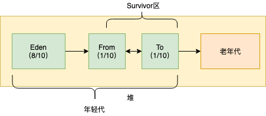

# Java虚拟机
Java虚拟机（JVM）由三部分组成，分别是
1. 类装载子系统
2. 运行时数据区（内存模型）
3. 执行引擎

具体可见下图所示.


## 运行时数据区
JVM的构成中，最重要的组成部分为运行时数据区（内存模型）。内存模型可分为如下几块：
1. 堆
2. 栈
3. 本地方法栈
4. 方法区（元空间）
5. 程序计数器。

下面分别介绍这几种内存结构。

### 堆
堆是所有线程共享的一块内存区域，在虚拟机启动时创建，此内存区域唯一的目的就是存放对象实例。

Java堆是垃圾收集器管理的主要区域。由于现在的垃圾收集器基本采用分代回收算法，所以Java堆还可以细分为新生代和老年代。具体而言如下图所示。


* 在java程序运行时，new出来的对象首先会存放在堆中的Eden区。
* Eden区放满后，JVM会执行`minor GC`操作，对Eden区中的无效对象进行清理，存活的对象从Eden区移到Survivor0（from）区域。
* From区域放满后，也会触发`minor GC`操作，对无效对象进行清理，存活的对象从Survivor0（from）移到Survivor1（to）区域。（此时from区域变空）。
* To区域放满后，也会触发`minor GC`操作，对无效对象进行清理，存活的对象从Survivor1（to）移到Survivor0（from）区域。（此时to区域变空）。
* 在垃圾回收过程中存活15次以上的对象，会被移到老生代区域。
* 老年代区域满后，会触发`Major GC`。
> 垃圾回收机制具体见相应章节。

### 栈
JVM栈（也称为线程栈）是为Java中每个线程都会创建的一块内存区域。栈是用来存储局部变量，方法参数，中间结果和其他数据等的。

* 栈帧：JVM栈通常由栈帧的形式进行管理。栈帧与线程中的方法相对应，每个方法在调用时会分配属于自己的一块栈帧区域，该方法调用完毕后，其栈帧区域被回收。也就是说，栈帧随着方法调用而创建，随着方法结束而销毁。每个栈帧都有自己的**局部变量表，操作数栈，动态链接和方法出口**，如图所示。


下面对栈帧中的各个结构分别做一个介绍。

#### 局部变量表
* 局部变量表是一组变量值存储空间，用于存放方法参数和方法内部定义的局部变量。在Java源文件编译为class文件时，就在方法表的Code属性的max_locals数据项中确定了该方法需要分配的最大局部变量表的容量。
* 表中每个slot大小为4个字节。对于int，float和引用类型的变量，在表中占1个slot；对于double，long等类型等变量，则在表中占据连续2个slot;对于byte，short，char类型的变量，会在进表之前被转换成int类型；不同的JVM对boolean类型变量的存储方式可能不同，但是大多数JVM使用一个slot存储boolean。

#### 操作数栈
操作数栈相当于JVM的工作空间，有点类似于C语言中使用的寄存器。在Java程序执行过程中，一些指令可以将数据压入操作数栈，一些指令可以对操作数栈中的数据进行相应的操作（四则运算等），一些指令可以读取操作数栈的数据并存储，所有的操作都离不开操作数栈。

例如，`iadd`命令会进行如下操作：
1. 从操作数栈顶部弹出两个int类型操作数a和b。
2. 将a和b相加，结果压入操作数栈。

`iload`指令将局部变量表中的值压入操作数栈，`istore`指令则弹出操作数栈中的数据并存入相应的局部变量。

下面几句指令将两个int型的局部变量相加，并加结果存入第三个局部变量。
``` java
iload_0    // push the int in local variable 0
iload_1    // push the int in local variable 1
iadd       // pop two ints, add them, push result
istore_2   // pop int, store into local variable 2
```

#### 动态链接
在JVM的指令集中，很多指令会引用常量池中的数据。有些指令会直接将常量池中的数据值（例如int, long, float, double等类型的值）压入操作数栈；另一些指令会使用常量池中的条目来引用实例化的类或者数组，要访问的字段或者要调用的方法；还有些指令会判断一个特定的对象是否是一个特定的类或者接口的后代（通过常量池条目确定这个特定的类或者接口）。这些指令都会用到常量池中的数据或者条目。

只要Java虚拟机遇到任何需要引用常量池中的条目的指令，它就会使用**帧数据(Frame Data)中指向常量池的指针**来访问该信息。这是因为在字节码中，对于类，字段，方法等的引用一开始都是符号化的，用符号来表示的。而虚拟机在使用该引用时，如果它是符号化的，虚拟机需要通过**指向常量池的指针**，来解析这个符号成为真正的引用地址，这个过程成为动态链接。

我们知道C/C++中，源文件首先被编译为.o的目标文件，然后几个目标文件链接成为可执行文件。在链接的步骤中，符号化的引用会被替换成实际运行时的内存地址。在Java中，这个链接的过程是在运行时动态执行的。
> 可以使用`javap -v xxx.class`反编译字节码，查看常量池相关信息。

#### 方法出口
在某方法执行完毕后退出时，线程需要知道如何回到上一个方法的正确位置继续执行，所以栈帧中需要保存一些信息，用来帮助它恢复上层方法的执行状态。

方法退出的过程实际上等同于把当前栈帧出栈，因此退出时可能执行的操作有：恢复上层方法的局部变量表和操作数栈，把返回值(如果有的话)压入上一栈帧的操作数栈中，调用PC计数器的值以指向方法调用指令后面的一条指令等。

> 我们可以通过研究Java代码的字节码来加深对JVM内存模型的理解。 `javap -c xxx.class`

### 本地方法栈
本地方法栈与栈的作用类似，不同之处在于普通栈为虚拟机执行的普通java方法服务，而本地方法栈为虚拟机用到的本地方法（native method）服务。

本地方法是java中的一类特殊方法，其底层不是用java实现，而是用C语言实现的，目前用的较少。

### 方法区（元空间）
与堆类似，方法区也是所有线程共享的内存区域。它在JVM启动时被创建。方法区的内存大小由JVM初始分配，运行过程中可以动态增加（如果需要的化）。
方法区也可以发生GC（垃圾收集）。

方法区中包含了类相关的信息，例如编译后的代码，方法以及相关的数据变量，以及**运行时的常量池**。

说起运行时常量池，必须首先解释静态常量池。常量池本身是class字节码文件中的一部分，用于存储字符串（数字）字面量，以及与该类相关的类、方法等信息，占用了class文件的绝大部分空间。这种常量池主要由两类常量组成：字面量(literal)和符号引用(symbolic references)。字面量相当于java语言层面常量的概念，如文本字符串，final变量等，符号引用则包括类和接口的名称、字段名称和描述符、方法名称和描述符。每一个class文件都有一个常量池。而当某个class被JVM加载后，在内存中有一块常量池的运行时版本，被称为**运行时常量池**，存放于方法区中。
> 可通过`javap -v xxx.class`反编译class文件，查看其常量池信息。

运行时常量池相对于静态常量池的重要特征是具备动态性，也就是说并非只有内置于class文件常量池的常量才能进行方法区中的运行时常量池，运行期间也可以将新的常量放入池中，例如String类的intern（）方法就利用了这个特性。
> String的intern()方法会查找在常量池中是否存在一份equal相等的字符串,如果有则返回该字符串的引用,如果没有则添加自己的字符串进入常量池。

### 程序计数器
每个线程都拥有一个独立都程序计数器，可以看作是当前线程所执行都字节码的行号指示器。在虚拟机的概念模型里，字节码解释器工作就是通过改变程序计数器的值来选择下一个需要执行的字节码指令。分支、循环、跳转、异常处理、线程恢复等基础功能都要依赖这个计数器完成。