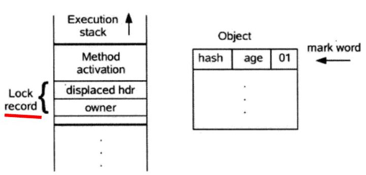
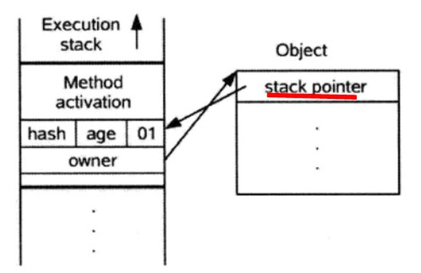
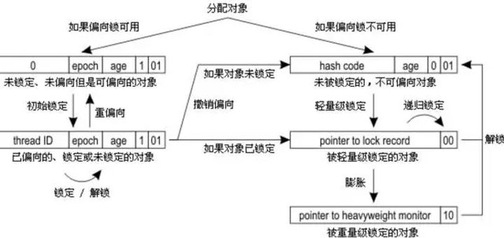

# 共享受限资源
可以把单线程程序当作在问题域求解的单一实体，每次只能做一件事情。因为只有一个实体，所以永远不用担心诸如“两个实体试图同时使用同一个资源”的问题。

有了并发后，可以同时做很多事情了，但是，两个或两个以上的线程彼此互相干涉的问题也就出现了。如果不防范这种冲突，就可能发生两个线程同时试图访问同一个银行账户，或向同一个打印机打印，改变同一个值等诸如此类的问题。

所以，对于并发工作，我们需要用某种方式来防止两个任务访问相同的资源，至少在关键阶段不能出现这种情况。

## synchronized
......

### synchronized 底层原理
synchronized 用的锁是存在 Java 对象头里面的，被称为监视器锁（monitor）。监视器锁（Monitor）本质是依赖于底层的操作系统的 Mutex Lock（互斥锁）来实现的。每个对象都对应于一个可称为" 互斥锁" 的标记，这个标记用来保证在任一时刻，只能有一个线程访问该对象。

先来看看 Java 对象头的长度。


其中，Mark Word 默认存储对象的 HashCode，分代年龄和锁标志位信息。这些信息都是与对象自身定义无关的数据，所以 Mark Word 被设计成一个非固定的数据结构以便在极小的空间内存存储尽量多的数据。它会根据对象的状态复用自己的存储空间，也就是说在运行期间Mark Word里存储的数据会随着锁标志位的变化而变化。

JVM 基于进入和退出 Monitor 对象来实现方法同步和代码块同步。代码块同步是使用 monitorenter 和 monitorexit 指令实现的，monitorenter 指令是在编译后插入到同步代码块的开始位置，而 monitorexit 是插入到方法结束处和异常处。任何对象都有一个 monitor 与之关联，当且一个 monitor 被持有后，它将处于锁定状态。

根据虚拟机规范的要求，在执行monitorenter指令时，首先要去尝试获取对象的锁，如果这个对象没被锁定，或者当前线程已经拥有了那个对象的锁，把锁的计数器加1；相应地，在执行monitorexit指令时会将锁计数器减1，当计数器被减到0时，锁就释放了。如果获取对象锁失败了，那当前线程就要阻塞等待，直到对象锁被另一个线程释放为止。

由于Java的线程是映射到操作系统的原生线程之上的，如果要阻塞或唤醒一条线程，都需要操作系统来帮忙完成，这就需要从用户态转换到核心态中，因此状态转换需要耗费很多的处理器时间。所以 synchronized 是 Java 语言中的一个重量级操作，这就是为什么有人说 Synchronized 效率低的原因。

Java SE 1.6为了减少获得锁和释放锁带来的性能消耗，引入了“偏向锁”和“轻量级锁”：锁一共有4种状态，级别从低到高依次是：**无锁状态、偏向锁状态、轻量级锁状态和重量级锁状态**。锁可以升级但不能降级。

上面提到过，Mark Word 里存储的数据会随着锁标志位的变化而变化。在这几种状态下，Mark Word 的内容分别如下图所示：


下面分别看看这几种锁的状态
#### 偏向锁
HotSpot的作者经过研究发现，大多数情况下，锁不仅不存在多线程竞争，而且总是由同一线程多次获得。偏向锁是为了在只有一个线程执行同步块时提高性能。

当一个线程访问同步块并获取锁时，会在对象头和栈帧中的锁记录里存储锁偏向的线程ID，以后该线程在进入和退出同步块时不需要进行CAS操作来加锁和解锁，只需简单地测试一下对象头的Mark Word里是否存储着指向当前线程的偏向锁。引入偏向锁是为了在无多线程竞争的情况下尽量减少不必要的轻量级锁执行路径，因为轻量级锁的获取及释放依赖多次CAS原子指令，而偏向锁只需要在置换ThreadID的时候依赖一次CAS原子指令（由于一旦出现多线程竞争的情况就必须撤销偏向锁，所以偏向锁的撤销操作的性能损耗必须小于节省下来的CAS原子指令的性能消耗）。

偏向锁获取过程：
1. 访问Mark Word中偏向锁的标识是否设置成1，锁标志位是否为01——确认为可偏向状态。
2. 如果为可偏向状态，则测试线程ID是否指向当前线程，如果是，进入步骤（5），否则进入步骤（3）。
3. 如果线程ID并未指向当前线程，则通过CAS操作竞争锁。如果竞争成功，则将Mark Word中线程ID设置为当前线程ID，然后执行（5）；如果竞争失败，执行（4）。
4. 如果CAS获取偏向锁失败，则表示有竞争（CAS获取偏向锁失败说明至少有过其他线程曾经获得过偏向锁，因为线程不会主动去释放偏向锁）。当到达全局安全点（safepoint）时，会首先暂停拥有偏向锁的线程，然后检查持有偏向锁的线程是否活着（因为可能持有偏向锁的线程已经执行完毕，但是该线程并不会主动去释放偏向锁），如果线程不处于活动状态，则将对象头设置成无锁状态（标志位为“01”），然后重新偏向新的线程；如果线程仍然活着，撤销偏向锁后升级到轻量级锁状态（标志位为“00”），此时轻量级锁由原持有偏向锁的线程持有，继续执行其同步代码，而正在竞争的线程会进入自旋等待获得该轻量级锁。
5. 执行同步代码。

#### 轻量级锁
轻量级锁是为了在线程近乎交替执行同步块时提高性能。

轻量级锁的加锁过程：

1. 在代码进入同步块的时候，如果同步对象锁状态为无锁状态（锁标志位为“01”状态，是否为偏向锁为“0”），虚拟机首先将在当前线程的栈帧中建立一个名为锁记录（Lock Record）的空间，用于存储锁对象目前的Mark Word的拷贝，官方称之为 Displaced Mark Word。这时候线程堆栈与对象头的状态如下图所示。



2. 拷贝对象头中的Mark Word复制到锁记录中。
3. 拷贝成功后，虚拟机将使用CAS操作尝试将对象的Mark Word更新为指向Lock Record的指针，并将Lock record里的owner指针指向object mark word。如果更新成功，则执行步骤（3），否则执行步骤（4）。
4. 如果这个更新动作成功了，那么这个线程就拥有了该对象的锁，并且对象Mark Word的锁标志位设置为“00”，即表示此对象处于轻量级锁定状态，这时候线程堆栈与对象头的状态如下图所示。



5. 如果这个更新操作失败了，虚拟机首先会检查对象的Mark Word是否指向当前线程的栈帧，如果是就说明当前线程已经拥有了这个对象的锁，那就可以直接进入同步块继续执行。否则说明多个线程竞争锁，若当前只有一个等待线程，则可通过自旋稍微等待一下，可能另一个线程很快就会释放锁。 但是当自旋超过一定的次数，或者一个线程在持有锁，一个在自旋，又有第三个来访时，轻量级锁膨胀为重量级锁，重量级锁使除了拥有锁的线程以外的线程都阻塞，防止CPU空转，锁标志的状态值变为“10”，Mark Word中存储的就是指向重量级锁（互斥量）的指针，后面等待锁的线程也要进入阻塞状态。

#### 重量级锁
如上轻量级锁的加锁过程步骤（5），轻量级锁所适应的场景是线程近乎交替执行同步块的情况，如果存在同一时间访问同一锁的情况，就会导致轻量级锁膨胀为重量级锁。Mark Word的锁标记位更新为10，Mark Word指向互斥量（重量级锁）.

Synchronized的重量级锁是通过对象内部的一个叫做监视器锁（monitor）来实现的，监视器锁本质又是依赖于底层的操作系统的Mutex Lock（互斥锁）来实现的。而操作系统实现线程之间的切换需要从用户态转换到核心态，这个成本非常高，状态之间的转换需要相对比较长的时间，这就是为什么Synchronized效率低的原因。(具体见前面的 mutex lock)

四种状态之间的切换可以用下图表示：



偏向所锁，轻量级锁都是乐观锁，重量级锁是悲观锁。

* 一个对象刚开始实例化的时候，没有任何线程来访问它的时候。它是可偏向的，意味着，它现在认为只可能有一个线程来访问它，所以当第一个线程来访问它的时候，它会偏向这个线程，此时，对象持有偏向锁。偏向第一个线程，这个线程在修改对象头成为偏向锁的时候使用CAS操作，并将对象头中的ThreadID改成自己的ID，之后再次访问这个对象时，只需要对比ID，不需要再使用CAS在进行操作。
* 一旦有第二个线程访问这个对象，因为偏向锁不会主动释放，所以第二个线程可以看到对象时偏向状态，这时表明在这个对象上已经存在竞争了。检查原来持有该对象锁的线程是否依然存活，如果挂了，则可以将对象变为无锁状态，然后重新偏向新的线程。如果原来的线程依然存活，则马上执行那个线程的操作栈，检查该对象的使用情况，如果仍然需要持有偏向锁，则偏向锁升级为轻量级锁，**（偏向锁就是这个时候升级为轻量级锁的）**，此时轻量级锁由原持有偏向锁的线程持有，继续执行其同步代码，而正在竞争的线程会进入自旋等待获得该轻量级锁；如果不存在使用了，则可以将对象回复成无锁状态，然后重新偏向。
* 轻量级锁认为竞争存在，但是竞争的程度很轻，一般两个线程对于同一个锁的操作都会错开，或者说稍微等待一下（自旋），另一个线程就会释放锁。 但是当自旋超过一定的次数，或者一个线程在持有锁，一个在自旋，又有第三个来访时，**轻量级锁膨胀为重量级锁**，重量级锁使除了拥有锁的线程以外的线程都阻塞，防止CPU空转。


总体来说，synchronized与java.util.concurrent包中的ReentrantLock相比，由于JDK1.6中加入了针对锁的优化措施（见后面），使得synchronized与ReentrantLock的性能基本持平。ReentrantLock只是提供了synchronized更丰富的功能，而不一定有更优的性能，所以在synchronized能实现需求的情况下，优先考虑使用synchronized来进行同步。
### synchronized 的不足
使用 synchronized 关键字非常方便，需要写的代码量很少，并且用户出现错误的可能性会降低。但是，synchronized 关键字不够灵活，例如它不能够做：
* 不能进行 “尝试获取锁，获取失败则返回” 的操作
* 不能进行 “尝试获取锁一段时间，一直不能获取则返回” 的操作。

要实现以上功能，就需要使用 `java.util.concurrent` 包中的显式 Lock 对象了。

## Lock
JAVA SE5 中有 `java.util.concurrent.locks` 包，其中包含了对锁的实现，最常用的就是 `ReentrantLock`（可重入锁）。

可重入锁又名递归锁，是指在同一个线程在外层方法获取锁的时候，再进入该线程的内层方法会自动获取锁（前提锁对象得是同一个对象或者class），不会因为之前已经获取过还没释放而阻塞。Java中ReentrantLock和synchronized都是可重入锁。

关于锁的内容非常多，先来讲讲广义上的概念：乐观锁和悲观锁。

### 乐观锁，悲观锁
乐观锁与悲观锁是一种广义上的概念，体现了看待线程同步的不同角度。在Java和数据库中都有此概念对应的实际应用。
* 对于同一个数据的并发操作，悲观锁认为自己在使用数据的时候一定有别的线程来修改数据，因此在获取数据的时候会先加锁，确保数据不会被别的线程修改。Java中，synchronized关键字和Lock的实现类都是悲观锁。
* 乐观锁认为自己在使用数据时不会有别的线程修改数据，所以不会添加锁，只是在更新数据的时候去判断之前有没有别的线程更新了这个数据。如果这个数据没有被更新，当前线程将自己修改的数据成功写入。如果数据已经被其他线程更新，则根据不同的实现方式执行不同的操作（例如报错或者自动重试）。乐观锁在 Java 中是通过使用无锁编程来实现的，最常采用的就是 CAS 算法。Java 原子类中的递增操作就是通过 CAS 自旋实现的。


根据上面的概念描述我们可以发现：
* 悲观锁适合写操作多的场景，先加锁可以保证写操作时数据正确。
* 乐观锁适合读操作多的场景，不加锁的特点能够使其读操作的性能大幅提升。

光看概念有点抽象，我们通过代码示例来看一下：
```java
// ------------------------- 悲观锁的调用方式 -------------------------
// synchronized
public synchronized void testMethod() {
	// 操作同步资源
}
// ReentrantLock
private ReentrantLock lock = new ReentrantLock(); // 需要保证多个线程使用的是同一个锁
public void modifyPublicResources() {
	lock.lock();
	// 操作同步资源
	lock.unlock();
}

// ------------------------- 乐观锁的调用方式 -------------------------
private AtomicInteger atomicInteger = new AtomicInteger();  // 需要保证多个线程使用的是同一个AtomicInteger
atomicInteger.incrementAndGet(); //执行自增1
```

通过调用方式示例，我们可以发现悲观锁基本都是在显式的锁定之后再操作同步资源，而乐观锁则直接去操作同步资源。那么，为何乐观锁能够做到不锁定同步资源也可以正确的实现线程同步呢？下面介绍乐观锁的主要实现方式 “CAS” 的技术原理.

CAS全称 Compare And Swap（比较与交换），是一种无锁算法。在不使用锁（没有线程被阻塞）的情况下实现多线程之间的变量同步。java.util.concurrent包中的原子类就是通过CAS来实现了乐观锁。

CAS算法涉及到三个操作数：
* 需要读写的内存值 V。
* 进行比较的值 A。
* 要写入的新值 B。

当且仅当 V 的值等于 A 时，CAS通过原子方式用新值B来更新V的值（“比较+更新”整体是一个原子操作），否则不会执行任何操作。一般情况下，“更新”是一个不断重试的操作。

之前提到`java.util.concurrent`包中的原子类，就是通过CAS来实现了乐观锁，那么我们进入原子类`AtomicInteger`的源码，看一下`AtomicInteger`的定义：


根据定义我们可以看出各属性的作用：

* unsafe： 获取并操作内存的数据。
* valueOffset： 存储value在AtomicInteger中的偏移量。
* value： 存储AtomicInteger的int值，该属性需要借助volatile关键字保证其在线程间是可见的。

接下来，我们查看AtomicInteger的自增函数incrementAndGet()的源码时，发现自增函数底层调用的是unsafe.getAndAddInt()。但是由于JDK本身只有Unsafe.class，只通过class文件中的参数名，并不能很好的了解方法的作用，所以我们通过OpenJDK 8 来查看Unsafe的源码：
```java
// ------------------------- JDK 8 -------------------------
// AtomicInteger 自增方法
public final int incrementAndGet() {
  return unsafe.getAndAddInt(this, valueOffset, 1) + 1;
}

// Unsafe.class
public final int getAndAddInt(Object var1, long var2, int var4) {
  int var5;
  do {
      var5 = this.getIntVolatile(var1, var2);
  } while(!this.compareAndSwapInt(var1, var2, var5, var5 + var4));
  return var5;
}

// ------------------------- OpenJDK 8 -------------------------
// Unsafe.java
public final int getAndAddInt(Object o, long offset, int delta) {
   int v;
   do {
       v = getIntVolatile(o, offset);
   } while (!compareAndSwapInt(o, offset, v, v + delta));
   return v;
}
```
根据OpenJDK 8的源码我们可以看出，getAndAddInt() 循环获取给定对象o中的偏移量处的值v，然后判断内存值是否等于v。如果相等则将内存值设置为 v + delta，否则返回false，继续循环进行重试，直到设置成功才能退出循环，并且将旧值返回。整个“比较+更新”操作封装在 compareAndSwapInt() 中，在 JNI 里是借助于一个 CPU 指令完成的，属于原子操作，可以保证多个线程都能够看到同一个变量的修改值。

CAS虽然很高效，但是它也存在三大问题，这里也简单说一下：
* ABA问题。CAS需要在操作值的时候检查内存值是否发生变化，没有发生变化才会更新内存值。但是如果内存值原来是A，后来变成了B，然后又变成了A，那么CAS进行检查时会发现值没有发生变化，但是实际上是有变化的。ABA问题的解决思路就是在变量前面添加版本号，每次变量更新的时候都把版本号加一，这样变化过程就从“A－B－A”变成了“1A－2B－3A”。
JDK从1.5开始提供了AtomicStampedReference类来解决ABA问题，具体操作封装在compareAndSet()中。compareAndSet()首先检查当前引用和当前标志与预期引用和预期标志是否相等，如果都相等，则以原子方式将引用值和标志的值设置为给定的更新值。
* 循环时间长开销大。CAS操作如果长时间不成功，会导致其一直自旋，给CPU带来非常大的开销。
* 只能保证一个共享变量的原子操作。对一个共享变量执行操作时，CAS能够保证原子操作，但是对多个共享变量操作时，CAS是无法保证操作的原子性的。
Java从1.5开始JDK提供了 AtomicReference 类来保证引用对象之间的原子性，可以把多个变量放在一个对象里来进行CAS操作。

### 自旋锁 vs 适应性自旋锁
在介绍自旋锁之前，首先介绍一些前提知识来帮忙明白自旋锁的概念。

阻塞或唤醒一个 Java 线程需要操作系统切换 CPU 状态来完成，这种状态转换需要消耗处理器时间。如果同步代码块中的内容过于简单，状态转换消耗的时间有可能比用户代码执行的时间还长。

在许多场景中，同步资源锁定的时间很短，为了这一小段时间去切换线程，线程挂起和恢复的花费可能会让系统得不偿失。如果物理机器有多个处理器，能够让两个或以上的线程同时并行执行，我们就可以让后面那个请求锁的线程不放弃 CPU 的执行时间按，看看持有锁的线程是否很快就会释放锁。

而为了让当前线程“稍等一下”，我们需要让当前线程自旋，如果在自旋完成后前面锁定同步资源的线程已经释放了锁，那么当前线程就可以不必阻塞而是直接获取同步资源，从而避免切换线程的开销。这就是自旋锁。


自旋锁本身也是有缺点的，它不能代替阻塞。自旋等待虽然避免了线程切换的开销，但它要占用处理器时间。如果锁被占用的时间很短，自旋等待的效果就会很好。反之，如果锁被占用的时间很长，那么自旋的线程就只会白浪费处理器资源。所以，自旋等待的时间必须有一定的限度，如果自旋超过了限定次数（默认是 10 次，可以用 `-XX:PreBlockSpin` 来修改）没有成功获得锁，就应该挂起线程。

自旋锁的实现原理同样也是 CAS，AtomicInteger 中调用 unsafe 进行自增操作的源码中的 do-while 循环就是一个自旋操作，如果修改数值失败则通过循环来执行自旋，直至修改成功。


自旋锁在 JDK1.4.2 中引入，使用 `-XX:+UseSpinning` 来开启。JDK 6中变为默认开启，并且引入了自适应的自旋锁（适应性自旋锁）。

自适应意味着自旋的时间（次数）不再固定，而是由前一次在同一个锁上的自旋时间以及锁的拥有者的状态来决定。如果在同一个锁对象上，自旋等待刚刚成功获得过锁，并且持有锁的线程正在运行中，那么虚拟机就会认为这次自旋也是很有可能再次成功，进而它将允许自旋等待持续相对更长的时间。如果对于某个锁，自旋很少成功获得过，那在以后尝试获取这个锁时将可能省略掉自旋过程，直接阻塞线程，避免浪费处理器资源。

> 在自旋锁中 另有三种常见的锁形式:TicketLock、CLHlock和MCSlock，本文中仅做名词介绍，不做深入讲解，感兴趣的同学可以自行查阅相关资料。
