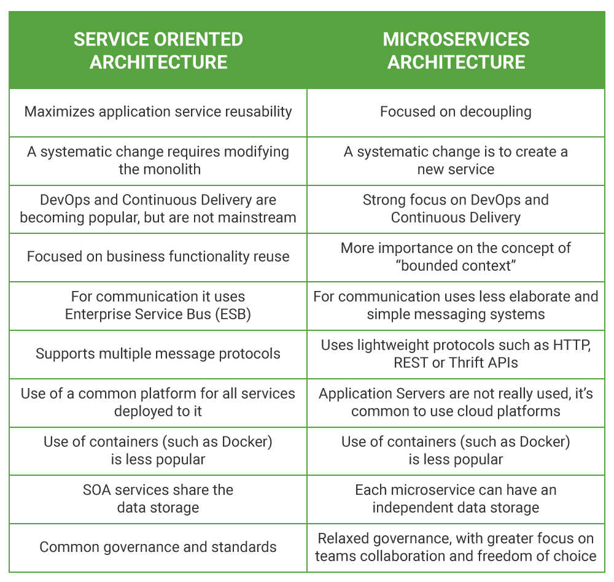

# 面向服务的架构（SOA）
## SOA
SOA（Service-Oriented Architecture）是一种设计方法，其中包含多个服务，而服务之间通过配合最终会提供一系列功能。一个服务通常以独立的形式存在于操作系统进程中。服务之间通过网络调用，而非采用进程内调用的方法进行通信。

在SOA中，我们很少关注如何将应用程序模块化，而更多地关注如何通过集成 分布式、独立维护和部署的软件组件来组合应用程序。我们会通过一些技术和标准来使各服务更容易地在网络上通信和协作，特别是在IP网络上。

在SOA中，主要有两种角色，一个是 服务提供方，一个是 服务消费方。其中消费方主要是使用软件的用户或者第三方，而提供方包括SOA软件中的所有服务。

## 微服务
在某种程度上，微服务是SOA发展的下一步。基本上，这种架构类型是开发软件、web或移动应用程序作为独立服务的一种方式。这些服务只提供一个特定的业务功能，如用户管理、用户角色、电子商务购物车、搜索引擎、社交媒体登录等。此外，它们彼此完全独立，这意味着它们可以用不同的编程语言编写并使用不同的数据库。在微服务架构中，集中式服务管理几乎不再存在，转而使用轻量级的HTTP，REST请求作为通信方式。

微服务这个词本身是在2011年5月的一次软件架构的workshop上被提出的。乍一看，我们讨论的微服务似乎跟之前的SOA是一个东西。然而，Martin Fowler，微服务领域的一个先驱曾说过：“我们应该认为SOA是微服务的超集”。也就是说，我们可以认为微服务架构是SOA的一种特定方法。

## SOA与微服务之间的区别
我们可以说，这两种架构之间有很多的相似之处。然而，归根结底，他们还是不同的两种架构。以下表格可以说明他们之间的不同。

对于表格中的某些方面，以下是一些细节。

* 开发。在两种架构中，服务都可以使用不同的编程语言和工具来编写。然而，在SOA架构中，每个team都需要知道共同的通信机制。而在微服务架构中，服务可以单独地进行运维和部署。因此，在微服务架构中独立部署新版本的服务更加容易。
* 有界上下文。SOA鼓励组件之间的共享，然而在微服务架构中，我们通过有界上下文来减小共享。有界上下文 指的是将组件和其数据进行结合形成一个具有最小依赖关系的单元。因为SOA架构中，我们需要使用多个服务来完成一次业务请求，所以可能会比微服务架构慢一些。
* 通信。在SOA架构中，ESB如果发生故障，会影响到整个系统。并且由于每个服务都是通过ESB进行通信，如果某个服务发生故障或者处理速率变慢，那么发送至该服务的请求会在ESB总线上发生堵塞，从而影响整个系统。另一方面，微服务架构对于错误的容忍度是比较高的。例如，如果某个微服务发生了内存泄漏，只有这个服务会受到影响。所有其他的服务都可以继续正常处理请求。
* 协同能力。在SOA架构中，推行的是在消息中间件中使用多种多样的协议。而微服务架构中会通过减少所有通信协议来简化架构设计。因此，如果你想要在复杂的环境中使用不同的协议来集成多个系统，那你应该考虑SOA；如果你的服务可以通过相同的远程访问协议来进行通信，那可能微服务架构更适合你。
* 服务大小。SOA与微服务架构之间的一个主要区别就是在服务的大小和规模上。微服务中的“微”代表服务拆分力度比较细，意味着一般来说其中的服务规模要比SOA架构中的小。微服务中的服务一般来说有一个单一的功能职责，而SOA中的服务通常会包含更多的功能逻辑，并且可以看作一个完备的子系统。

## 结论
对于SOA架构和微服务架构，我们不能说谁比谁好。其实使用哪种架构取决于你构建应用的目的。对于大型的，复杂的，需要与其他应用做集成的商业系统来说，使用SOA架构可能会更好一点。而对于比较小型的应用来说，SOA可能不是一个好的选择，因为不需要使用重量级的消息中间件。而在另一方面，微服务更适合于划分清晰的基于Web的应用系统。并且，如果你在开发一个Web或者手机应用，那么微服务可以给你更好的掌控。所以最后，我们可以得出结论：微服务和SOA其实是不同的两种架构。

## 参考资料
[Microservices vs. SOA -- Is there any difference at all?](https://medium.com/@kikchee/microservices-vs-soa-is-there-any-difference-at-all-2a1e3b66e1be)
