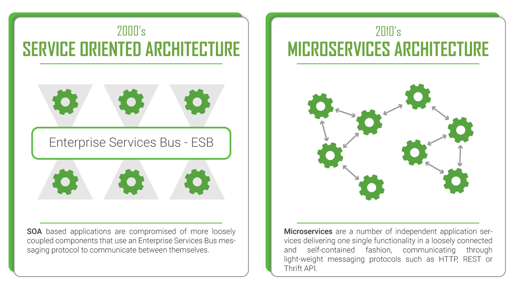

# 面向服务的架构（SOA）
SOA（Service-Oriented Architecture）是一种设计方法，其中包含多个服务，而服务之间通过配合最终会提供一系列功能。一个服务通常以独立的形式存在于操作系统进程中。服务之间通过网络调用，而非采用进程内调用的方法进行通信。

在SOA中，我们很少关注如何将应用程序模块化，而更多地关注如何通过集成 分布式、独立维护和部署的软件组件来组合应用程序。我们会通过一些技术和标准来使各服务更容易地在网络上通信和协作，特别是在IP网络上。

在SOA中，主要有两种角色，一个是 服务提供方，一个是 服务消费方。其中消费方主要是使用软件的用户或者第三方，而提供方包括SOA软件中的所有服务。

## 微服务
在某种程度上，微服务是SOA发展的下一步。基本上，这种架构类型是开发软件、web或移动应用程序作为独立服务的一种方式。这些服务只提供一个特定的业务功能，如用户管理、用户角色、电子商务购物车、搜索引擎、社交媒体登录等。此外，它们彼此完全独立，这意味着它们可以用不同的编程语言编写并使用不同的数据库。在微服务架构中，集中式服务管理几乎不再存在，转而使用轻量级的HTTP，REST请求作为通信方式。

## SOA与微服务之间的区别
我们可以说，这两种架构之间有很多的相似之处。然而，归根结底，他们还是不同的两种架构。以下表格可以说明他们之间的不同。

对于表格中的某些方面，以下是一些细节。

* 开发。在两种架构中，服务都可以使用不同的编程语言和工具来编写。然而，在SOA架构中，每个team都需要知道共同的通信机制。而在微服务架构中，服务可以单独地进行运维和部署。因此，在微服务架构中独立部署新版本的服务更加容易。