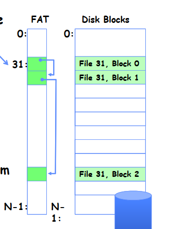

# 文件系统
文件系统是操作系统中最明显的部分。文件系统由两个不同的部分组成：
* 文件集合。每个文件存储相关数据。
* 目录结构，用于组织系统内的所有文件并提供文件信息。

## 文件属性
文件的属性因操作系统而异，但通常包括：名称，标识符，类型，位置，尺寸，保护，时间等。

所有的文件保存在目录结构中，该目录结构也保存在外存上。通常，目录条目由文件名称及其唯一标识符组成。根据标识符，可以定位到文件的其他属性

目录也是一种特殊的文件。

## 文件操作
操作系统提供文件的六种基本操作：
* 创建文件。创建文件需要两个步骤。首先，需要在文件系统中找到空闲空间。其次，必须在目录中创建相应新文件的条目。
* 写文件。
* 读文件。
* 重新定位文件。
* 删除文件。
* 截断文件。

## 文件系统实现
文件系统永久驻留在外存（磁盘）上，这里我们讨论各种方法，用于组织文件使用，分配磁盘空间，恢复空闲空间，跟踪数据位置等。所以我们需要创建算法和数据结构，以便映射逻辑文件系统到物理外存设备。

现在使用的文件系统有很多，大多操作系统支持多个文件系统。UNIX 使用 Unix 文件系统（Unix File System, UFS），它是基于 Berkeley 的快速文件系统（Fast File System, FFS）。
Windows支持磁盘的文件系统格式，如 FAT，FAT32 和 NTFS（Windows NT File System），以及 CDROM 和 DVD 的文件系统格式。
虽然 Linux 支持40多种不同的文件系统，Linux 的标准文件系统是 可扩展文件系统（extended file system），最常见的版本是 ext3 和 ext4.

### 分配方法
如果为文件分配磁盘空间，以便有效利用磁盘空间和快速访问文件，是个重要的问题。磁盘空间分配通常由三种方法：连续，链接和索引。每个方法各有优缺点。

#### 连续分配
连续分配方法要求每个文件在磁盘上占有一组连续的块。此时在目录条目中记录文件名，起始块地址，连续的块数，即可。

连续分配实现简单，文件访问也很容易，但是也有很多问题。
1. 外部碎片。随着文件的分配和删除，可用磁盘空间被分割为许多小片，这时就会存在外部碎片。当最大连续片不能满足需求时，就会出现问题。
2. 确定文件需要多少空间。当创建一个文件时，需要找到并分配它所需空间的总数。如果文件分配的空间太小，则无法支持文件的扩展。

#### 链接分配
采用链接分配，每个文件是磁盘块的链表；磁盘块可能分布在磁盘的任何地方。这里就解决了连续分配的两个问题。链接分配也有两个缺点
1. 只能有效用于顺序访问文件，不能有效支持文件的直接访问。因为要找到文件的第i个块，必须从文件的开始起，跟着指针，找到第i块。每个指针的访问都需要一个磁盘读操作，可能会涉及磁盘寻道，因此比较耗时。
2. 指针所需空间。如果块的大小为512字节，指针大小为4字节，则 0.78% 的磁盘空间会用于指针。

为了改进文件的直接访问，连接分配的一个重要变种就是 文件分配表（FAT）。每个卷的开头部分的磁盘用于存储该表。表中，每个磁盘块都有一个条目，并可按块号来索引。FAT的使用与链表相同。目录条目包含文件首块
的块号。通过块号索引的表条目包含文件的下一块的块号。这条链会一直下去，直到最后一块，最后一块的表条目值为文件结束值，如下图所示。



操作系统将 FAT 缓存进内存后，可以大大提高访问文件的效率。尤其是对文件内容进行直接访问（随机访问）时，无需再从头开始访问每个块，而可以直接在FAT中索引到相应的块后，再进入磁盘中寻找。

#### 索引分配
索引分配通过将所有指针放到一起，即索引块，解决了直接访问慢的问题。

在 Unix 中使用的 FFS（Fast File System）中，每个文件有一个 `inode` . inode 的结构如下图所示.


inode 是一个多级索引结构，其中除了文件的元属性外，还有15个指针。其中前12个指针为直接索引，直接指向数据块；后三个为间接索引，分别为一级索引，二级索引，三级索引。

这种结构下，小的文件（不超过12块）不需要单独的索引块，访问起来非常快；同时这种结构也能满足大型文件的存储。

这里我们以 Linux 中常用的 ext4 为例，看看索引分配下的文件系统。


ext4 文件系统会把分区主要分为两大部分（暂且不提超级块）：小部分用于保存文件的 inode；大部分用来保存 block 信息。

inode 的默认大小位 128 Byte，用来记录文件的权限（r，w，x）、文件的所有者和属组、文件的大小、文件的状态改变时间（ctime）、文件的最近一次读取时间（atime）、文件的最近一次修改时间（mtime）、文件的数据真正保存的 block 编号。

每个文件需要占用一个 inode。（另外，如果仔细查看，会发现 inode 中是不包含文件名的，因为文件名记录在了文件所在目录的 block 中）。

block 的大小可以是 1KB、2KB、4KB，默认为 4KB。block 用于实际的数据存储，如果一个 block 放不下数据，则可以占用多个 block。例如，有一个 10KB 的文件需要存储，则会占用 3 个 block，虽然最后一个 block 不能占满，但也不能再放入其他文件的数据。这 3 个 block 有可能是连续的，也有可能是分散的。

由此，我们可以知道以下 2 个重要的信息：
1. 每个文件都独自占用一个 inode，文件内容由 inode 的记录来指向；
2. 如果想要读取文件内容，就必须借助目录中记录的文件名找到该文件的 inode，才能成功找到文件内容所在的 block 块；

## 硬链接和软链接
Linux 中有两种链接类型，硬链接和软链接。
* 硬链接：我们知道，文件的基本信息都存储在 inode 中，而硬链接指的就是给一个文件的 inode 分配多个文件名，通过任何一个文件名，都可以找到此文件的 inode，从而读取该文件的数据信息。
* 软链接：类似于 Windows 系统中给文件创建快捷方式，即产生一个特殊的文件，该文件用来指向另一个文件，此链接方式同样适用于目录。

创建硬链接可以用 `ln 源文件 目标文件`，而创建软链接使用 `ln -s 源文件 目标文件`.

上面提到过，inode 里是没有文件名称的。其实，一个 inode 是可以有多个文件名称的。创建硬链接后，链接文件的 inode 其实与源文件是同一个 inode，它们仅仅是文件名不同。示意图如下：


当我们查找一个文件时，比如 `/root/test`，其实有以下步骤：
1. 首先找到根目录的 inode（根目录的 inode 是系统已知的，inode 号是 2），然后判断用户是否有权限访问根目录的 block。
2. 如果有权限，则可以在根目录的 block 中访问到 /root 的文件名及对应的 inode 号。
3. 通过 /root/ 目录的 inode 号，可以查找到 /root/ 目录的 inode 信息，接着判断用户是否有权限访问 /root/ 目录的 block。
4. 如果有权限，则可以从 /root/ 目录的 block 中读取到 test 文件的文件名及对应的 inode 号。
5. 通过 test 文件的 inode 号，就可以找到 test 文件的 inode 信息，接着判断用户是否有权限访问 test 文件的 block。
6. 如果有权限，则可以读取 block 中的数据，这样就完成了 /root/test 文件的读取与访问。

按照这个步骤，在给源文件 `/root/test` 建立了硬链接文件 `/tmp/test-hard` 之后，在 `/root/` 目录和 `/tmp/` 目录的 block 中就会建立 `test` 和 `test-hard` 的信息，这个信息主要就是文件名和对应的 inode 号。但是我们会发现 `test` 和 `test-hard` 的 inode 信息居然是一样的，那么，我们无论访问哪个文件，最终都会访问 inode 号是 262147 的文件信息。

这就是硬链接的原理。硬链接的特点如下：
* 不论是修改源文件（test 文件），还是修改硬链接文件（test-hard 文件），另一个文件中的数据都会发生改变。
* 不论是删除源文件，还是删除硬链接文件，只要还有一个文件存在，这个文件（inode 号是 262147 的文件）都可以被访问。
* 硬链接不会建立新的 inode 信息，也不会更改 inode 的总数。
* 硬链接不能跨文件系统（分区）建立，因为在不同的文件系统中，inode 号是重新计算的。
* 硬链接不能链接目录，因为如果给目录建立硬链接，那么不仅目录本身需要重新建立，目录下所有的子文件，包括子目录中的所有子文件都需要建立硬链接，这对当前的 Linux 来讲过于复杂。

硬链接的限制比较多，既不能跨文件系统，也不能链接目录，而且源文件和硬链接文件之间除 inode 号是一样的之外，没有其他明显的特征。这些特征都使得硬链接并不常用，大家有所了解就好。

软链接也称作符号链接，相比硬链接来讲，软链接就要常用多了。下面是一个建立软链接的例子：
```bash
[root@localhost ~]$ touch check
#建立源文件
[root@localhost ~]$ ln -s /root/check /tmp/check-soft
#建立软链接文件
[root@localhost ~]$ ll -id /root/check /tmp/check-soft
262154 -rw-r--r-- 1 root root 0 6月 19 11:30 /root/check
917507 lrwxrwxrwx 1 root root 11 6月 19 11:31 /tmp/ check-soft -> /root/check
#软链接和源文件的 inode 号不一致，软链接通过 -> 明显地标识出源文件的位置
#在软链接的权限位 lrwxrwxrwx 中，l 就代表软链接文件
```

软链接的标志非常明显，首先，权限位中"l"表示这是一个软链接文件；其次，在文件的后面通过 "->" 显示出源文件的完整名字。所以软链接比硬链接的标志要明显得多，而且软链接也不像硬链接的限制那样多，比如软链接可以链接目录，也可以跨分区来建立软链接。

软链接完全可以当作 Windows 的快捷方式来对待，它的特点和快捷方式一样，我们更推荐大家使用软链接，而不是硬链接。

笔者个人觉得，软链接主要是为了照顾管理员的使用习惯。比如，有些系统的自启动文件 `/etc/rc.local` 放置在 `/etc` 目录中，而有些系统却将其放置在 `/etc/rc.d/rc.local` 中，那么干脆对这两个文件建立软链接，不论你习惯操作哪一个文件，结果都是一样的。

如果你比较细心，则应该已经发现软链接和源文件的 inode 号是不一致的，我们也画一张示意图来看看软链接的原理，如图所示。


软链接和硬链接在原理上最主要的不同在于：硬链接不会建立自己的 inode 索引和 block（数据块），而是直接指向源文件的 inode 信息和 block，所以硬链接和源文件的 inode 号是一致的；而软链接会真正建立自己的 inode 索引和 block，所以软链接和源文件的 inode 号是不一致的，而且在软链接的 block 中，写的不是真正的数据，而仅仅是源文件的文件名及 inode 号。

我们来看看访问软链接的步骤和访问硬链接的步骤有什么不同。
1. 首先找到根目录的 inode 索引信息，然后判断用户是否有权限访问根目录的 block。
2. 如果有权限访问根目录的 block，就会在 block 中查找到 /tmp/ 目录的 inode 号。
3. 接着访问 /tmp/ 目录的 inode 信息，判断用户是否有权限访问 /tmp/ 目录的 block。
4. 如果有权限，就会在 block 中读取到软链接文件 check-soft 的 inode 号。因为软链接文件会真正建立自己的 inode 索引和 block，所以软链接文件和源文件的 inode 号是不一样的。
5. 通过软链接文件的 inode 号，找到了 check-soft 文件 inode 信息，判断用户是否有权限访问 block。
6. 如果有权限，就会发现 check-soft 文件的 block 中没有实际数据，仅有源文件 check 的 inode 号。
7. 接着通过源文件的 inode 号，访问到源文件 check 的 inode 信息，判断用户是否有权限访问 block。
8. 如果有权限，就会在 check 文件的 block 中读取到真正的数据，从而完成数据访问。

通过这个过程，我们就可以总结出软链接的特点（软链接的特点和 Windows 中的快捷方式完全一致）：
* 不论是修改源文件（check），还是修改硬链接文件（check-soft)，另一个文件中的数据都会发生改变。
* 删除软链接文件，源文件不受影响。而删除原文件，软链接文件将找不到实际的数据，从而显示文件不存在。
* 软链接会新建自己的 inode 信息和 block，只是在 block 中不存储实际文件数据，而存储的是源文件的文件名及 inode 号。
* 软链接可以链接目录。
* 软链接可以跨分区。

# 参考资料
[Linux ln命令：在文件之间建立链接（硬链接和软链接）详解版](http://c.biancheng.net/view/740.html)
