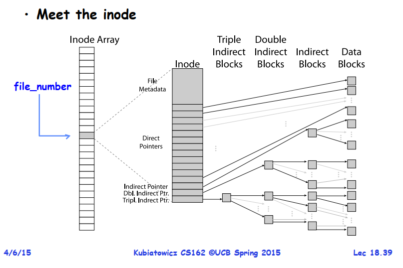

# 文件系统
文件系统是操作系统中最明显的部分。文件系统由两个不同的部分组成：
* 文件集合。每个文件存储相关数据。
* 目录结构，用于组织系统内的所有文件并提供文件信息。

## 文件属性
文件的属性因操作系统而异，但通常包括：名称，标识符，类型，位置，尺寸，保护，时间等。

所有的文件保存在目录结构中，该目录结构也保存在外存上。通常，目录条目由文件名称及其唯一标识符组成。根据标识符，可以定位到文件的其他属性。目录也是一种特殊的文件。

## 文件操作
操作系统提供文件的六种基本操作：
* 创建文件。创建文件需要两个步骤。首先，需要在文件系统中找到空闲空间。其次，必须在目录中创建相应新文件的条目。
* 写文件。
* 读文件。
* 重新定位文件。
* 删除文件。
* 截断文件。

## 文件系统实现
文件系统永久驻留在外存（磁盘）上，这里我们讨论各种方法，用于组织文件使用，分配磁盘空间，恢复空闲空间，跟踪数据位置等。所以我们需要创建算法和数据结构，以便映射逻辑文件系统到物理外存设备。

现在使用的文件系统有很多，大多操作系统支持多个文件系统。UNIX 使用 Unix 文件系统（Unix File System, UFS），它是基于 Berkeley 的快速文件系统（Fast File System, FFS）。
Windows支持磁盘的文件系统格式，如 FAT，FAT32 和 NTFS（Windows NT File System），以及 CDROM 和 DVD 的文件系统格式。
虽然 Linux 支持40多种不同的文件系统，Linux 的标准文件系统是 可扩展文件系统（extended file system），最常见的版本是 ext3 和 ext4.

### 分配方法
如果为文件分配磁盘空间，以便有效利用磁盘空间和快速访问文件，是个重要的问题。磁盘空间分配通常由三种方法：连续，链接和索引。每个方法各有优缺点。

#### 连续分配
连续分配方法要求每个文件在磁盘上占有一组连续的块。此时在目录条目中记录文件名，起始块地址，连续的块数，即可。

连续分配实现简单，文件访问也很容易，但是也有很多问题。
1. 外部碎片。随着文件的分配和删除，可用磁盘空间被分割为许多小片，这时就会存在外部碎片。当最大连续片不能满足需求时，就会出现问题。
2. 确定文件需要多少空间。当创建一个文件时，需要找到并分配它所需空间的总数。如果文件分配的空间太小，则无法支持文件的扩展。

#### 链接分配
采用链接分配，每个文件是磁盘块的链表；磁盘块可能分布在磁盘的任何地方。这里就解决了连续分配的两个问题。链接分配也有两个缺点
1. 只能有效用于顺序访问文件，不能有效支持文件的直接访问。因为要找到文件的第i个块，必须从文件的开始起，跟着指针，找到第i块。每个指针的访问都需要一个磁盘读操作，可能会涉及磁盘寻道，因此比较耗时。
2. 指针所需空间。如果块的大小为512字节，指针大小为4字节，则 0.78% 的磁盘空间会用于指针。

为了改进文件的直接访问，连接分配的一个重要变种就是 文件分配表（FAT）。每个卷的开头部分的磁盘用于存储该表。表中，每个磁盘块都有一个条目，并可按块号来索引。FAT的使用与链表相同。目录条目包含文件首块
的块号。通过块号索引的表条目包含文件的下一块的块号。这条链会一直下去，直到最后一块，最后一块的表条目值为文件结束值，如下图所示。

操作系统将 FAT 缓存进内存后，可以大大提高访问文件的效率。尤其是对文件内容进行直接访问（随机访问）时，无需再从头开始访问每个块，而可以直接在FAT中索引到相应的块后，再进入磁盘中寻找。

#### 索引分配
索引分配通过将所有指针放到一起，即索引块，解决了直接访问慢的问题。

在 Unix 中使用的 FFS（Fast File System）中，每个文件有一个 `inode` . inode 的结构如下图所示.

inode 是一个多级索引结构，其中除了文件的元属性外，还有15个指针。其中前12个指针为直接索引，直接指向数据块；后三个为间接索引，分别为一级索引，二级索引，三级索引。

这种结构下，小的文件（不超过12块）不需要单独的索引块，访问起来非常快；同时这种结构也能满足大型文件的存储。