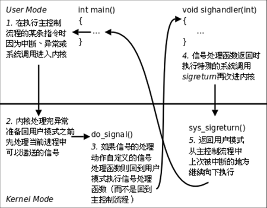

# 进程间通信
进程间通信，这里介绍常用的 6 种。

## 1. 管道/匿名管道（Pipe）
* 管道是半双工，数据只能向一个方向流动；双方需要互相通信时，需要建立起两个管道。
* 只能用于具有亲缘关系的进程（父子进程或者兄弟进程）之间。
* 管道对于两端通信的进程来说就只是一种文件，一种不属于文件系统仅存在内存中的“伪文件”。
* 管道的通信方式为：写端每次都将数据写入管道缓冲区的 末尾 ，而读端每次都从管道缓冲区的 头部 读出数据。

管道的实质是内核利用 环形队列 的数据结构在 内核缓冲区 中的一个实现，默认设置大小为4K，可以通过 `ulimit -a` 命令查看。由于利用 环形队列 进行实现，读和写的位置都是自动增长的，不能随意改变，一个数据只能被读取一次，读取后数据就会从缓冲区中移除。当缓冲区读空或者写满时，有一定的规则控制相应的读进程或者写进程进入等待队列，当空的缓冲区有新数据写入或者满的缓冲区有数据读出来时，就唤醒等待队列中的进程继续读写。

### 管道的使用
```c
int pipe(int pipefd[2]);  // 成功，返回 0；失败，返回 -1，并设置 errno
```

函数调用成功返回 `r/w` 两个文件描述符。无需 open，但需手动 close。规定：fd[0] → r； fd[1] → w，就像 0 对应标准输入，1对应标准输出一样。向管道文件读写数据其实是在读写内核缓冲区。

管道创建成功后，创建该管道的进程（父进程）同时掌握着管道的读端和写端。那么如何实现父子间通信呢？通常可以采用如下步骤：
1. 父进程调用pipe函数创建管道，得到两个文件描述符 fd[0]、fd[1] 指向管道的读端和写端。
2. 父进程调用fork创建子进程，那么子进程也有两个文件描述符指向同一管道。
3. 父进程关闭管道读端，子进程关闭管道写端。父进程可以向管道中写入数据，子进程将管道中的数据读出。由于管道是利用环形队列实现的，数据从写端流入管道，从读端流出，这样就实现了进程间通信。


## 2. 命名管道（FIFO）
FIFO 常被称为命名管道，以区分管道(pipe)。管道(pipe)只能用于“有血缘关系”的进程间。但通过 FIFO，不相关的进程也能交换数据。

命名管道不同于匿名管道之处在于它提供了一个路径名与之关联，以命名管道的文件形式存在于文件系统中，这样，即使与命名管道的创建进程不存在亲缘关系的进程，只要可以访问该路径，就能够彼此通过命名管道相互通信，因此，通过命名管道不相关的进程也能交换数据。值的注意的是，命名管道严格遵循先进先出(first in first out),对匿名管道及有名管道的读总是从开始处返回数据，对它们的写则把数据添加到末尾。它们不支持诸如lseek()等文件定位操作。命名管道的名字存在于文件系统中，内容存放在内存中。

### 命名管道的使用

```c
int mkfifo(const char *pathname, mode_t mode); // 成功，返回 0；失败，返回 -1，设置 errno
```

一旦使用 `mkfifo` 创建了一个FIFO，就可以使用open打开它，常见的文件I/O函数都可用于 fifo。如：close、read、write、unlink等。

具体的代码例子可以见参考资料。

## 3. 信号（SIGNAL）
* 信号是 Linux 系统中用于进程间互相通信或者操作的一种机制，信号可以在任何时候发给某一进程，而无需知道该进程的状态。
* 如果该进程当前并未处于执行状态，则该信号就有内核保存起来，直到该进程回复执行并传递给它为止。
* 如果一个信号被进程设置为阻塞，则该信号的传递被延迟，直到其阻塞被取消是才被传递给进程。

Linux 种常用的信号：
1. SIGHUP：用户从终端注销，所有已启动进程都将收到该进程。系统缺省状态下对该信号的处理是终止进程。
2. SIGINT：程序终止信号。程序运行过程中，按`Ctrl+C`键将产生该信号。
3. SIGQUIT：程序退出信号。程序运行过程中，按`Ctrl+\`键将产生该信号。
4. SIGBUS 和 SIGSEGV：进程访问非法地址。
5. SIGFPE：运算中出现致命错误，如除零操作、数据溢出等。
6. SIGKILL：用户终止进程执行信号。shell下执行`kill -9 pid`发送该信号。
7. SIGTERM：结束进程信号。shell下执行`kill pid`发送该信号。
8. SIGALRM：定时器信号。
9. SIGCLD：子进程退出信号。如果其父进程没有忽略该信号也没有处理该信号，则子进程退出后将形成僵尸进程。
可以使用 `kill -l` 查看当前系统可用信号有哪些.

信号是软件层次上对中断机制的一种模拟，是一种异步通信方式。信号可以在用户空间进程和内核之间直接交互，内核可以利用信号来通知用户空间的进程发生了哪些系统事件，信号事件主要有两个来源：
1. 硬件来源：用户按键输入 Ctrl+C 退出、硬件异常如无效的存储访问等。
2. 软件终止：终止进程信号、其他进程调用 kill 函数、软件异常产生信号。

信号的生命周期和处理过程如下图所示



## 4. 消息队列


## 5. socket


## 6. 共享内存


# 参考
[进程间通信 （IPC） 方法总结 (一)](https://www.cnblogs.com/joker-wz/p/11000489.html)