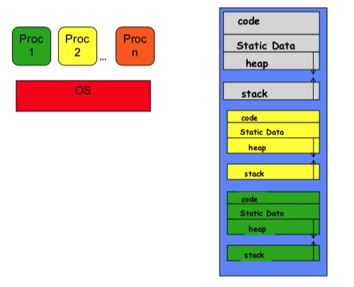
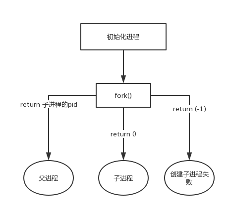

# 进程与线程
* 进程：是资源分配的最小单位，一个进程可以包含多个线程。
* 线程： 是程序执行的最小单元，是系统独立调度和分配CPU的基本单位。

进程是执行中的一段应用程序，即一旦程序被载入到内存准备执行，它就是一个进程；而线程就是一个单独的指令执行序列，以及与它相关的上下文，例如 PC计数器、寄存器、调用栈等。

## 线程
* 线程（Thread）是操作系统能够进行运算调度的最小单位，它被包含在进程之中，是进程的实际运作单位。
* 一条线程是进程中的单一顺序的控制流，它同时还拥有自己独立的 调用栈（call stack）、寄存器环境（register context）、线程本地存储（thread-local storage）。
* 同一进程中的多个线程之间共享内存空间。特别是，它们会共享 执行的代码，动态分配的变量和非线程局部全局变量的值。
* 当一个线程的上下文环境驻留在处理器的寄存器中时，表示它正在处理器上执行，此时程序计数器（PC）指示了该线程正在执行或者下一执行指令所在地址。
* 特定的寄存器存储了线程相关的上下文环境，例如栈指针（stack pointer）指向调用栈顶部等。（不同的指令集体系可能会有不同）。
* 寄存器需要存储的是线程的“核心”状态，其余上下文则存储在内存中。

## 地址空间
地址空间 = 可访问地址集 + 与之相关的上下文状态。
> 对于一个32位操作系统，有`2^32 bit`空间，也就是4GB。

不同的进程拥有独立的内存空间。操作系统使用 **地址转换** 将进程所使用的虚拟地址转换为实际地址，将不同的进程所使用的地址转换到不同的内存块中，互相隔离，如图所示。


## 进程

进程的组成包括**地址空间**和**一个或多个线程**。

### 为什么使用进程？
* 操作系统与用户进程之间是隔离的，用于保护操作系统。
* 进程之间是相互隔离的，互相之间不受影响。
* 进程提供了内存保护，每个进程都拥有自己单独的地址空间，不同的进程无法访问对方的内存空间。

## 上下文切换
当系统中存在多个进程/线程时，如何使所有进程均得到执行时间，从而造成多个处理同时进行的错觉呢？这时便要考虑并发了。
系统在不同的进程之间来回切换处理，从而造成所有进程都在进行处理的错觉。

* 每个“虚拟CPU”需要一个结构来存储：PC计数器，栈指针，寄存器数据等。
* 如何从一个虚拟CPU切换到另一个虚拟CPU呢？
    * 在当前状态块中，保存PC，SP，和寄存器数据。
    * 从新的状态块中，加载PC，SP，和寄存器数据。
* 如何触发上下文切换呢？
    * Timer计数器，yield，I/O，以及其他。

一旦涉及并发，就有一个基本问题，资源分配/共享的问题。
* 硬件：系统可能拥有单个的CPU，内存，I/O设备等。多个线程/进程并发时，如何使用这些资源呢？
* 并发编程API：进程以为自己对共享资源有“独占”访问权限，如何保证进程顺利工作呢？

所有的这些问题，都需要操作系统来进行协调，从而使进程在并发的时候也能够顺利使用共享资源，完成自身工作。

## Linux 中创建进程
Linux 中创建进程主要提供了三种方法：fork, vfork, 和 clone。

在 Linux 源码中，这三个调用的执行过程是：在执行 `fork(),vfork(),clone()` 时，通过一个系统调用表映射到 `sys_fork(),sys_vfork(),sys_clone()`,再在这三个函数中去调用 `do_fork()` 去做具体的创建进程工作。

### fork
fork 创建一个子进程时，子进程只是完全复制父进程的资源，复制出来的子进程有自己的 task_struct 结构和 pid,但却复制父进程其它所有的资源。例如，要是父进程打开了五个文件，那么子进程也有五个打开的文件，而且这些文件的当前读写指针也停在相同的地方。所以，这一步所做的是复制。
这样得到的子进程独立于父进程， 具有良好的并发性，但是二者之间的通讯需要通过专门的通讯机制，如：pipe，共享内存等机制， 另外通过 fork 创建子进程，需要将上面描述的每种资源都复制一个副本。这样看来，fork 是一个开销十分大的系统调用，这些开销并不是所有的情况下都是必须的，比如某进程 fork 出一个子进程后，其子进程仅仅是为了调用 exec 执行另一个可执行文件，那么在 fork 过程中对于虚存空间的复制将是一个多余的过程。
但由于现在 Linux 中是采取了 copy-on-write (COW 写时复制)技术，为了降低开销，fork 最初并不会真的产生两个不同的拷贝，因为在那个时候，大量的数据其实完全是一样的。
写时复制是在推迟真正的数据拷贝。若后来确实发生了写入，那意味着 parent 和 child 的数据不一致了，于是产生复制动作，每个进程拿到属于自己的那一份，这样就可以降低系统调用的开销。
所以有了写时复制后呢，vfork 其实现意义就不大了。

fork()调用执行一次返回两个值，对于父进程，fork 函数返回子程序的进程号，而对于子程序，fork 函数则返回零，这就是一个函数返回两次的本质。

在fork之后，子进程和父进程都会继续执行fork调用之后的指令。子进程是父进程的副本。它将获得父进程的数据空间，堆和栈的副本，这些都是副本，父子进程并不共享这部分的内存。也就是说，子进程对父进程中的同名变量进行修改并不会影响其在父进程中的值。但是父子进程又共享一些东西，简单说来就是程序的正文段。正文段存放着由cpu执行的机器指令，通常是read-only的。



fork 往往需要和 wait 一起使用。wait 函数的功能是：
* 父进程一旦调用了 wait 就立即阻塞自己，由 wait 自动分析是否当前进程的某个子进程已经退出，如果让它找到了这样一个已经变成僵尸的子进程，wait 就会收集这个子进程的信息，并把它彻底销毁后返回；如果没有找到这样一个子进程，wait就会一直阻塞在这里，直到有一个出现为止。

* 僵尸进程：当父进程忘了用 wait() 函数等待已终止的子进程时,子进程就会进入一种无父进程的状态,此时子进程就是僵尸进程。
* 孤儿进程：当父进程忘了用 wait() 函数等待还未终止的子进程时，子进程就会变成孤儿进程，交给 init 领养。

僵尸进程的示例：
```c
#include <stdio.h>
#include <unistd.h>
#include <errno.h>
#include <stdlib.h>

int main()
{
    pid_t pid;
    pid = fork();
    if (pid < 0)
    {
        perror("fork error:");
        exit(1);
    }
    else if (pid == 0)
    {
        printf("I am child process.I am exiting.\n");
        exit(0);
    }
    printf("I am father process.I will sleep two seconds\n");
    //等待子进程先退出
    sleep(2);
    //输出进程信息
    system("ps -o pid,ppid,state,tty,command");  // 此时子进程已经是僵尸进程了
    printf("father process is exiting.\n");
    return 0;
}
```
孤儿进程的示例：

```c
#include <stdio.h>
#include <stdlib.h>
#include <errno.h>
#include <unistd.h>

int main()
{
    pid_t pid;
    //创建一个进程
    pid = fork();
    //创建失败
    if (pid < 0)
    {
        perror("fork error:");
        exit(1);
    }
    //子进程
    if (pid == 0)
    {
        printf("I am the child process.\n");
        //输出进程ID和父进程ID
        printf("pid: %d\tppid:%d\n",getpid(),getppid());
        printf("I will sleep five seconds.\n");
        //睡眠5s，保证父进程先退出
        sleep(5);
        printf("pid: %d\tppid:%d\n",getpid(),getppid());
        printf("child process is exited.\n");
    }
    //父进程
    else
    {
        printf("I am father process.\n");
        //父进程睡眠1s，保证子进程输出进程id
        sleep(1);
        printf("father process is  exited.\n");
    }
    return 0;
}
```
测试结果如下：


### vfork
vfork 系统调用不同于 fork，用 vfork 创建的子进程与父进程共享地址空间，也就是说子进程完全运行在父进程的地址空间上，如果这时子进程修改了某个变量，这将影响到父进程。

但此处有一点要注意的是用 vfork() 创建的子进程必须显示调用 exit() 来结束，否则子进程将不能结束，而 fork() 则不存在这个情况。

Vfork 也是在父进程中返回子进程的进程号，在子进程中返回 0。

用 vfork 创建子进程后，父进程会被阻塞直到子进程调用 exec(exec，将一个新的可执行文件载入到地址空间并执行之)或 exit。vfork的好处是在子进程被创建后往往仅仅是为了调用 exec 执行另一个程序，因为它就不会对父进程的地址空间有任何引用，所以对地址空间的复制是多余的 ，因此通过 vfork 共享内存可以减少不必要的开销。（不过，当 fork 支持 写时复制 之后，vfork 的用处就不大了）
### clone
系统调用 fork() 和 vfork() 是无参数的，而 clone() 则带有参数。fork() 是全部复制，vfork() 是共享内存，而 clone() 是则可以将父进程资源有选择地复制给子进程，而没有复制的数据结构则通过指针的复制让子进程共享，具体要复制哪些资源给子进程，由参数列表中的 clone_flags 来决定。另外，clone() 返回的是子进程的 pid。

